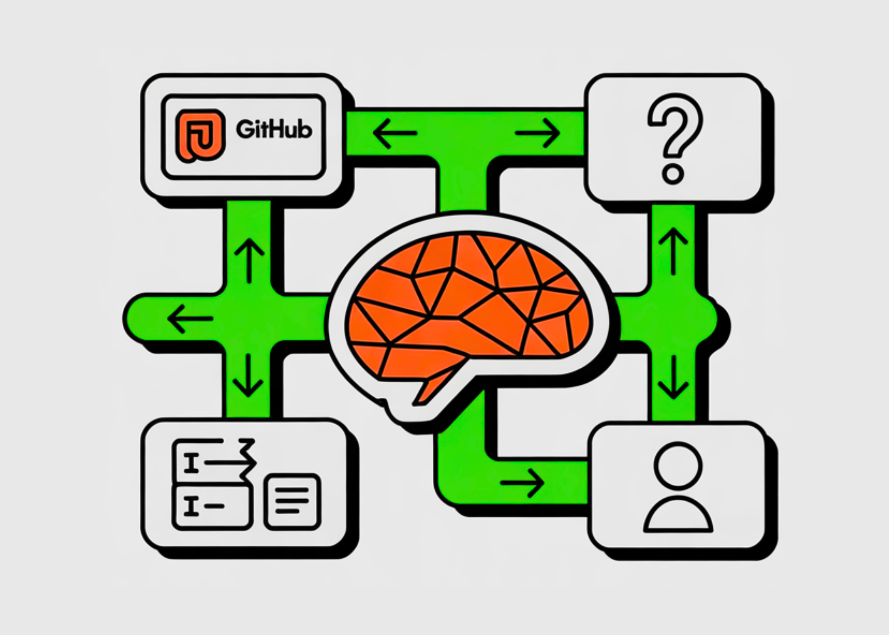

# CMU Researchers Introduce PPP and UserVille To Train Proactive And Personalized LLM Agents

> Most LLM agents are tuned to maximize task success. They resolve GitHub issues or answer deep research queries, but they do not reason carefully about when to ask the user questions or how to respect different interaction preferences. How can we design LLM agents that know when to ask better questions and adapt their behavior […]

Most LLM agents are tuned to maximize task success. They resolve GitHub issues or answer deep research queries, but they do not reason carefully about when to ask the user questions or how to respect different interaction preferences. How can we design LLM agents that know when to ask better questions and adapt their behavior to each individual user?

A team of researchers from **Carnegie Mellon University CMU and OpenHands** formalizes these missing behaviors as 3 joint objectives, **Productivity, Proactivity, and Personalization**, and optimizes them with a multi objective reinforcement learning framework called **PPP** inside a new environment named **UserVille**.

*Figure 1 shows that GPT 5 achieves strong productivity on SWE-Bench and BrowseComp Plus, but its proactivity and personalization scores are much lower when prompts are made vague. (https://arxiv.org/pdf/2511.02208)*

### From task success to interaction aware agents

The research team defines:

- **Productivity** as task completion quality, for example F1 on SWE-Bench Verified function localization or exact match on BrowseComp-Plus.

- **Proactivity** as asking essential clarifying questions when the initial prompt is vague while avoiding unnecessary queries.

- **Personalization** as following user specific interaction preferences such as brevity, format, or language.

### UserVille, an interactive environment with preference aware simulators

UserVille converts existing agent benchmarks into an interaction centric RL environment populated by LLM based user simulators.

**It has 3 stages:**

- **Prompt Vaguenization**: Precise task prompts are rewritten into vague prompts that keep the same intent but remove details. This creates information asymmetry, the simulator still observes the precise prompt, the agent only sees the vague version.

- **Preference Aware User Simulation**: Each user simulator is parameterized by a preference from a pool of 20 types. Preferences cover brevity, number of questions per turn, answer format, timing, language constraints, or requirements such as JSON formatted questions. Twelve preferences are used in training and 8 preferences are held out for generalization tests.

- **User Centric Evaluation**: After the task, the simulator labels each question as low effort, medium effort, or high effort based on whether it can answer using the precise prompt and how hard it is to respond. Proactivity score is 1 if the overall session is low effort, otherwise 0. Personalization score is 1 if the agent follows the preference, otherwise 0, averaged over sessions where the agent asked at least 1 question.

UserVille is instantiated on 2 domains, software engineering with SWE-Gym for training and SWE-Bench Verified and SWE-Bench Full for evaluation, and deep research with BrowseComp-Plus and a search plus open_page tool scaffold.

*https://arxiv.org/pdf/2511.02208*

### PPP, multi objective RL for productive, proactive, and personalized agents

Agents are implemented as ReAct style tool using policies based on Seed-OSS-36B-Instruct. They can call domain tools and an ask_user tool that queries the user simulator.

PPP defines a trajectory level reward

R = RProd​ + RProact​ + RPers​.

- **Productivity reward** RProd​ is the task metric, F1 on SWE-Func-Loc or exact match on BrowseComp-Plus.

- **Proactivity reward** RProact adds a bonus of +0.05 if all questions in the session are low effort and applies penalties of −0.1 for each medium effort question and −0.5 for each high effort question.

- **Personalization reward** RPers​ adds +0.05 when the agent follows the preference and adds non positive penalties defined by the preference specific rule for each violation.

Training uses a GRPO based RL algorithm with the Clip Higher strategy and token level policy gradient loss from DAPO, and only optimizes LLM generated tokens. The training environment is implemented with Verl. Seed-OSS-36B-Instruct is trained for 200 steps with batch size 64 and group size 8. Maximum output lengths are 32k tokens for SWE-Func-Loc, 65k for SWE-Full, and 41k for deep research. GPT 5 Nano is used as the user simulator. SWE scaffolds are based on OpenHands, and deep research uses a search tool and an open_page tool with Qwen3-Embed-8B as retriever.

*https://arxiv.org/pdf/2511.02208*

### Experimental results

The table-2 (below image) evaluates productivity, proactivity, and personalization on SWE-Bench Verified Func-Loc and BrowseComp-Plus, using vague prompts and averaging over 20 preferences.

*https://arxiv.org/pdf/2511.02208*

**For the Seed-OSS-36B-Instruct base model:**

- on SWE-Func-Loc, productivity 38.59, proactivity 43.70, personalization 69.07

- on BrowseComp-Plus, productivity 18.20, proactivity 37.60, personalization 64.76.

**After PPP RL training, the PPP model reaches:**

- on SWE-Func-Loc, productivity 56.26, proactivity 75.55, personalization 89.26

- on BrowseComp-Plus, productivity 26.63, proactivity 47.69, personalization 76.85.

The average gain across all 3 dimensions and both datasets is 16.72 points relative to Seed-OSS-36B-Instruct and PPP also outperforms GPT 5 and other GPT series baselines on the combined metric.

Interaction is crucial for vague prompts. On SWE-Func-Loc, F1 with precise prompts and no interaction is 64.50. With vague prompts and no interaction it drops to 44.11. Adding interaction without RL does not recover this gap. With PPP training and interaction, F1 under vague prompts improves by 21.66 points.

PPP also changes interaction behavior. The ask ratio on SWE-Func-Loc rises from 50 percent to 100 percent under vague prompts and from 51 percent to 85 percent on deep research, while remaining low for precise prompts. The number of questions per session increases early in training, then stabilizes with a high proportion of low effort questions and very few high effort questions.

### Key Takeaways

- PPP frames agent training as a **multi objective RL problem** that jointly optimizes Productivity, Proactivity, and Personalization, instead of focusing only on task success.

- UserVille builds **vague prompt versions** of existing benchmarks and pairs them with **preference aware user simulators**, which enforce 20 distinct interaction preferences and label user effort levels.

- The total reward combines **task metric, user effort, and preference adherence**, using bonuses for low effort questions and penalties for medium and high effort or preference violations, implemented with a GRPO based RL algorithm.

- On SWE Bench Func Loc and BrowseComp Plus with vague prompts, **PPP trained Seed OSS 36B** significantly improves all 3 metrics over the base model and over GPT 5 baselines, with an average gain of about 16.72 points across dimensions and datasets.

- PPP agents **generalize to unseen preferences, alternate simulators, and harder tasks** such as SWE Bench Full, and they learn to ask fewer but more targeted low effort questions, especially when prompts are vague.

### Editorial Comments

PPP and UserVille mark an important step toward interaction aware LLM agents, since they explicitly encode Productivity, Proactivity, and Personalization in the reward design, use preference aware user simulators that enforce 20 interaction preferences, and apply GRPO with DAPO style token level optimization inside Verl and OpenHands scaffolds. The improvements on SWE Bench Func Loc, SWE Bench Full, and BrowseComp Plus show that interaction modeling is now a core capability, not an auxiliary feature.

---

Check out the **[Paper](https://arxiv.org/pdf/2511.02208) **and** [Repo](https://github.com/sunnweiwei/PPP-Agent)**. Feel free to check out our **[GitHub Page for Tutorials, Codes and Notebooks](https://github.com/Marktechpost/AI-Tutorial-Codes-Included)**. Also, feel free to follow us on **[Twitter](https://x.com/intent/follow?screen_name=marktechpost)** and don’t forget to join our **[100k+ ML SubReddit](https://www.reddit.com/r/machinelearningnews/)** and Subscribe to **[our Newsletter](https://www.aidevsignals.com/)**. Wait! are you on telegram? **[now you can join us on telegram as well.](https://t.me/machinelearningresearchnews)**
