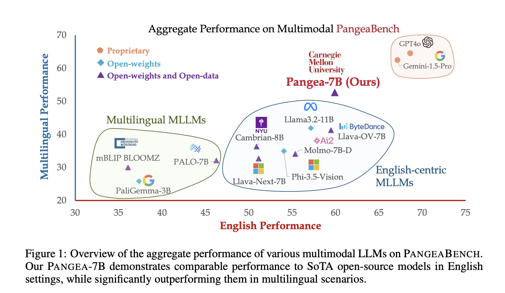

# CMU Researchers Release Pangea-7B: A Fully Open Multimodal Large Language Models MLLMs for 39 Languages

> Despite recent advances in multimodal large language models (MLLMs), the development of these models has largely centered around English and Western-centric datasets. This emphasis has resulted in a significant gap in linguistic and cultural representation, with many languages and cultural contexts around the world remaining underrepresented. Consequently, existing models often perform poorly in multilingual environments […]

Despite recent advances in multimodal large language models (MLLMs), the development of these models has largely centered around English and Western-centric datasets. This emphasis has resulted in a significant gap in linguistic and cultural representation, with many languages and cultural contexts around the world remaining underrepresented. Consequently, existing models often perform poorly in multilingual environments and fail to align with the socio-cultural norms of underrepresented languages. This presents a substantial limitation, particularly given the increasing adoption of these models globally, where equitable representation is crucial for effective real-world applications.

A team of researchers from Carnegie Mellon University introduced PANGEA, a multilingual multimodal LLM designed to bridge linguistic and cultural gaps in visual understanding tasks. PANGEA is trained on a newly curated dataset, PANGEAINS, which contains 6 million instruction samples across 39 languages. The dataset is specifically crafted to improve cross-cultural coverage by combining high-quality English instructions, machine-translated instructions, and culturally relevant multimodal tasks. In addition, to evaluate PANGEA’s capabilities, the researchers introduced PANGEABENCH, an evaluation suite spanning 14 datasets covering 47 languages. This comprehensive evaluation provides insight into the model’s performance on both multimodal and multilingual tasks, showing that PANGEA outperforms many existing models in multilingual scenarios.

PANGEA was developed using PANGEAINS, a rich and diverse dataset that includes instructions for general visual understanding, document and chart question answering image captioning, and more. The dataset was designed to address the major challenges of multilingual multimodal learning: data scarcity, cultural nuances, catastrophic forgetting, and evaluation complexity. To build PANGEAINS, the researchers employed several strategies: translating high-quality English instructions, generating culturally aware tasks, and incorporating existing open-source multimodal datasets. The researchers also developed a sophisticated pipeline to filter culturally diverse images and generate detailed multilingual and cross-cultural captions, ensuring that the model understands and responds appropriately in different linguistic and cultural contexts.

The results of PANGEA’s evaluation on PANGEABENCH demonstrate its strengths. PANGEA-7B, the 7-billion parameter model, showed significant improvements over existing open-source models, achieving an average improvement of 7.3 points on English tasks and 10.8 points on multilingual tasks. PANGEA also excels in multicultural understanding, as evidenced by its performance on the CVQA and xChat benchmarks. Interestingly, the model’s performance in multilingual settings did not drop as significantly as that of other models, demonstrating its balanced cross-language capabilities. Moreover, PANGEA matches or even outperforms proprietary models like Gemini-1.5-Pro and GPT4o in several areas, indicating that it is a strong competitor in the multilingual MLLM space.

PANGEA represents a significant step forward in creating inclusive and robust multilingual multimodal LLMs. The researchers successfully addressed data scarcity and cultural representation challenges by leveraging machine translation and culturally aware data generation strategies, creating a comprehensive dataset that spans 39 languages. The open-sourcing of PANGEAINS, PANGEABENCH, and PANGEA models is expected to facilitate further development and innovation in this field, promoting equity and accessibility across linguistic and cultural boundaries. Despite its promising performance, there are still areas for improvement, such as enhancing performance in multimodal chat and complex reasoning tasks, which the researchers hope to address in future iterations.

---

Check out the** [Paper](https://arxiv.org/abs/2410.16153), [Project Page](https://neulab.github.io/Pangea/), and [Model Card on Hugging Face](https://huggingface.co/collections/neulab/pangea-6713c3b0d78a453906eb2ed8).** All credit for this research goes to the researchers of this project. Also, don’t forget to follow us on **[Twitter](https://twitter.com/Marktechpost)** and join our **[Telegram Channel](https://pxl.to/at72b5j)** and [**LinkedIn Gr**](https://www.linkedin.com/groups/13668564/)[**oup**](https://www.linkedin.com/groups/13668564/). **If you like our work, you will love our**[** newsletter..**](https://marktechpost-newsletter.beehiiv.com/subscribe) Don’t Forget to join our **[50k+ ML SubReddit](https://www.reddit.com/r/machinelearningnews/)**.

**[[Upcoming Live Webinar- Oct 29, 2024] ](https://go.predibase.com/predibase-inference-engine-102924-lp?utm_medium=3rdparty&utm_source=marktechpost)****[The Best Platform for Serving Fine-Tuned Models: Predibase Inference Engine (Promoted)](https://go.predibase.com/predibase-inference-engine-102924-lp?utm_medium=3rdparty&utm_source=marktechpost)**
