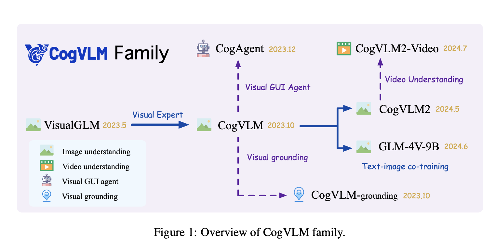

# CogVLM2: Advancing Multimodal Visual Language Models for Enhanced Image, Video Understanding, and Temporal Grounding in Open-Source Applications

> Large Language Models (LLMs), initially limited to text-based processing, faced significant challenges in comprehending visual data. This limitation led to the development of Visual Language Models (VLMs), which integrate visual understanding with language processing. Early models like VisualGLM, built on architectures such as BLIP-2 and ChatGLM-6B, represented initial efforts in multi-modal integration. However, these models […]

Large Language Models (LLMs), initially limited to text-based processing, faced significant challenges in comprehending visual data. This limitation led to the development of Visual Language Models (VLMs), which integrate visual understanding with language processing. Early models like VisualGLM, built on architectures such as BLIP-2 and ChatGLM-6B, represented initial efforts in multi-modal integration. However, these models often relied on shallow alignment techniques, restricting the depth of visual and linguistic integration, thereby highlighting the need for more advanced approaches.

Subsequent advancements in VLM architecture, exemplified by models like CogVLM, focused on achieving a deeper fusion of vision and language features, thereby enhancing natural language performance. The development of specialized datasets, such as the Synthetic OCR Dataset, played a crucial role in improving models’ OCR capabilities, enabling broader applications in document analysis, GUI comprehension, and video understanding. These innovations have significantly expanded the potential of LLMs, driving the evolution of visual language models.

This research paper from Zhipu AI and Tsinghua University introduces the CogVLM2 family, a new generation of visual language models designed for enhanced image and video understanding, including models such as CogVLM2, CogVLM2-Video, and GLM-4V. Advancements include a higher-resolution architecture for fine-grained image recognition, exploration of broader modalities like visual grounding and GUI agents, and innovative techniques like post-downsample for efficient image processing. The paper also emphasizes the commitment to open-sourcing these models, providing valuable resources for further research and development in visual language models.

The CogVLM2 family integrates architectural innovations, including the Visual Expert and high-resolution cross-modules, to enhance the fusion of visual and linguistic features. The training process for CogVLM2-Video involves two stages: Instruction Tuning, using detailed caption data and question-answering datasets with a learning rate of 4e-6, and Temporal Grounding Tuning on the TQA Dataset with a learning rate of 1e-6. Video input processing employs 24 sequential frames, with a convolution layer added to the Vision Transformer model for efficient video feature compression.

CogVLM2’s methodology utilizes substantial datasets, including 330,000 video samples and an in-house video QA dataset, to enhance temporal understanding. The evaluation pipeline involves generating and evaluating video captions using GPT-4o to filter videos based on scene content changes. Two model variants, cogvlm2-video-llama3-base, and cogvlm2-video-llama3-chat, serve different application scenarios, with the latter fine-tuned for enhanced temporal grounding. The training process occurs on an 8-node NVIDIA A100 cluster, completed in approximately 8 hours.

CogVLM2, particularly the CogVLM2-Video model, achieves state-of-the-art performance across multiple video question-answering tasks, excelling in benchmarks like MVBench and VideoChatGPT-Bench. The models also outperform existing models, including larger ones, in image-related tasks, with notable success in OCR comprehension, chart and diagram understanding, and general question-answering. Comprehensive evaluation reveals the models’ versatility in tasks such as video generation and summarization, establishing CogVLM2 as a new standard for visual language models in both image and video understanding.

In conclusion, the CogVLM2 family marks a significant advancement in integrating visual and language modalities, addressing the limitations of traditional text-only models. The development of models capable of interpreting and generating content from images and videos broadens their application in fields such as document analysis, GUI comprehension, and video grounding. Architectural innovations, including the Visual Expert and high-resolution cross-modules, enhance performance in complex visual-language tasks. The CogVLM2 series sets a new benchmark for open-source visual language models, with detailed methodologies for dataset generation supporting its robust capabilities and future research opportunities.

---

Check out the **[Paper](https://arxiv.org/abs/2408.16500v1) and [GitHub](https://github.com/THUDM/CogVLM2?tab=readme-ov-file).** All credit for this research goes to the researchers of this project. Also, don’t forget to follow us on **[Twitter](https://twitter.com/Marktechpost)** and [**LinkedIn**](https://www.linkedin.com/company/marktechpost/?viewAsMember=true). Join our **[Telegram Channel](https://www.zyphra.com/post/zamba2-mini)**.

**If you like our work, you will love our**[** newsletter..**](https://marktechpost-newsletter.beehiiv.com/subscribe)

Don’t Forget to join our **[50k+ ML SubReddit](https://www.reddit.com/r/machinelearningnews/)**
