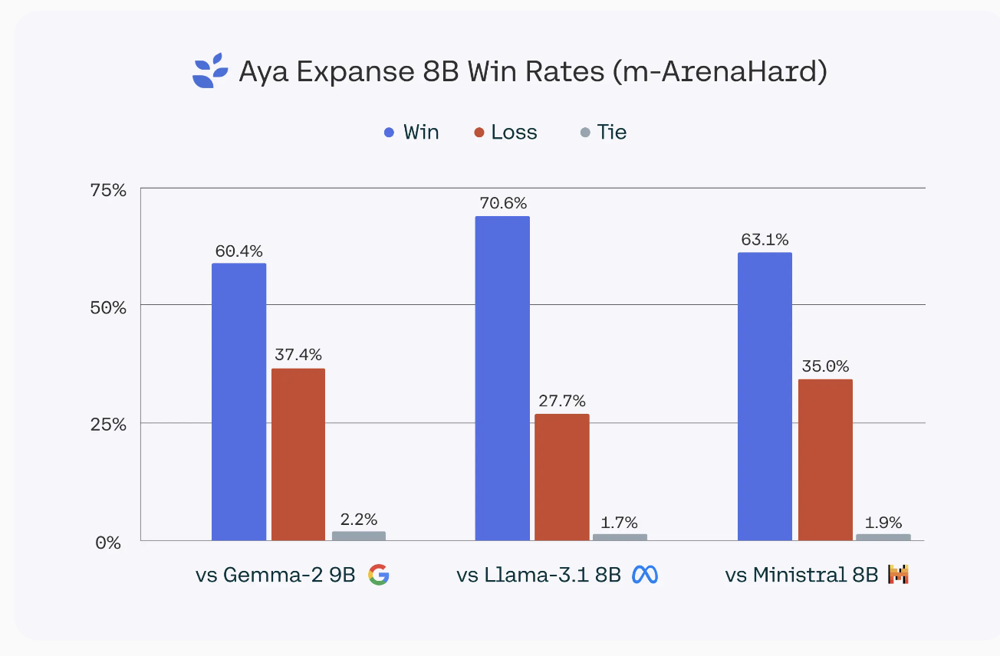

# Cohere for AI Releases Aya Expanse (8B & 32B): A State-of-the-Art Multilingual Family of Models to Bridge the Language Gap in AI

> Despite rapid advancements in language technology, significant gaps in representation persist for many languages. Most progress in natural language processing (NLP) has focused on well-resourced languages like English, leaving many others underrepresented. This imbalance means that only a small portion of the world’s population can fully benefit from AI tools. The absence of robust language […]

Despite rapid advancements in language technology, significant gaps in representation persist for many languages. Most progress in natural language processing (NLP) has focused on well-resourced languages like English, leaving many others underrepresented. This imbalance means that only a small portion of the world’s population can fully benefit from AI tools. The absence of robust language models for low-resource languages, coupled with unequal AI access, exacerbates disparities in education, information accessibility, and technological empowerment. Addressing these challenges requires a concerted effort to develop and deploy language models that serve all communities equitably.

**Cohere for AI Introduces Aya Expanse: an open-weights state-of-art family of models to help close the language gap with AI**. Aya Expanse is designed to expand language coverage and inclusivity in the AI landscape by providing open-weight models that can be accessed and built upon by researchers and developers worldwide. Available in multiple sizes, including Aya Expanse-8B and Aya Expanse-32B, these models are adaptable across a wide range of natural language tasks, such as text generation, translation, and summarization. The different model sizes offer flexibility for various use cases, from large-scale applications to lighter deployments. Aya Expanse utilizes advanced transformer architecture to capture linguistic nuances and semantic richness, and it is fine-tuned to handle multilingual scenarios effectively. The models leverage diverse datasets from low-resource languages like Swahili, Bengali, and Welsh to ensure equitable performance across linguistic contexts.

Aya Expanse plays a crucial role in bridging linguistic divides, ensuring underrepresented languages have the tools needed to benefit from AI advancements. The Aya Expanse-32B model, in particular, has demonstrated significant improvements in multilingual understanding benchmarks, outperforming models such as Gemma 2 27B, Mistral 8x22B, and Llama 3.1 70B—a model more than twice its size. In evaluations, Aya Expanse-32B achieved a 25% higher average accuracy across low-resource language benchmarks compared to other leading models. Similarly, Aya Expanse-8B outperforms leading models in its parameter class, including Gemma 2 9B, Llama 3.1 8B, and the recently released Ministral 8B, with win rates ranging from 60.4% to 70.6%. These results highlight Aya Expanse’s potential to support underserved communities and foster better language inclusivity.

The improvements in Aya Expanse stem from Cohere for AI’s sustained focus on expanding how AI serves languages around the world. By rethinking the core building blocks of machine learning breakthroughs, including data arbitrage, preference training for general performance and safety, and model merging, Cohere for AI has made a significant contribution to bridging the language gap. Making the model weights openly available encourages an inclusive ecosystem of researchers and developers, ensuring language modeling becomes a community-driven effort rather than one controlled by a few entities.

In conclusion, Aya Expanse represents a significant step towards democratizing AI and addressing the language gap in NLP. By providing powerful, multilingual language models with open weights, Cohere for AI advances language technology while promoting inclusivity and collaboration. Aya Expanse enables developers, educators, and innovators from diverse linguistic backgrounds to create applications that are accessible and beneficial to a broader population, ultimately contributing to a more connected and equitable world. This move aligns well with the core values of artificial intelligence—accessibility, inclusiveness, and innovation without borders.

---

Check out the** [Details](https://cohere.com/blog/aya-expanse-connecting-our-world), [8B Model](https://huggingface.co/CohereForAI/aya-expanse-8b?ref=cohere-ai.ghost.io) and [32B Model](https://huggingface.co/CohereForAI/aya-expanse-32b?ref=cohere-ai.ghost.io).** All credit for this research goes to the researchers of this project. Also, don’t forget to follow us on **[Twitter](https://twitter.com/Marktechpost)** and join our **[Telegram Channel](https://pxl.to/at72b5j)** and [**LinkedIn Gr**](https://www.linkedin.com/groups/13668564/)[**oup**](https://www.linkedin.com/groups/13668564/). **If you like our work, you will love our**[** newsletter..**](https://marktechpost-newsletter.beehiiv.com/subscribe) Don’t Forget to join our **[55k+ ML SubReddit](https://www.reddit.com/r/machinelearningnews/)**.

**[[Upcoming Live Webinar- Oct 29, 2024] ](https://go.predibase.com/predibase-inference-engine-102924-lp?utm_medium=3rdparty&utm_source=marktechpost)****[The Best Platform for Serving Fine-Tuned Models: Predibase Inference Engine (Promoted)](https://go.predibase.com/predibase-inference-engine-102924-lp?utm_medium=3rdparty&utm_source=marktechpost)**
