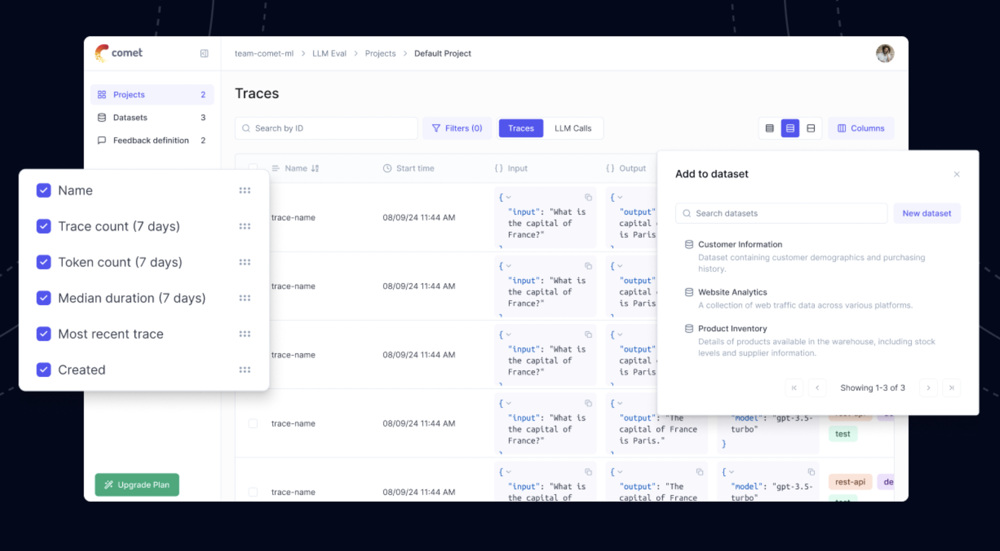

# Comet Launches Opik: A Comprehensive Open-Source Tool for End-to-End LLM Evaluation, Prompt Tracking, and Pre-Deployment Testing with Seamless Integration

> Comet has unveiled Opik, an open-source platform designed to enhance the observability and evaluation of large language models (LLMs). This tool is tailored for developers and data scientists to monitor, test, and track LLM applications from development to production. Opik offers a comprehensive suite of features that streamline the evaluation process and improve the overall […]

Comet has unveiled [**Opik**](https://github.com/comet-ml/opik), an open-source platform designed to enhance the observability and evaluation of large language models (LLMs). This tool is tailored for developers and data scientists to monitor, test, and track LLM applications from development to production. [**Opik**](https://github.com/comet-ml/opik) offers a comprehensive suite of features that streamline the evaluation process and improve the overall reliability of LLM-based applications.

[**Opik**](https://github.com/comet-ml/opik) is intended to address some of the key challenges faced by developers working with LLMs, particularly in performance monitoring and observability. LLMs have gained prominence across industries, powering applications like chatbots, text generators, and automated decision-making tools. However, these models often need help tracking their behavior and outputs across various development and deployment stages. In particular, issues such as hallucinations, where models generate inaccurate or irrelevant outputs, can take time to catch early in the process. With [**Opik**](https://github.com/comet-ml/opik), Comet has provided a solution enabling developers to gain insights into how their models perform over time and in different contexts, making detecting and correcting these problems before they reach production easier.

*[**Image Source**](https://www.comet.com/site/products/opik/)*

One of the standout features of [**Opik**](https://github.com/comet-ml/opik) is its ability to track prompts and responses, enabling developers to log and monitor the interaction between inputs and outputs at every stage of the LLM lifecycle. This feature is particularly useful for tracing how a model responds to different types of prompts and identifying areas where the model’s performance may be lacking. By accessing these detailed logs, developers can better understand the decision-making processes of their models and take corrective actions as necessary.

[**Opik**](https://github.com/comet-ml/opik) also includes end-to-end LLM evaluation tools that allow developers to set up comprehensive test suites to evaluate their models before deployment. These test suites can assess whether a model produces accurate and reliable results, ensuring it meets the necessary quality standards before being integrated into production environments. This pre-deployment testing is crucial for minimizing errors and avoiding costly issues that could arise if flawed models are deployed without proper evaluation.

*[**Image Source**](https://www.comet.com/site/products/opik/)*

Another key feature of [**Opik**](https://github.com/comet-ml/opik) is its seamless integration with other popular LLM tools such as OpenAI, Langchain, and LlamaIndex. This integration capability means developers can easily incorporate [**Opik**](https://github.com/comet-ml/opik) into their existing workflows without overhauling their current setups. The tool is designed to be easy to use, with minimal configuration required. Developers can add [**Opik**](https://github.com/comet-ml/opik) to their workflow with just a few lines of code, making it a highly accessible solution for teams of all sizes.

[**Opik**](https://github.com/comet-ml/opik) is built on an open-source foundation, which aligns with Comet’s commitment to transparency and collaboration in the AI community. By making [**Opik**](https://github.com/comet-ml/opik) open-source, Comet has enabled developers and organizations to customize and extend the platform according to their needs. This flexibility is particularly beneficial for enterprise teams that require scalable, industry-compliant solutions for managing their LLM applications. The open-source nature of [**Opik**](https://github.com/comet-ml/opik) also fosters collaboration within the developer community, as users can contribute to the platform’s ongoing development and share best practices for optimizing LLM performance.

*[**Image Source**](https://www.comet.com/site/products/opik/)*

With pre-deployment evaluation capabilities, [**Opik**](https://github.com/comet-ml/opik) offers robust monitoring and analysis tools for production environments. These tools allow them to track their models’ performance on unseen data, providing insights into how the models perform in real-world applications. This post-deployment monitoring is essential for maintaining the long-term reliability of LLM-based applications, as it enables developers to identify & address issues that may arise as the models interact with new and evolving datasets.

The platform is designed to offer a user-friendly interface that simplifies logging and analyzing LLM outputs. Developers can manually annotate and compare responses in a table format, making identifying patterns and discrepancies in the model’s behavior easier. [**Opik**](https://github.com/comet-ml/opik) also supports logging traces during development and production, giving developers a holistic view of their model’s performance throughout its lifecycle.

*[**Image Source**](https://www.comet.com/site/products/opik/)*

One of [**Opik**](https://github.com/comet-ml/opik)‘s major advantages is its compatibility with continuous integration/continuous deployment (CI/CD) pipelines. By integrating with CI/CD workflows, [**Opik**](https://github.com/comet-ml/opik) ensures that LLM applications are consistently tested and evaluated as they progress through the development cycle. This integration allows developers to establish reliable performance baselines and run automated tests on their models with every deployment. As a result, teams can ensure that their LLM applications remain stable and performant, even as new features and updates are introduced.

**_‘Opik is the only comprehensive open source LLM evaluation platform. We put an emphasis not only on model observability, but on end-to-end testing, such that you can incorporate LLM evaluations into your CI/CD pipeline and ensure reliable model behavior on every deploy. Super excited to see what the open source community builds with it!’_** **_– _**Gideon Mendels (CEO at Comet)

In conclusion, [**Opik**](https://github.com/comet-ml/opik) is a powerful open-source tool that addresses many challenges developers face when working with LLMs. Its end-to-end evaluation capabilities, prompt and response tracking, and seamless integration with popular LLM tools make it an essential addition to any AI development workflow. [**Opik**](https://github.com/comet-ml/opik) ensures that LLM applications are reliable, accurate, and optimized for performance by providing both pre-deployment testing and post-deployment monitoring. Its open-source nature and ease of integration further enhance its appeal, making it a valuable resource for developers looking to improve the quality and observability of their LLM-based projects.

---

Check out the **[GitHub Page](https://github.com/comet-ml/opik) and [Product Page](https://www.comet.com/site/products/opik/)**. All credit for this research goes to the researchers of this project. Also, don’t forget to follow us on **[Twitter](https://twitter.com/Marktechpost)** and join our **[Telegram Channel](https://pxl.to/at72b5j)** and [**LinkedIn Gr**](https://www.linkedin.com/groups/13668564/)[**oup**](https://www.linkedin.com/groups/13668564/). **If you like our work, you will love our**[** newsletter..**](https://marktechpost-newsletter.beehiiv.com/subscribe)

Don’t Forget to join our **[50k+ ML SubReddit](https://www.reddit.com/r/machinelearningnews/)**

**[⏩ ⏩ FREE AI WEBINAR: ‘SAM 2 for Video: How to Fine-tune On Your Data’ (Wed, Sep 25, 4:00 AM – 4:45 AM EST)](https://encord.com/webinar/sam2-for-video/?utm_medium=affiliate&utm_source=newsletter&utm_campaign=marktechpost&utm_content=sam2video)**
