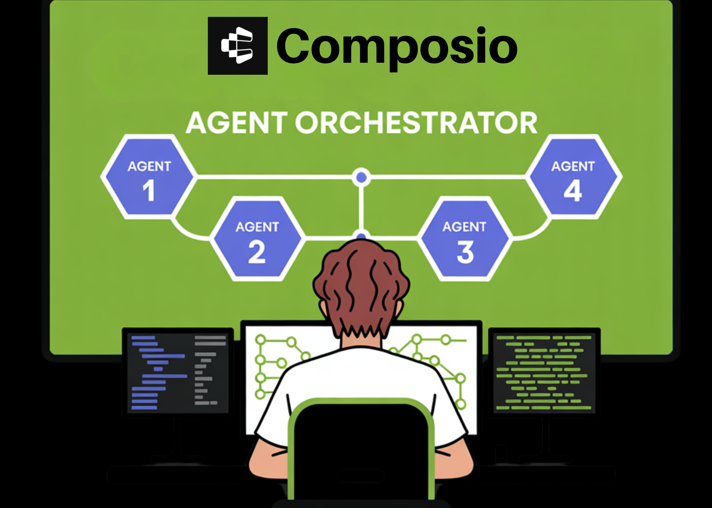

# Composio Open Sources Agent Orchestrator to Help AI Developers Build Scalable Multi-Agent Workflows Beyond the Traditional ReAct Loops

> For the past year, AI devs have relied on the ReAct (Reasoning + Acting) pattern—a simple loop where an LLM thinks, picks a tool, and executes. But as any software engineer who has tried to move these agents into production knows, simple loops are brittle. They hallucinate, they lose track of complex goals, and they […]

For the past year, AI devs have relied on the ReAct (Reasoning + Acting) pattern—a simple loop where an LLM thinks, picks a tool, and executes. But as any software engineer who has tried to move these agents into production knows, simple loops are brittle. They hallucinate, they lose track of complex goals, and they struggle with ‘tool noise’ when faced with too many APIs.

**Composio** team is moving the goalposts by open-sourcing **Agent Orchestrator**. This framework is designed to transition the industry from ‘Agentic Loops’ to ‘Agentic Workflows’—structured, stateful, and verifiable systems that treat AI agents more like reliable software modules and less like unpredictable chatbots.

*https://pkarnal.com/blog/open-sourcing-agent-orchestrator*

### The Architecture: Planner vs. Executor

The core philosophy behind Agent Orchestrator is the strict separation of concerns. In traditional setups, the LLM is expected to both plan the strategy and execute the technical details simultaneously. This often leads to ‘greedy’ decision-making where the model skips crucial steps.

**Composio’s Orchestrator introduces a dual-layered architecture:**

- **The Planner:** This layer is responsible for task decomposition. It takes a high-level objective—such as ‘Find all high-priority GitHub issues and summarize them in a Notion page’—and breaks it into a sequence of verifiable sub-tasks.

- **The Executor:** This layer handles the actual interaction with tools. By isolating the execution, the system can use specialized prompts or even different models for the heavy lifting of API interaction without cluttering the global planning logic.

### Solving the ‘Tool Noise’ Problem

The most significant bottleneck in agent performance is often the context window. If you give an agent access to 100 tools, the documentation for those tools consumes thousands of tokens, confusing the model and increasing the likelihood of hallucinated parameters.

Agent Orchestrator solves this through **Managed Toolsets**. Instead of exposing every capability at once, the Orchestrator dynamically routes only the necessary tool definitions to the agent based on the current step in the workflow. This ‘Just-in-Time’ context management ensures that the LLM maintains a high signal-to-noise ratio, leading to significantly higher success rates in function calling.

### State Management and Observability

One of the most frustrating aspects of early-level AI engineering is the ‘black box’ nature of agents. When an agent fails, it’s often hard to tell if the failure was due to a bad plan, a failed API call, or a lost context.

Agent Orchestrator introduces **Stateful Orchestration**. Unlike stateless loops that effectively ‘start over’ or rely on messy chat histories for every iteration, the Orchestrator maintains a structured state machine.

- **Resiliency:** If a tool call fails (e.g., a 500 error from a third-party API), the Orchestrator can trigger a specific error-handling branch without crashing the entire workflow.

- **Traceability:** Every decision point, from the initial plan to the final execution, is logged. This provides the level of observability required for debugging production-grade software.

### Key Takeaways

- **De-coupling Planning from Execution:** The framework moves away from simple ‘Reason + Act’ loops by separating the **Planner** (which decomposes goals into sub-tasks) from the **Executor** (which handles API calls). This reduces ‘greedy’ decision-making and improves task accuracy.

- **Dynamic Tool Routing (Context Management):** To prevent LLM ‘noise’ and hallucinations, the Orchestrator only feeds relevant tool definitions to the model for the current task. This ‘Just-in-Time’ context management ensures high signal-to-noise ratios even when managing 100+ APIs.

- **Centralized Stateful Orchestration:** Unlike stateless agents that rely on unstructured chat history, the Orchestrator maintains a structured **state machine**. This allows for ‘Resume-on-Failure’ capabilities and provides a clear audit trail for debugging production-grade AI.

- **Built-in Error Recovery and Resilience:** The framework introduces structured ‘Correction Loops.’ If a tool call fails or returns an error (like a 404 or 500), the Orchestrator can trigger specific recovery logic without losing the entire mission’s progress.

---

Check out the **[GitHub Repo](https://github.com/ComposioHQ/agent-orchestrator)** and **[Technical details](https://pkarnal.com/blog/open-sourcing-agent-orchestrator). **Also, feel free to follow us on **[Twitter](https://x.com/intent/follow?screen_name=marktechpost)** and don’t forget to join our **[100k+ ML SubReddit](https://www.reddit.com/r/machinelearningnews/)** and Subscribe to **[our Newsletter](https://www.aidevsignals.com/)**. Wait! are you on telegram? **[now you can join us on telegram as well.](https://t.me/machinelearningresearchnews)**
