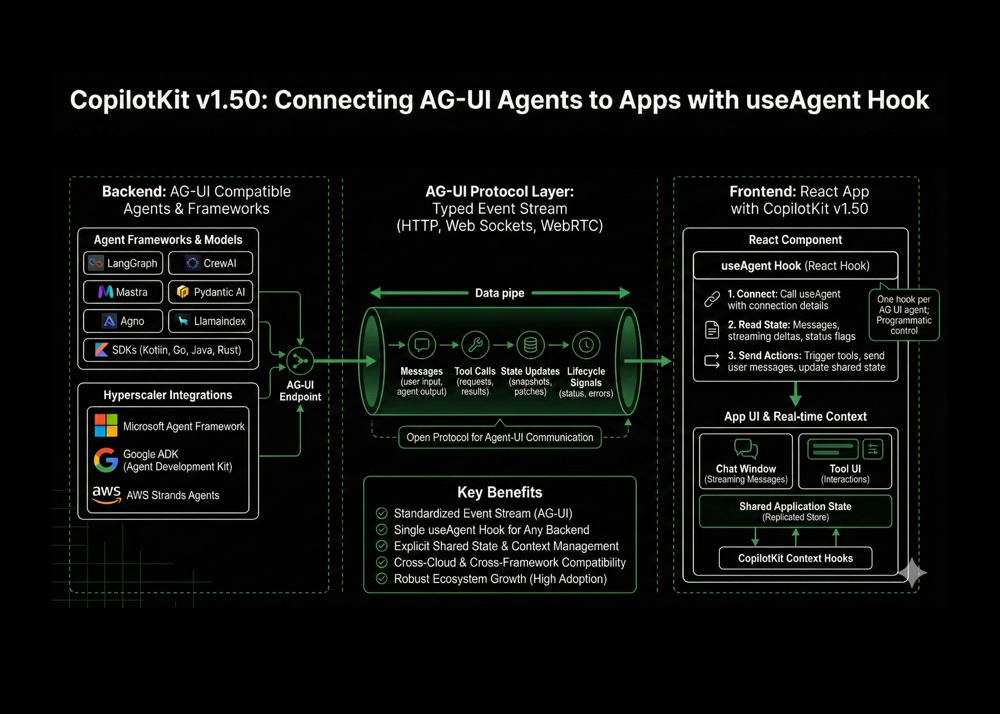

# CopilotKit v1.50 Brings AG-UI Agents Directly Into Your App With the New useAgent Hook

> Agent frameworks are now good at reasoning and tools, but most teams still write custom code to turn agent graphs into robust user interfaces with shared state, streaming output and interrupts. CopilotKit targets this last mile. It is an open source framework for building AI copilots and in-app agents directly in your app, with real […]

Agent frameworks are now good at reasoning and tools, but most teams still write custom code to turn agent graphs into robust user interfaces with shared state, streaming output and interrupts. [CopilotKit](https://go.copilotkit.ai/copilot) targets this last mile. It is an open source framework for building AI copilots and in-app agents directly in your app, with real time context and UI control. (⭐️ [**Check out the CopilotKit GitHub**](https://go.copilotkit.ai/copilot))

The release of of CopilotKit’s v1.50 rebuilds the project on the Agent User Interaction Protocol ([AG-UI](https://go.copilotkit.ai/ag-ui-github)) natively.The key idea is simple; Let AG-UI define all traffic between agents and UIs as a typed event stream to any  app through a single hook, useAgent.

### useAgent, one React hook per AG-UI agent

AG-UI defines how an agent backend and a frontend exchange a single ordered sequence of JSON encoded events. These events include messages, tool calls, state updates and lifecycle signals, and they can stream any transport like HTTP, Web Sockets, or even WebRTC. 

CopilotKit v1.50 uses this protocol as the native transport layer. Instead of separate adapters for each framework, everything  now communicates via AG-UI directly. This is all made easily accessible by the new [useAgent](https://go.copilotkit.ai/useagent-docs) – a React hook that  provides programmatic control of any AG-UI agent. It subscribes to the event stream, keeps a local model of messages and shared state, and exposes a small API for sending user input and UI intents.

**At a high level, a React component does three things:**

- Call useAgent with connection details for the backend agent.

- Read current state, such as message list, streaming deltas and agent status flags.

- Call useAgent methods from the hook to send user messages, trigger tools or update shared state.

Because the hook only depends on AG-UI, the same UI code can work with different agent frameworks, as long as they expose an AG-UI endpoint.

### Context messaging and shared state

AG-UI assumes that agentic apps are stateful. The protocol standardizes how context moves between UI and agent. 

On the frontend, CopilotKit already lets developers register app data as context, for example with hooks that make parts of React state readable to the agent. In the AG-UI model this becomes explicit. State snapshots and state patch events keep the backend and the UI in sync. The agent sees a consistent view of the application, and the UI can render the same state without custom synchronization logic.

For an early level engineer this removes a common pattern. You no longer push props into prompts manually on every call. The state is then updated, and the AG-UI client encodes those updates as events, and the backend agent consumes the same state through its AG-UI library.

### AG-UI, protocol layer between agents and users

AG-UI is defined as an open, lightweight protocol that standardizes how agents connect to user facing applications.It focuses on event semantics rather than transport. Core SDKs provide strongly typed event models and clients in TypeScript, Python and other languages.

The JavaScript package @ag-ui/core implements the streaming event based architecture on the client side. It exposes message and state models, run input types and event utilities, and currently records about 178,751 weekly downloads on npm for version 0.0.41. On the Python side, the ag-ui-protocol package provides the canonical event models, with around 619,035 downloads in the last week and about 2,172,180 in the last month.

**CopilotKit v1.50** builds directly on these components. Frontend code uses CopilotKit React primitives, but under the hood the connection to the backend is an AG-UI client that sends and receives standard events.

### First party integrations across the 3 hyperscalers

The AG-UI overview lists Microsoft Agent Framework, Google Agent Development Kit, ADK, and AWS Strands Agents as supported frameworks, each with dedicated documentation and demos. These are first party integrations maintained by the protocol and framework owners.

Microsoft published [a tutorial](https://learn.microsoft.com/en-us/agent-framework/integrations/ag-ui/getting-started?) that shows how to build both server and client applications using AG-UI with Agent Framework in .NET or Python. [Google documents](https://google.github.io/adk-docs/) AG-UI under the Agentic UI section of the ADK docs, and CopilotKit provides a full guide on building an ADK along with AG-UI and CopilotKit stack. AWS [Strands](https://strandsagents.com/latest/documentation/docs/community/integrations/ag-ui/) exposes AG-UI integration through official tutorials and a CopilotKit quickstart, which wires a Strands agent backend to a React client in one scaffolded project.

For a React team this means that useAgent can attach to agents defined in any of these frameworks, as long as the backend exposes an AG-UI endpoint. The frontend code stays the same, while the agent logic and hosting environment can change.

### Ecosystem growth around CopilotKit and AG-UI

CopilotKit presents itself as the agentic framework for in-app copilots, with more than 20,000 GitHub stars and being trusted by over 100,000 developers. 

AG-UI itself has moved from a protocol proposal to a shared layer across multiple frameworks. The partnerships or integrations include with LangGraph, CrewAI, Mastra, Pydantic AI, Agno, LlamaIndex and others, plus SDKs in Kotlin, Go, Java, Rust and more.This cross framework adoption is what makes a generic hook like useAgent viable, because it can rely on a consistent event model.

### Key Takeaways

- CopilotKit v1.50 standardizes its frontend layer on AG-UI, so all agent to UI communication is a single event stream instead of custom links per backend.

- The new useAgent React hook lets a component connect to any AG-UI compatible agent, and exposes messages, streaming tokens, tools and shared state through a typed interface.

- AG-UI formalizes context messaging and shared state as replicated stores with event sourced deltas, so both agent and UI share a consistent application view without manual prompt wiring.

- AG-UI has first party integrations with Microsoft Agent Framework, Google Agent Development Kit and AWS Strands Agents, which means the same CopilotKit UI code can target agents across all 3 major clouds.

- CopilotKit and AG-UI show strong ecosystem traction, with high GitHub adoption and significant weekly downloads for @ag-ui/core on npm and ag-ui-protocol on PyPI, which signals that the protocol is becoming a common layer for agentic applications.****

If you’re interested in using [CopilotKit](https://go.copilotkit.ai/useagent-docs) in a production product or business, you can schedule time with the team here:👉 [Scheduling link](https://calendly.com/d/cnqt-yr9-hxr/talk-to-copilotkit?&utm_campaign=Waitlist%20-%20Signups&utm_source=hs_email&utm_medium=email&_hsenc=p2ANqtz--cL-Mg2BOqoVAplzvoDC67-VIdWQvzK-wIkqz9Rvb13Yb7ZmCVqAdqon12V4NMrMqW8-Na)
