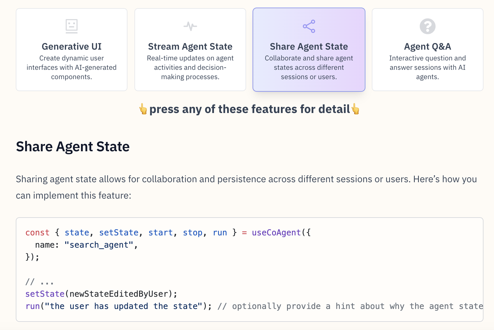

# CopilotKit’s CoAgents: The Missing Link that Makes It Easy to Connect LangGraph Agents to Humans in the Loop

> CopilotKit has emerged as a leading open-source framework designed to streamline the integration of AI into modern applications. Widely appreciated within the open-source community, CopilotKit has garnered significant recognition, boasting over 10.5k+ GitHub stars. The platform enables developers to create custom AI copilots, in-app agents, and interactive assistants capable of dynamically engaging with their application’s […]

[**CopilotKit **](https://github.com/CopilotKit/CopilotKit)has emerged as a leading open-source framework designed to streamline the integration of AI into modern applications. Widely appreciated within the open-source community, CopilotKit has garnered significant recognition, boasting over [**10.5k+ GitHub stars**](https://github.com/CopilotKit/CopilotKit?tab=readme-ov-file). The platform enables developers to create custom AI copilots, in-app agents, and interactive assistants capable of dynamically engaging with their application’s environment. Built with the complexity of modern AI integrations in mind, CopilotKit handles intricate aspects such as app context awareness, real-time interaction, and data handling.

With the introduction of the new [**CoAgents beta release**](https://docs.copilotkit.ai/coagents), CopilotKit extends its functionality to support more sophisticated Human-in-the-Loop (HITL) AI agents. These agents are developed alongside LangGraph, an advanced framework that enhances collaboration between AI agents and human operators, enabling more reliable and autonomous system performance. Let’s delve into CopilotKit’s key features and components and how the CoAgents release is pivotal for creating human-centric AI systems.

[Star the GitHub Repo](https://github.com/CopilotKit/CopilotKit)

**What is CopilotKit?**

CopilotKit serves as a robust infrastructure framework, making it easier to incorporate AI-driven features such as chatbots, in-app agents, and intelligent text generation tools within applications. The platform offers various native components, enabling developers to build app-aware AI features seamlessly. Key components include:

- **CopilotChat:** A tool that allows developers to build AI chatbots with native support for LangChain, LangGraph, and other frameworks, enabling chatbots to interact with both the frontend and backend of applications.

- **CopilotTextarea:** A replacement for the standard ‘’ element, this component integrates AI-assisted text generation and editing capabilities.

- **In-App Agents:** These agents have real-time access to application contexts and can initiate actions based on user interactions, creating a dynamic and responsive environment for end-users.

- **CoAgents:** A framework for developing Human-in-the-Loop agents that support human interventions, real-time state sharing, and structured data exchange, providing a transparent way to build intelligent systems that can function independently but also accept guidance from human operators.

**Challenges Addressed by CopilotKit**

In AI integration, developers often need more context awareness, better interaction quality, and complex integration requirements. CopilotKit addresses these issues through its comprehensive framework, which integrates deeply with applications’ frontend and backend. Using LangGraph, CopilotKit facilitates the development of in-app AI agents that can perform tasks autonomously or under human supervision. Some of the major challenges addressed include:

- **Context Awareness:** CopilotKit gives agents real-time access to the application’s environment, ensuring they have the context to make informed decisions.

- **Human-in-the-Loop Interventions:** With CoAgents, human operators can now monitor and intervene in agent activities, preventing erroneous actions and ensuring that agents stay on track.

[**CoAgents Beta Release:**](https://docs.copilotkit.ai/coagents)** Transforming Human-AI Collaboration**

The CoAgents beta release represents a significant enhancement to CopilotKit’s capabilities. Built on LangGraph, CoAgents enables developers to create HITL AI systems that bridge the gap between fully autonomous agents and human oversight. This hybrid approach allows agents to perform complex tasks while being guided by human inputs when necessary. Key features of CoAgents include:

- **Streaming Intermediate Agent States:** With this feature, CoAgents can stream their intermediate states to the application UI, giving users visibility into what the agent is doing in real-time. This transparency ensures users can validate the agent’s steps and offer corrective inputs as needed.

- **Shared State Between Agents and Applications:** CoAgents facilitate bi-directional state sharing between the application and the agent, enabling real-time collaboration and data syncing.

- **Agent Q&A: **This feature allows agents to ask users questions when additional information is required to complete a task. The Q&A interactions can be formatted as text or JSON feedback depending on the application’s context.

- **Agent Steering (Upcoming): **Soon, CoAgents will allow users to steer agents back to a previous state if they deviate from the desired path. This feature will make correcting errors and re-run processes from specific checkpoints easier.

[Check out the GitHub Repo](https://github.com/CopilotKit/CopilotKit)

**Real-World Use Cases for CopilotKit and its CoAgents**

CopilotKit and its CoAgents have been integrated into several innovative applications, pushing the boundaries of what AI systems can achieve. Some notable examples include:

- **Text-to-PowerPoint Application:** CopilotKit has been used to create an AI-powered PowerPoint generator that can search the web for content and create professional slides on any topic. This application utilizes Next.js, OpenAI, LangChain, and Tavily, demonstrating CopilotKit’s versatility in handling different data sources and APIs.

- **AI-Powered Blogging Platform:** An AI-driven blogging platform was built using CopilotKit. It can research topics and draft articles based on user prompts. The platform integrates seamlessly with OpenAI and LangChain, showcasing how CopilotKit can automate complex workflows in content creation.

- **AI Resume Builder:** By combining Next.js, CopilotKit, and OpenAI, developers have built an interactive resume builder that can dynamically update resume content based on user inputs and provide AI-generated suggestions.

- **AI Coagent Storybook Generator: **CoAgents were used to build a children’s storybook in a demonstration. The AI agent helps develop a story outline, generate characters, create chapters, and provide image descriptions. This application utilizes DALL-E 3 for image generation, offering an engaging way to create interactive storybooks.

**Technical Capabilities and Integration**

At its core, CopilotKit is built to work seamlessly with LangGraph, a framework for defining, coordinating, and executing LLM agents in a structured manner using graphs. CopilotKit’s integration with LangGraph allows developers to create more sophisticated workflows incorporating AI agents and human inputs. The following features make CopilotKit an attractive choice for AI integration:

- **Framework-First Design: **CopilotKit is a framework-first solution that easily connects every application component to the AI copilot engine.

- **Generative UI:** The platform supports creating custom, interactive user interfaces rendered inside the chat or alongside AI-initiated actions. This feature enhances user experience and ensures seamless interaction with AI agents.

- **Turnkey Cloud Services:** CopilotKit provides built-in cloud services for scaling copilots, copilot memory, chat histories, and guardrails. This ensures that copilots become smarter with each interaction and can handle large-scale deployments.

- **In-App AI Chatbot:** CopilotKit offers plug-and-play components for adding AI chatbots to applications, including support for headless UI elements.

**The Future of AI: CoAgents and Human-AI Synergy**

As the AI landscape evolves, the role of Human-in-the-Loop AI systems is becoming increasingly prominent. While fully autonomous AI agents are still far off, hybrid systems like CoAgents offer a balanced approach, leveraging AI capabilities and human operators’ guidance. This synergy is crucial for building AI systems that are not only capable but also reliable and trustworthy.

Through its open-source approach, CopilotKit invites developers, startups, and research institutions to collaborate on advancing the capabilities of HITL systems. The introduction of CoAgents strengthens CopilotKit’s position as a leading AI integration platform. It sets a new standard for creating reliable, human-centric AI systems that can operate effectively in real-world scenarios.

[Check out the GitHub Repo](https://github.com/CopilotKit/CopilotKit)

**Conclusion**

CopilotKit and its newly introduced CoAgents framework offer a comprehensive solution for easily integrating AI into applications. CopilotKit empowers developers to create more sophisticated AI features that adapt to complex environments and workflows by focusing on human-AI collaboration. The platform’s support for real-time context access, streaming agent states, and human intervention capabilities make it a compelling choice for those looking to build intelligent, responsive AI agents. CopilotKit and CoAgents are poised to play a critical role in shaping the future of HITL AI systems, bringing users closer to achieving a seamless fusion of human and machine intelligence.

---

Check out the **[GitHub Repo](https://github.com/CopilotKit/CopilotKit), [CopilotKit documentation](https://docs.copilotkit.ai/what-is-copilotkit),** and **[CoAgents documentation](https://docs.copilotkit.ai/coagents)**. All credit for this research goes to the researchers of this project.

_Thanks to the Tawkit team for the thought leadership/ Resources for this article. Tawkit has supported this content/article_.
