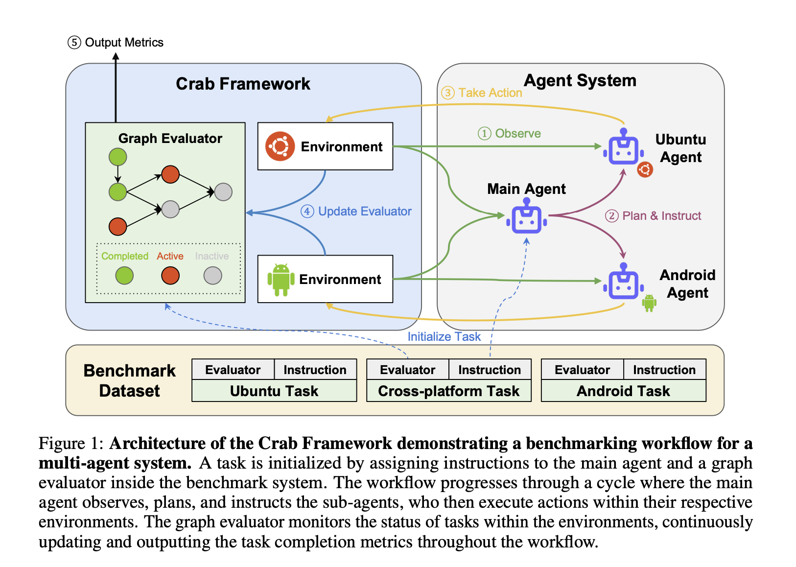

# Crab Framework Released: An AI Framework for Building LLM Agent Benchmark Environments in a Python-Centric Way

> The development of autonomous agents capable of performing complex tasks across various environments has gained significant traction in artificial intelligence research. These agents are designed to interpret and execute natural language instructions within graphical user interface (GUI) environments, such as websites, desktop operating systems, and mobile devices. The ability of these agents to seamlessly navigate […]

The development of autonomous agents capable of performing complex tasks across various environments has gained significant traction in artificial intelligence research. These agents are designed to interpret and execute natural language instructions within graphical user interface (GUI) environments, such as websites, desktop operating systems, and mobile devices. The ability of these agents to seamlessly navigate and perform tasks in these diverse environments is crucial for advancing human-computer interaction, allowing machines to handle increasingly intricate functions that span multiple platforms and systems.

A major challenge in this area is the development of reliable benchmarks that can accurately assess the performance of these agents in real-world scenarios. Traditional benchmarks often fail to meet this need due to limitations, such as a narrow focus on single-environment tasks, reliance on static datasets, and simplistic evaluation methods that do not reflect the dynamic nature of real-world applications. For example, existing benchmarks evaluate agents based on whether they achieve a final goal without considering the incremental progress made during the task or the multiple valid approaches an agent might take. This results in a less comprehensive evaluation that may not accurately capture the agent’s capabilities.

Researchers from KAUST, Eigent.AI, UTokyo, CMU, Stanford, Harvard, Tsinghua, SUSTech, and Oxford have developed the** **[**Crab framework**](https://github.com/camel-ai/crab), a novel benchmarking tool designed to evaluate cross-environment tasks. This framework stands out by supporting functions that span multiple devices and platforms, such as desktops and mobile phones, and by incorporating a graph-based evaluation method that offers a more detailed and nuanced assessment of an agent’s performance. Unlike traditional benchmarks, the Crab framework allows for the simultaneous operation of agents across different environments, making it more reflective of the complexities agents face in real-world scenarios.

The Crab framework introduces an innovative approach to task evaluation by decomposing complex tasks into smaller, manageable sub-tasks, each represented as nodes in a directed acyclic graph (DAG). This graph-based structure enables the sequential and parallel execution of sub-tasks, evaluated at multiple points rather than just at the end. This approach allows for assessing an agent’s performance at each task step, providing a more accurate picture of how well the agent functions across different environments. The flexibility of this method also accommodates multiple valid pathways to completing a task, ensuring a fairer and more comprehensive evaluation.

In the Crab Benchmark-v0, the researchers implemented a set of 100 real-world tasks that span both cross-environment and single-environment challenges. These tasks are designed to reflect common real-world applications, such as managing calendars, sending emails, navigating maps, and interacting with web browsers and terminal commands. The benchmark includes 29 tasks for Android devices, 53 tasks for Ubuntu desktops, and 18 tasks that require interaction between both environments. This comprehensive set of functions allows for a rigorous assessment of how well agents can perform across different platforms, simulating real-world conditions as closely as possible.

The research team tested the Crab framework using four advanced multimodal language models (MLMs): GPT-4o, GPT-4 Turbo, Claude 3 Opus, and Gemini 1.5 Pro. The agents were evaluated in single-agent and multi-agent configurations, with nine different agent settings tested. The results revealed that the single-agent setup using the GPT-4o model achieved the highest task completion ratio of 35.26%, indicating its superior ability to handle cross-environment tasks. In contrast, other models and configurations showed varying effectiveness, with multi-agent structures generally performing slightly lower than single-agent setups. The performance metrics introduced by the Crab framework, such as Completion Ratio (CR), Execution Efficiency (EE), and Cost Efficiency (CE), successfully differentiated between the methods, highlighting the strengths & weaknesses of each model.

The framework also provided insights into why tasks were not completed, with the termination reasons categorized as False Completion, Reach Step Limit, and Invalid Action. For instance, multi-agent structures were more likely to produce invalid actions or incorrectly complete tasks due to potential miscommunication between agents. This analysis underlined the importance of improving communication protocols within multi-agent systems to enhance their overall performance.

In conclusion, the Crab framework introduces a detailed graph-based evaluation method and supports cross-environment tasks, offering a more dynamic and accurate assessment of agent performance. The benchmark’s rigorous testing with advanced MLMs such as GPT-4o and GPT-4 Turbo has provided valuable insights into the capabilities & challenges of current autonomous agents, paving the way for future research and development in this field. The framework’s ability to closely mirror real-world conditions makes it a critical tool for advancing the state of autonomous agent research.

---

Check out the **[Paper](https://arxiv.org/abs/2407.01511)**, **[GitHub](https://github.com/camel-ai/crab)**, and **[Project Page](https://crab.camel-ai.org/)**. All credit for this research goes to the researchers of this project. Also, don’t forget to follow us on **[Twitter](https://twitter.com/Marktechpost)** and join our **[Telegram Channel](https://pxl.to/at72b5j)** and [**LinkedIn Gr**](https://www.linkedin.com/groups/13668564/)[**oup**](https://www.linkedin.com/groups/13668564/). **If you like our work, you will love our**[** newsletter..**](https://marktechpost-newsletter.beehiiv.com/subscribe)

Don’t Forget to join our **[48k+ ML SubReddit](https://www.reddit.com/r/machinelearningnews/)**

**Find Upcoming [AI Webinars here](https://www.marktechpost.com/ai-webinars-list-llms-rag-generative-ai-ml-vector-database/)**

---

> [Arcee AI Released DistillKit: An Open Source, Easy-to-Use Tool Transforming Model Distillation for Creating Efficient, High-Performance Small Language Models](https://www.marktechpost.com/2024/08/01/arcee-ai-released-distillkit-an-open-source-easy-to-use-tool-transforming-model-distillation-for-creating-efficient-high-performance-small-language-models/)
