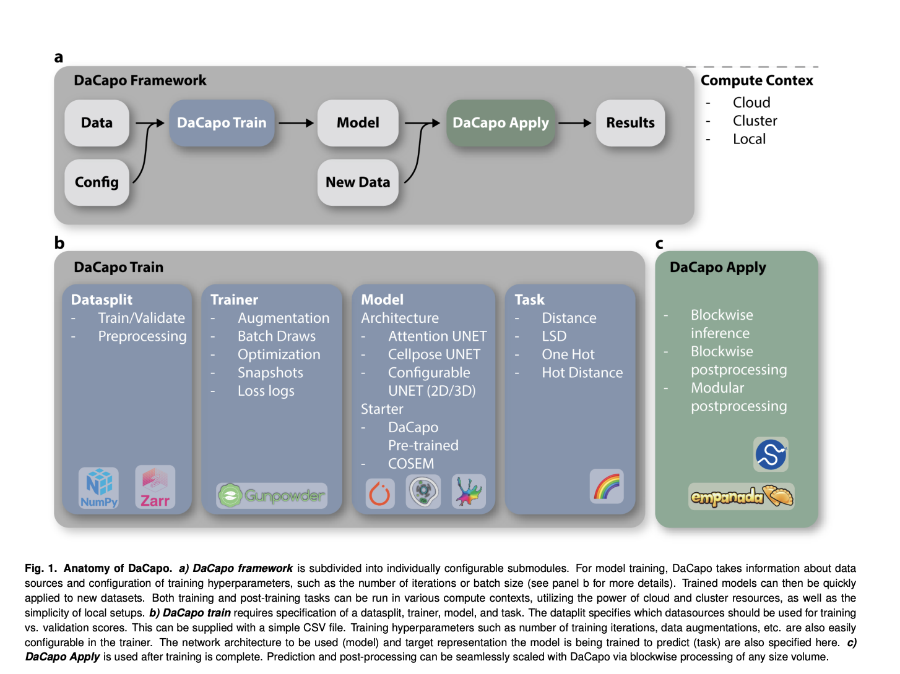

# DaCapo: An Open-Sourced Deep Learning Framework to Expedite the Training of Existing Machine Learning Approaches on Large and Near-Isotropic Image Data

> Accurate segmentation of structures like cells and organelles is crucial for deriving meaningful biological insights from imaging data. However, as imaging technologies advance, images’ growing size, dimensionality, and complexity present challenges for scaling existing machine-learning techniques. This is particularly evident in volume electron microscopy, such as focused ion beam-scanning electron microscopy (FIB-SEM) with near-isotropic capabilities. […]

Accurate segmentation of structures like cells and organelles is crucial for deriving meaningful biological insights from imaging data. However, as imaging technologies advance, images’ growing size, dimensionality, and complexity present challenges for scaling existing machine-learning techniques. This is particularly evident in volume electron microscopy, such as focused ion beam-scanning electron microscopy (FIB-SEM) with near-isotropic capabilities. Traditional 2D neural network-based segmentation methods still need to be fully optimized for these high-dimensional imaging modalities, highlighting the need for more advanced approaches to handle the increased data complexity effectively.

Researchers at Janelia Research Campus have developed DaCapo, an open-source framework designed for scalable deep learning applications, particularly for segmenting large and complex imaging datasets like those produced by FIB-SEM. DaCapo’s modular design allows customization to suit various needs, such as 2D or 3D segmentation, isotropic or anisotropic data, and different neural network architectures. It supports blockwise distributed deployment across local, cluster, or cloud infrastructures, making it adaptable to different computational environments. DaCapo aims to enhance accessibility to large-scale image segmentation and invites community collaboration.

DaCapo streamlines the training process for deep learning models by managing data loading, augmentation, loss calculation, and parameter optimization. Users can easily designate data subsets for training or validation using a CSV file. DaCapo handles model checkpointing and performs parameter sweeps for post-processing, evaluating performance metrics like F1-score, Jaccard index, and Variation of Information. It also offers flexibility in task specification, allowing users to switch between segmentation tasks and prediction targets with minimal code changes. This modular design enables easy customization and scalability across various computational environments, enhancing the efficiency of model training and deployment.

DaCapo is a comprehensive framework designed for training and deploying deep learning models, particularly for large-scale biological image segmentation. It includes pre-built model architectures, such as 2D and 3D UNets, and supports the integration of user-trained or pretrained models. Notably, it provides access to pretrained networks from the COSEM Project Team, which are useful for segmenting cells and subcellular structures in FIB-SEM images. Users can download and fine-tune these models for specific datasets, with future models like CellMap expected to be added to DaCapo’s offerings. The platform encourages community contributions to expand its model repository.

To handle petabyte-scale datasets, DaCapo utilizes blockwise inference and post-processing, leveraging tools like Daisy and chunked file formats (e.g., Zarr-V2 and N5) to efficiently process large volumes of data. This approach eliminates edge artifacts and allows for the seamless parallelization of both semantic and instance segmentation tasks. Users can also create custom scripts for tailored post-processing without expertise in parallelization or chunked formats. An example implementation includes using Empanada for mitochondria segmentation in large image volumes, showcasing the platform’s versatility and scalability.

DaCapo’s compute context configuration offers flexibility in managing operations on local nodes, distributed clusters, or cloud environments. It supports a range of storage options and compute environments, with easy deployment facilitated by a Docker image for cloud resources like AWS. The platform continuously evolves, with plans to enhance its user interface, expand its pretrained model repository, and improve scalability. The DaCapo team invites the community to contribute to its ongoing development, aiming to advance the field of biological image analysis.

---

Check out the **[Paper](https://arxiv.org/abs/2408.02834v1)** and **[GitHub](https://github.com/janelia-cellmap/dacapo)**. All credit for this research goes to the researchers of this project. Also, don’t forget to follow us on **[Twitter](https://twitter.com/Marktechpost)** and join our **[Telegram Channel](https://pxl.to/at72b5j)** and [**LinkedIn Gr**](https://www.linkedin.com/groups/13668564/)[**oup**](https://www.linkedin.com/groups/13668564/). **If you like our work, you will love our**[** newsletter..**](https://marktechpost-newsletter.beehiiv.com/subscribe)

Don’t Forget to join our **[48k+ ML SubReddit](https://www.reddit.com/r/machinelearningnews/)**

**Find Upcoming [AI Webinars here](https://www.marktechpost.com/ai-webinars-list-llms-rag-generative-ai-ml-vector-database/)**

---

> [Researchers at FPT Software AI Center Introduce XMainframe: A State-of-the-Art Large Language Model (LLM) Specialized for Mainframe Modernization to Address the $100B Legacy Code Modernization](https://www.marktechpost.com/2024/08/12/researchers-at-fpt-software-ai-center-introduce-xmainframe-a-state-of-the-art-large-language-model-llm-specialized-for-mainframe-modernization-to-address-the-100b-legacy-code-modernization/)
