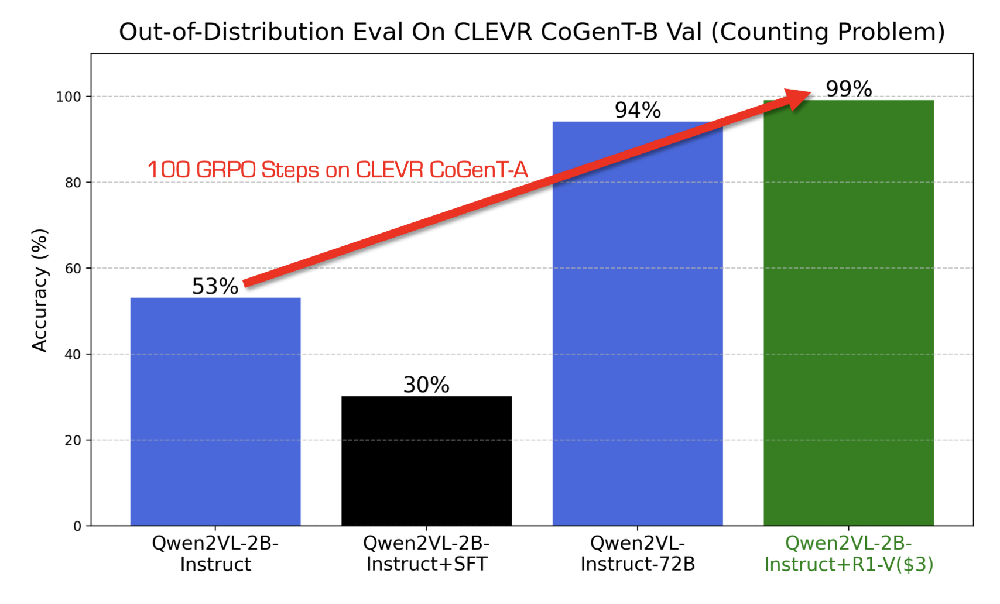

# Deep Agent Released R1-V: Reinforcing Super Generalization in Vision-Language Models with Cost-Effective Reinforcement Learning to Outperform Larger Models

> Vision-language models (VLMs) face a critical challenge in achieving robust generalization beyond their training data while maintaining computational resources and cost efficiency. Approaches, such as chain-of-thought supervised fine-tuning (CoT-SFT), often lead to overfitting, where models perform well on seen data but struggle with new, unseen scenarios. This limitation reduces their effectiveness in applications that demand […]

Vision-language models (VLMs) face a critical challenge in achieving robust generalization beyond their training data while maintaining computational resources and cost efficiency. Approaches, such as chain-of-thought supervised fine-tuning (CoT-SFT), often lead to overfitting, where models perform well on seen data but struggle with new, unseen scenarios. This limitation reduces their effectiveness in applications that demand adaptability, such as autonomous systems, medical imaging, and visual reasoning tasks. Also, the prevailing assumption is that increasing model size is the key to improved performance. The need for a more efficient training paradigm that enhances generalization, minimizes overfitting and reduces computational costs has become crucial for advancing VLMs.

[Deep Agent released R1-V](https://github.com/Deep-Agent/R1-V) to resolve some of the above concerns. This novel reinforcement learning approach enhances the generalization ability of VLMs while being cost-effective. This approach demonstrates how _reinforcement learning with verifiable rewards (RLVR)_ can outperform traditional CoT-SFT in effectiveness and robustness when dealing with out-of-distribution (OOD) data.

The main objective of the R1-V approach is to enhance VLMs’ ability to generalize beyond their training datasets. R1-V tackles this issue by employing reinforcement learning techniques that guide the model to learn generalizable skills rather than memorizing training examples. In particular, it focuses on teaching VLMs to develop robust visual counting abilities, an essential skill in many AI applications, including image recognition, autonomous systems, and visual reasoning.

*[**Image Source**](https://github.com/Deep-Agent/R1-V)*

_A major highlight of R1-V is its training efficiency. Despite utilizing a relatively small model with only 2 billion parameters, R1-V performs better than a significantly larger 72 billion parameter model in OOD tests._ This demonstrates that model size is not the sole determinant of performance; the training methodology and reinforcement learning strategies are crucial in enhancing a model’s capabilities.

R1-V was trained on eight A100 GPUs for 30 minutes, with a total computational cost of only $2.62. This cost-effectiveness makes it an attractive alternative for researchers and developers who wish to achieve high performance without extensive computational resources. R1-V also stands out due to its reliance on a curated training dataset. The model was trained using [CLEVR-70k](https://huggingface.co/datasets/leonardPKU/clevr_cogen_a_train) and [R1-Distilled Visual Reasoning datasets](https://huggingface.co/datasets/MMInstruction/Clevr_CoGenT_TrainA_R1), specifically designed to encourage visual reasoning and robust decision-making. Using these datasets ensures that the model develops a deep understanding of visual relationships and logical reasoning rather than simply learning to recognize patterns from a given dataset.

*[**Image Source**](https://github.com/Deep-Agent/R1-V)*

In conclusion, the development of R1-V supports open-source AI research by making its code, model weights, datasets, and training scripts publicly available. This allows the AI research community to refine and improve vision-language modeling. R1-V’s reinforcement learning approach enables rapid learning of patterns and structures in data. It leads to high performance with minimal computational cost. This challenges the assumption that extensive training and massive datasets are necessary for state-of-the-art AI performance. Instead, efficient training methodologies can reduce computational demands while maintaining or surpassing traditional results.

---

Check out **_the [GitHub Page](https://github.com/Deep-Agent/R1-V)._** All credit for this research goes to the researchers of this project. Also, don’t forget to follow us on **[Twitter](https://x.com/intent/follow?screen_name=marktechpost)** and join our **[Telegram Channel](https://arxiv.org/abs/2406.09406)** and [**LinkedIn Gr**](https://www.linkedin.com/groups/13668564/)[**oup**](https://www.linkedin.com/groups/13668564/). Don’t Forget to join our **[75k+ ML SubReddit](https://www.reddit.com/r/machinelearningnews/)**.

🚨 [**Marktechpost is inviting AI Companies/Startups/Groups to partner for its upcoming AI Magazines on ‘Open Source AI in Production’ and ‘Agentic AI’.**](https://www.marktechpost.com/ai-magazine/)
