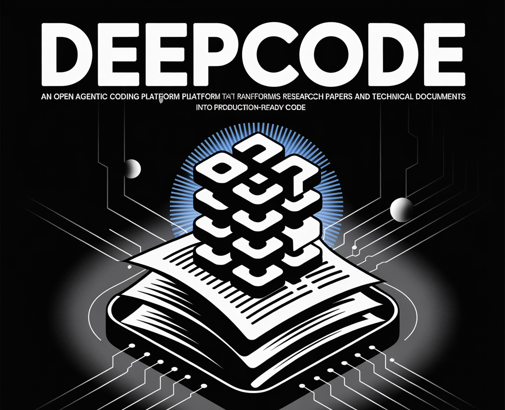

# DeepCode: An Open Agentic Coding Platform that Transforms Research Papers and Technical Documents into Production-Ready Code

> The emergence of advanced AI development tools is revolutionizing the way researchers and engineers translate groundbreaking academic ideas into robust, real-world applications. A team of researchers from the University of Hong Kong release DeepCode. DeepCode proposes an “Open Agentic Coding” paradigm, leveraging multi-agent AI systems to automate coding processes from research paper interpretation through to […]

The emergence of advanced AI development tools is revolutionizing the way researchers and engineers translate groundbreaking academic ideas into robust, real-world applications. A team of researchers from the University of Hong Kong release **DeepCode**. DeepCode proposes an “Open Agentic Coding” paradigm, leveraging multi-agent AI systems to automate coding processes from research paper interpretation through to production-ready codebases.

### What Is DeepCode?

**[DeepCode](https://github.com/HKUDS/DeepCode?tab=readme-ov-file)** is an open-source AI-powered coding platform designed to automate software development by orchestrating a suite of specialized agents. It can process diverse inputs, including research papers, technical documents, plain language specifications, and URLs, and transmute them directly into **production-grade code**, including full-stack applications with backend, frontend, documentation, and automated tests.


### Key Features

**DeepCode offers several novel features:**

- **Paper2Code**: Automatically converts complex research algorithms and academic concepts into high-quality, reproducible implementations. This feature targets one of the most time-consuming aspects of AI and technical research: the manual translation of research papers into functional code.

- **Text2Web**: Takes plain textual descriptions and generates visually appealing, fully functional web interfaces, accelerating front-end prototyping.

- **Text2Backend**: Converts text requirements into efficient, scalable backend code, streamlining server-side development for rapid iteration.[g](https://github.com/HKUDS/DeepCode)

- **Quality Assurance Automation**: Performs integrated static analysis, generates unit tests, and synthesizes documentation for comprehensive code validation.

### Multi-Agent Architecture

At the core of DeepCode is a complex multi-agent system. Key agents include:

- **Central Orchestrating Agent**: Leads workflow execution, making high-level decisions and coordinating task distribution.

- **Intent Understanding Agent**: Parses user requirements—whether ambiguous or technical—into structured, actionable specifications.

- **Document Parsing Agent**: Deciphers technical documents and research papers to extract algorithms, implementation details, and experiment configurations.

- **Code Planning & Reference Mining Agents**: Analyze technology stacks, search repositories for reusable components, and optimize architecture design.

- **Code Generation Agent**: Synthesizes workflow outputs into executable code, interface elements, API endpoints, schemas, and full-stack deployments.

Each agent specializes in a facet of the coding lifecycle, but collectively, the system delivers an end-to-end, context-aware automation pipeline—from requirement decomposition to code delivery.

### Technical Details

**DeepCode’s agentic pipeline offers several advanced capabilities:**

- **Research-to-Production Pipeline**: Uses multi-modal document analysis to extract algorithms and mathematical models from papers, targeting reproducibility and fidelity to original research.

- **Context-Aware Code Synthesis**: Employs fine-tuned language models to maintain architectural consistency and optimize for code patterns observed in large repositories.

- **Automated Prototyping**: Produces entire application scaffolds—databases, APIs, interfaces—using dependency analysis for scalable software architectures.

- **Retrieval-Augmented Generation (CodeRAG)**: Integrates semantic and graph-based dependency analysis for optimal library selection and implementation strategy.

### Workflow Example

- **Input**: The user provides a research paper, technical requirements, or project specifications (PDF/text/URL).

- **Processing**: DeepCode’s orchestrating agent decomposes requirements, document parsing agents extract algorithms and specs, reference miners find libraries, and the planning agent selects architecture.

- **Code Generation**: The code generation agent produces executable code, test suites, and documentation.

- **Validation**: QA automation agents test and verify the code before delivering the final output.

### Real-World Impact

**DeepCode directly addresses critical bottlenecks in AI, machine learning, and academic software development:**

- **Accelerates Research Implementation**: Researchers can move from theoretical concepts to working prototypes in hours instead of weeks or months.

- **Standardizes Reproducibility**: Automated extraction of code from papers improves reproducibility and accelerates peer review and open science efforts.

- **Scales Developer Productivity**: By handling repetitive and complex translation tasks, DeepCode frees developers to focus on innovation rather than boilerplate coding.

**DeepCode is available via PyPI or source install, supporting CLI and Streamlit-based web interfaces:**

- **Via pip**:

Copy CodeCopiedUse a different Browser
```
pip install deepcode-hku

```

- **Web Interface**: Run `deepcode` to launch a visual dashboard locally.

- **Configurable Search & Document Processing**: Supports Brave and Bocha-MCP search servers with API keys, and features robust document segmentation for handling large technical papers.

### Conclusion

DeepCode exemplifies the next frontier of agentic development: adaptive, intelligent, and fully automated translation of technical knowledge into functioning software. Whether you’re an AI researcher, academic, or developer, DeepCode can be helpful to transform your workflow from idea to implementation—with the added benefits of reproducibility, rapid prototyping, and streamlined QA.

---

Check out the **[GitHub Page here](https://github.com/HKUDS/DeepCode?tab=readme-ov-file)**. Feel free to check out our **[GitHub Page for Tutorials, Codes and Notebooks](https://github.com/Marktechpost/AI-Tutorial-Codes-Included)**. Also, feel free to follow us on **[Twitter](https://x.com/intent/follow?screen_name=marktechpost)** and don’t forget to join our **[100k+ ML SubReddit](https://www.reddit.com/r/machinelearningnews/)** and Subscribe to **[our Newsletter](https://www.aidevsignals.com/)**.
