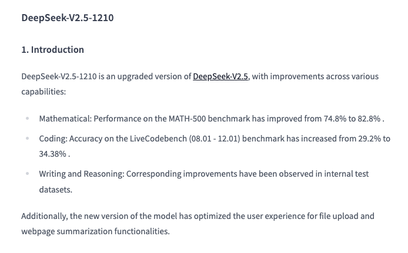

# DeepSeek AI Just Released DeepSeek-V2.5-1210: The Updated Version of DeepSeek-V2.5 with Significant Performance Boosts in Mathematics, Coding, Writing, and Reasoning Tasks

> DeepSeek AI has made significant progress in advancing artificial intelligence, particularly in areas like reasoning, mathematics, and coding. Earlier versions of its models achieved notable success in tackling mathematical and reasoning tasks, but there was room to improve their consistency across a broader range of applications, such as live coding and nuanced writing. These gaps […]

DeepSeek AI has made significant progress in advancing artificial intelligence, particularly in areas like reasoning, mathematics, and coding. Earlier versions of its models achieved notable success in tackling mathematical and reasoning tasks, but there was room to improve their consistency across a broader range of applications, such as live coding and nuanced writing. These gaps highlighted the potential to create a more adaptable and reliable AI model that could excel across diverse use cases.

DeepSeek AI recently released DeepSeek-V2.5-1210, an enhanced version of DeepSeek-V2.5 that delivers major improvements in mathematics, coding, writing, and reasoning tasks. This update addresses previous challenges by refining the model’s core functionalities and introducing optimizations that boost reliability and ease of use. With capabilities like solving complex equations, drafting coherent essays, and summarizing web content effectively, DeepSeek-V2.5-1210 caters to a wide variety of users, including researchers, software developers, educators, and analysts.

DeepSeek-V2.5-1210 incorporates several technical upgrades that make it more effective. Its performance on the MATH-500 dataset improved from 74.8% to 82.8%, showcasing its ability to solve intricate mathematical problems. The LiveCodebench score also rose from 29.2% to 34.38%, reflecting significant progress in live coding tasks. Internal evaluations revealed improvements in writing and reasoning, where the model demonstrated an ability to generate coherent and context-aware outputs. Practical updates like enhanced file upload functionality and better webpage summarization further improve the user experience. These advancements are supported by an optimized Transformer architecture, refined token handling, and better integration of training data, ensuring robust performance across tasks.

The model’s improvements are evident in its benchmark results and real-world applications. The enhanced mathematical accuracy benefits researchers working on complex calculations, while its coding capabilities address practical challenges for developers. Writing and reasoning enhancements, demonstrated through internal tests, show promise in tasks like essay drafting, summarization, and logical analysis. Additionally, the improved file handling and summarization features make it easier for users to integrate the model into their workflows, whether in academia or industry.

In conclusion, DeepSeek-V2.5-1210 marks a noteworthy advancement in AI development. By addressing previous limitations and introducing consistent improvements in mathematics, coding, writing, and reasoning, it provides a dependable tool for a broad range of applications. Its combination of technical sophistication, increased accuracy, and user-friendly features makes it a valuable asset for professionals across various fields. This release reinforces DeepSeek AI’s commitment to innovation and practicality, offering solutions that enhance productivity and problem-solving efficiency.

---

Check out **the _[Model on Hugging Face](https://huggingface.co/deepseek-ai/DeepSeek-V2.5-1210)_**. All credit for this research goes to the researchers of this project. Also, don’t forget to follow us on **[Twitter](https://twitter.com/Marktechpost)** and join our **[Telegram Channel](https://github.com/XGenerationLab/XiYan-SQL)** and [**LinkedIn Gr**](https://www.linkedin.com/groups/13668564/)[**oup**](https://www.linkedin.com/groups/13668564/). Don’t Forget to join our **[60k+ ML SubReddit](https://www.reddit.com/r/machinelearningnews/)**.

**🚨 [[Must Subscribe](https://www.airesearchinsights.com/subscribe)]: [Subscribe to our newsletter to get trending AI research and dev updates](https://www.airesearchinsights.com/subscribe)**
