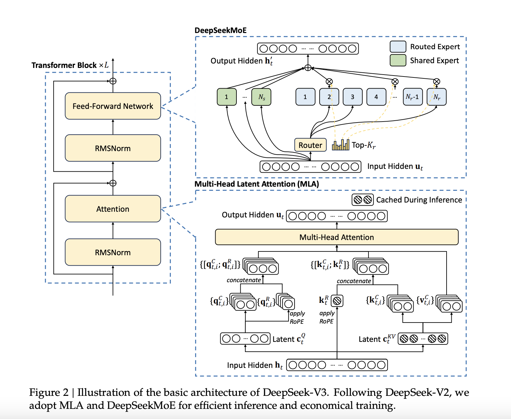

# DeepSeek-AI Just Released DeepSeek-V3: A Strong Mixture-of-Experts (MoE) Language Model with 671B Total Parameters with 37B Activated for Each Token

> The field of Natural Language Processing (NLP) has made significant strides with the development of large-scale language models (LLMs). However, this progress has brought its own set of challenges. Training and inference require substantial computational resources, the availability of diverse, high-quality datasets is critical, and achieving balanced utilization in Mixture-of-Experts (MoE) architectures remains complex. These […]

The field of Natural Language Processing (NLP) has made significant strides with the development of large-scale language models (LLMs). However, this progress has brought its own set of challenges. Training and inference require substantial computational resources, the availability of diverse, high-quality datasets is critical, and achieving balanced utilization in Mixture-of-Experts (MoE) architectures remains complex. These factors contribute to inefficiencies and increased costs, posing obstacles to scaling open-source models to match proprietary counterparts. Moreover, ensuring robustness and stability during training is an ongoing issue, as even minor instabilities can disrupt performance and necessitate costly interventions.

DeepSeek-AI just gave a Christmas present to the AI world by releasing DeepSeek-V3, a Mixture-of-Experts (MoE) language model featuring 671 billion parameters, with 37 billion activated per token. The model builds on proven architectures such as Multi-Head Latent Attention (MLA) and DeepSeekMoE, which were refined in earlier versions. DeepSeek-V3 has been trained on an extensive dataset of 14.8 trillion high-quality tokens, ensuring a broad and diverse knowledge base. Importantly, the model is fully open-source, with accessible models, papers, and training frameworks for the research community to explore.

### Technical Details and Benefits

DeepSeek-V3 incorporates several innovations aimed at addressing long-standing challenges in the field. Its auxiliary-loss-free load balancing strategy ensures efficient distribution of computational loads across experts while maintaining model performance. The adoption of a multi-token prediction training objective enhances data efficiency and facilitates faster inference through speculative decoding. Additionally, FP8 mixed precision training improves computational efficiency by reducing GPU memory usage without sacrificing accuracy. The DualPipe algorithm further minimizes pipeline bubbles by overlapping computation and communication phases, reducing all-to-all communication overhead. These advancements enable DeepSeek-V3 to process 60 tokens per second during inference—a significant improvement over its predecessor.

### Performance Insights and Results

DeepSeek-V3 has been rigorously evaluated across multiple benchmarks, demonstrating strong performance. On educational datasets like MMLU and MMLU-Pro, it achieved scores of 88.5 and 75.9, respectively, outperforming other open-source models. In mathematical reasoning tasks, it set new standards with a score of 90.2 on MATH-500. The model also performed exceptionally in coding benchmarks such as LiveCodeBench. Despite these achievements, the training cost was kept relatively low at $5.576 million, requiring only 2.788 million H800 GPU hours. These results highlight DeepSeek-V3’s efficiency and its potential to make high-performance LLMs more accessible.

### Conclusion

DeepSeek-V3 represents a meaningful advancement in open-source NLP research. By tackling the computational and architectural challenges associated with large-scale language models, it establishes a new benchmark for efficiency and performance. Its innovative training methods, scalable architecture, and strong evaluation results make it a competitive alternative to proprietary models. DeepSeek-AI’s commitment to open-source development ensures that the broader research community can benefit from its advancements.

---

Check out **the _[Paper](https://github.com/deepseek-ai/DeepSeek-V3/blob/main/DeepSeek_V3.pdf), [GitHub Page](https://github.com/deepseek-ai/DeepSeek-V3),_** and **[_Model on Hugging Fac_e](https://huggingface.co/collections/deepseek-ai/deepseek-v3-676bc4546fb4876383c4208b)**. All credit for this research goes to the researchers of this project. Also, don’t forget to follow us on **[Twitter](https://twitter.com/Marktechpost)** and join our **[Telegram Channel](https://github.com/XGenerationLab/XiYan-SQL)** and [**LinkedIn Gr**](https://www.linkedin.com/groups/13668564/)[**oup**](https://www.linkedin.com/groups/13668564/). Don’t Forget to join our **[60k+ ML SubReddit](https://www.reddit.com/r/machinelearningnews/)**.

**[🚨 Trending: LG AI Research Releases EXAONE 3.5: Three Open-Source Bilingual Frontier AI-level Models Delivering Unmatched Instruction Following and Long Context Understanding for Global Leadership in Generative AI Excellence….](https://www.marktechpost.com/2024/12/11/lg-ai-research-releases-exaone-3-5-three-open-source-bilingual-frontier-ai-level-models-delivering-unmatched-instruction-following-and-long-context-understanding-for-global-leadership-in-generative-a/)**
