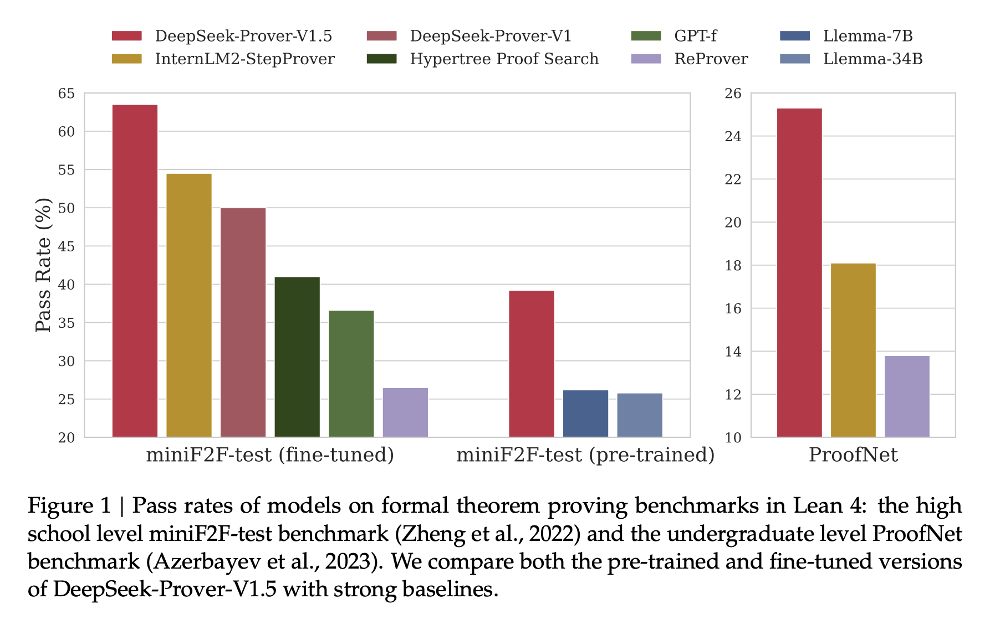

# DeepSeek-AI Open-Sources DeepSeek-Prover-V1.5: A Language Model with 7 Billion Parameters that Outperforms all Open-Source Models in Formal Theorem Proving in Lean 4

> Large language models (LLMs) have made significant strides in mathematical reasoning and theorem proving, yet they face considerable challenges in formal theorem proving using systems like Lean and Isabelle. These systems demand rigorous derivations that adhere to strict formal specifications, posing difficulties even for advanced models such as GPT-4. The core challenge lies in the […]

Large language models (LLMs) have made significant strides in mathematical reasoning and theorem proving, yet they face considerable challenges in formal theorem proving using systems like Lean and Isabelle. These systems demand rigorous derivations that adhere to strict formal specifications, posing difficulties even for advanced models such as GPT-4. The core challenge lies in the model’s need to simultaneously comprehend the syntax and semantics of formal systems while aligning abstract mathematical reasoning with precise formal representations. This complex task requires a deep understanding of coding intricacies and mathematical concepts, creating a significant hurdle for current AI systems in producing complex formal proofs.

Researchers from DeepSeek-AI introduced **_DeepSeek-Prover-V1.5_**, a unified approach that combines the strengths of proof-step and whole-proof generation techniques through a robust truncate-and-resume mechanism. This method begins with whole-proof generation, where the language model produces complete proof code based on the theorem statement. The Lean prover then verifies this code. If an error is detected, the code is truncated at the first error message, and the successfully generated portion serves as a prompt for the next proof segment. The latest state from the Lean 4 prover is appended as a comment to the prompt to enhance accuracy. The truncate-and-resume mechanism is integrated into the Monte-Carlo tree search (MCTS), allowing for flexible truncation points determined by the tree search policy. Also, a reward-free exploration algorithm is proposed to address the reward sparsity issue in proof search, assigning intrinsic motivation to the tree search agent for extensive exploration of the tactic state space.

This study presents the following contributions:

• Pre-Training: Enhanced base model with further training on mathematics and code data, focusing on formal languages like Lean, Isabelle, and Metamath.

• Supervised Fine-Tuning: Improved Lean 4 code completion dataset through two data augmentation techniques:

  1. Used DeepSeek-Coder V2 236B to add natural language chain-of-thought comments.

  2. Inserted intermediate tactic state information within Lean 4 proof code.

• Reinforcement Learning: Employed GRPO algorithm for reinforcement learning from proof assistant feedback (RLPAF), using Lean prover verification results as rewards.

• Monte-Carlo Tree Search: Advanced tree search method with:

 1. Truncate-and-resume mechanism as state-action abstraction.

 2. RMaxTS algorithm, utilizing RMax strategy for exploration in sparse-reward proof search.

 3. Assigned intrinsic rewards to encourage diverse planning paths and extensive proof space exploration.

DeepSeek-Prover-V1.5 demonstrates significant advancements in formal theorem proving across multiple benchmarks. On the miniF2F-test dataset, DeepSeek-Prover-V1.5-RL achieved a 60.2% pass rate in a single-pass whole-proof generation, marking a 10.2 percentage point improvement over its predecessor. With a limited sampling budget of 128 attempts, it proved 51.6% of problems, outperforming other whole-proof generation methods and matching leading tree search methods. When enhanced with RMaxTS tree search, DeepSeek-Prover-V1.5-RL achieved a state-of-the-art 62.7% pass rate. Also, it surpassed the previous best result with significantly fewer samplings. On the ProofNet dataset, DeepSeek-Prover-V1.5-RL achieved pass rates of 22.6% and 25.3% in single-pass and RMaxTS-enhanced settings respectively, outperforming existing methods. These results demonstrate DeepSeek-Prover-V1.5’s superior performance across different theorem-proving tasks and methodologies.

_DeepSeek-Prover-V1.5_, a 7 billion parameter language model, sets new benchmarks in formal theorem proving using Lean 4. Built on DeepSeek-Prover-V1.5-Base, it undergoes specialized pre-training, comprehensive supervised fine-tuning, and reinforcement learning via GRPO. The model incorporates RMaxTS, an innovative Monte-Carlo tree search variant, to enhance problem-solving through extensive exploration. This framework establishes an AlphaZero-like pipeline for formal theorem proving, utilizing expert iteration and synthetic data. While the current focus is on exploration, future developments may include a critic model for assessing incomplete proofs, addressing the exploitation aspect of reinforcement learning in theorem proving.

---

Check out the **[Paper ](https://arxiv.org/abs/2408.08152)and [GitHub](https://github.com/deepseek-ai/DeepSeek-Prover-V1.5).** All credit for this research goes to the researchers of this project. Also, don’t forget to follow us on **[Twitter](https://twitter.com/Marktechpost)** and join our **[Telegram Channel](https://pxl.to/at72b5j)** and [**LinkedIn Gr**](https://www.linkedin.com/groups/13668564/)[**oup**](https://www.linkedin.com/groups/13668564/). **If you like our work, you will love our**[** newsletter..**](https://marktechpost-newsletter.beehiiv.com/subscribe)

Don’t Forget to join our **[48k+ ML SubReddit](https://www.reddit.com/r/machinelearningnews/)**

**Find Upcoming [AI Webinars here](https://www.marktechpost.com/ai-webinars-list-llms-rag-generative-ai-ml-vector-database/)**
