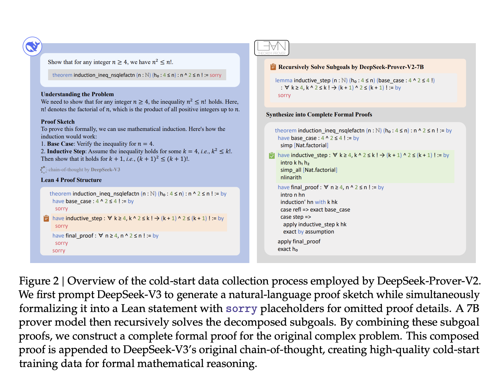

# DeepSeek-AI Released DeepSeek-Prover-V2: An Open-Source Large Language Model Designed for Formal Theorem, Proving through Subgoal Decomposition and Reinforcement Learning

> Formal mathematical reasoning has evolved into a specialized subfield of artificial intelligence that requires strict logical consistency. Unlike informal problem solving, which allows for intuition and loosely defined heuristics, formal theorem proving relies on every step being fully described, precise, and verifiable by computational systems. Proof assistants, such as Lean, Coq, and Isabelle, serve as […]

Formal mathematical reasoning has evolved into a specialized subfield of artificial intelligence that requires strict logical consistency. Unlike informal problem solving, which allows for intuition and loosely defined heuristics, formal theorem proving relies on every step being fully described, precise, and verifiable by computational systems. Proof assistants, such as Lean, Coq, and Isabelle, serve as the structural frameworks within which these formal proofs are constructed. Their operation demands logical soundness with no space for omissions, approximations, or unstated assumptions. This makes the challenge particularly demanding for AI systems, especially large language models, which excel in producing coherent natural language responses but typically lack the rigor to produce verifiable formal proofs. However, the desire to blend these strengths, AI’s fluency in informal reasoning and the structure of formal verification, has led to new innovations at the interface of language modeling and formal logic automation.

A major issue arises from the inability of current language models to bridge the conceptual divide between informal and formal reasoning. Language models typically excel at generating human-like explanations and solving math problems written in natural language. However, this reasoning is inherently informal and often lacks the structural precision required by formal logic systems. While humans can intuitively leap from one deductive step to another, proof assistants require a fully specified sequence of steps, free of ambiguity. Thus, the challenge is to guide AI models to produce logically coherent formal outputs from their otherwise informal and intuitive internal reasoning processes. This problem becomes increasingly complex when handling advanced theorems from domains such as number theory or geometry, where precision is crucial.

Recent efforts have attempted to address this issue by guiding models first to generate natural language proof sketches, which are then manually or semi-automatically translated into formal proof steps. A known strategy includes decomposing a complex theorem into smaller subgoals. Each subgoal represents a lemma that can be tackled independently and later combined to form a complete proof. Frameworks like “Draft, Sketch, and Prove” have applied this idea, using language models to generate proof outlines that are then translated into formal language. Another method employs hierarchical reinforcement learning, breaking down complex mathematical problems into simpler layers. However, these models often struggle to produce fully verifiable outputs in Lean or Coq environments. Moreover, the training data for these models is usually limited, and proof attempts frequently fail to yield successful outcomes that provide useful learning signals.

A team of researchers from DeepSeek-AI has introduced a new model, [DeepSeek-Prover-V2](https://github.com/deepseek-ai/DeepSeek-Prover-V2?tab=readme-ov-file), designed to generate formal mathematical proofs by leveraging subgoal decomposition and reinforcement learning. The core of their approach utilizes DeepSeek-V3 to break down a complex theorem into manageable subgoals, each of which is translated into a “have” statement in Lean 4 with a placeholder indicating that the proof is incomplete. These subgoals are then passed to a 7B-sized prover model that completes each proof step. Once all steps are resolved, they are synthesized into a complete Lean proof and paired with the original natural language reasoning generated by DeepSeek-V3. This forms a rich cold-start dataset for reinforcement learning. Importantly, the model’s training is entirely bootstrapped from synthetic data, with no human-annotated proof steps used.

The cold-start pipeline begins by prompting DeepSeek-V3 to create proof sketches in natural language. These sketches are transformed into formal theorem statements with unresolved parts. A key innovation lies in recursively solving each subgoal using the 7B prover, reducing computation costs while maintaining formal rigor. Researchers constructed a curriculum learning framework that increased the complexity of training tasks over time. They also implemented two types of subgoal theorems, one incorporating preceding subgoals as premises, and one treating them independently. This dual structure was embedded into the model’s expert iteration stage to train it on progressively more challenging problem sets. The model’s capability was then reinforced through a consistency-based reward system during training, ensuring that all decomposed lemmas were correctly incorporated into the final formal proof.

On the MiniF2F-test benchmark, the model achieved an 88.9% pass rate with high sampling (Pass@8192), compared to 82.0% by Kimina-Prover and 64.7% by Geodel-Prover. It also solved 49 out of 658 problems from PutnamBench, a platform featuring challenging mathematical tasks. On the newly introduced ProverBench dataset, comprising 325 formalized problems, the model addressed 6 out of 15 issues from the AIME (American Invitational Mathematics Examination) competitions for the years 2024 and 2025. These benchmarks highlight the model’s generalization ability across multiple formal reasoning tasks. Even when compared to DeepSeek-V3, which employs natural-language reasoning, the new model demonstrates competitive performance, solving a comparable number of AIME problems while ensuring formal verifiability.

**Several Key Takeaways from the Research on DeepSeek-Prover-V2:**

- DeepSeek-Prover-V2 achieved an 88.9% pass rate on the MiniF2F-test (Pass@8192), the highest reported among formal reasoning models so far.

- The model successfully solved 49 out of 658 problems from the PutnamBench dataset, which contains advanced mathematical challenges.

- It tackled 6 out of 15 problems from the recent AIME 2024–2025 competitions, showcasing real-world applicability.

- A new benchmark, ProverBench, comprising 325 formal problems, has been introduced for evaluating formal reasoning models.

- The pipeline unifies natural language proof sketching and formal proof construction by combining DeepSeek-V3 and a 7B prover model.

- Two types of subgoal decompositions—one with and one without dependent premises—were used to train the model in a structured, curriculum-guided manner.

- Reinforcement learning with a consistency-based reward significantly improved proof accuracy by enforcing structural alignment between sketch and solution.

- The entire training strategy relies on synthetic cold-start data, eliminating dependence on manually labeled proofs.

---

**Check out the model on [Paper](https://github.com/deepseek-ai/DeepSeek-Prover-V2/blob/main/DeepSeek_Prover_V2.pdf) and [GitHub Page](https://github.com/deepseek-ai/DeepSeek-Prover-V2?tab=readme-ov-file)**. Also, don’t forget to follow us on **[Twitter](https://x.com/intent/follow?screen_name=marktechpost)** and join our **[Telegram Channel](https://arxiv.org/abs/2406.09406)** and [**LinkedIn Gr**](https://www.linkedin.com/groups/13668564/)[**oup**](https://www.linkedin.com/groups/13668564/). Don’t Forget to join our **[90k+ ML SubReddit](https://www.reddit.com/r/machinelearningnews/)**.

[**🔥 [Register Now] miniCON Virtual Conference on AGENTIC AI: FREE REGISTRATION + Certificate of Attendance + 4 Hour Short Event (May 21, 9 am- 1 pm PST) + Hands on Workshop**](https://minicon.marktechpost.com/)
