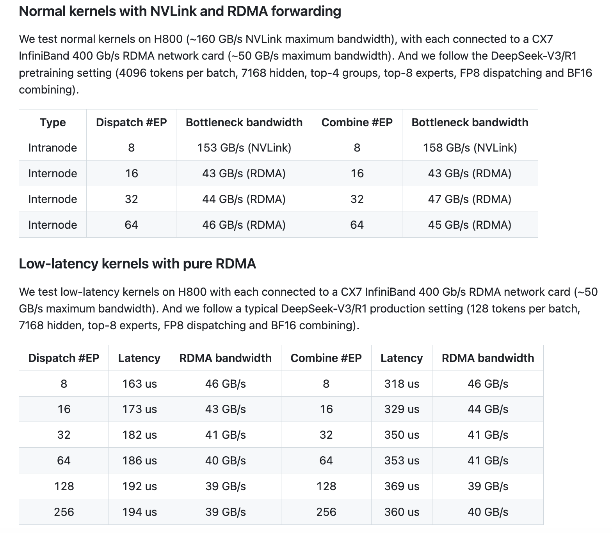

# DeepSeek AI Releases DeepEP: An Open-Source EP Communication Library for MoE Model Training and Inference

> Large language models that use the Mixture-of-Experts (MoE) architecture have enabled significant increases in model capacity without a corresponding rise in computation. However, this approach also introduces challenges—especially when it comes to communication between GPUs. In MoE models, only a subset of experts is active for any given token, so efficiently exchanging data among devices […]

Large language models that use the Mixture-of-Experts (MoE) architecture have enabled significant increases in model capacity without a corresponding rise in computation. However, this approach also introduces challenges—especially when it comes to communication between GPUs. In MoE models, only a subset of experts is active for any given token, so efficiently exchanging data among devices is critical. Traditional methods for all-to-all communication can create bottlenecks that increase latency and underutilize GPU resources. In latency-sensitive settings, such as real-time inference, even small delays can affect overall performance. Moreover, while low-precision operations (such as FP8) help reduce memory usage, they require careful optimization to maintain model quality. These issues underscore the need for a communication library tailored to the specific demands of expert parallelism.

DeepSeek AI has recently introduced DeepEP, a communication library specifically designed for MoE models and expert parallelism (EP). DeepEP addresses the inefficiencies inherent in how tokens are dispatched and aggregated across GPUs. The library provides high-throughput, low-latency all-to-all GPU kernels—commonly referred to as MoE dispatch and combine kernels—that streamline data exchange during both training and inference. Notably, DeepEP supports low-precision operations (including FP8), aligning with techniques detailed in the DeepSeek-V3 paper. This release responds directly to the challenges of scaling MoE architectures in both intranode and internode environments.

### Technical Overview and Benefits

DeepEP offers two primary types of kernels designed to meet different operational needs:

- **Normal Kernels:** These kernels are optimized for scenarios that require high throughput, such as during the pre-filling phase of inference or training. They efficiently forward data across GPUs by taking advantage of both NVLink and RDMA networking technologies. For instance, tests on Hopper GPUs with NVLink have shown throughput around 153 GB/s for intranode communication, while internode tests using CX7 InfiniBand (approximately 50 GB/s bandwidth) achieve stable performance near 43–47 GB/s. By maximizing available bandwidth, these kernels reduce communication overhead during token dispatch and result combining.

- **Low-Latency Kernels:** For inference tasks where responsiveness is crucial, DeepEP provides low-latency kernels that rely solely on RDMA. These kernels are tailored to handle small batches—common in real-time applications—with reported latencies as low as 163 microseconds for dispatch operations involving eight experts. The design also incorporates a hook-based communication-computation overlapping technique that allows data transfers to occur concurrently with computation, without consuming GPU streaming multiprocessors (SMs).

DeepEP further offers flexibility through adaptive configurations. Users can adjust parameters such as the number of SMs in use or set environment variables (for example, `NVSHMEM_IB_SL`) to manage traffic isolation. Adaptive routing, which is currently supported in the low-latency kernels, helps distribute network traffic evenly under heavy loads, thereby improving robustness.

### Performance Insights and Practical Outcomes

The performance metrics for DeepEP are noteworthy. In typical tests using normal kernels, intranode communication can achieve throughput up to 153 GB/s, and internode setups maintain around 43–47 GB/s over RDMA. Low-latency kernels are particularly effective in production scenarios; for a batch of 128 tokens processed with eight experts, dispatch latency can be as low as 163 microseconds. Such improvements mean that the overall inference process becomes more efficient, allowing for larger batch sizes and smoother overlap between computation and communication.

In practical terms, these optimizations lead to faster response times in inference decoding and improved throughput in training scenarios. The inclusion of FP8 support not only lowers the memory footprint but also facilitates quicker data transfers, which is essential when deploying models in environments where resources are limited.

### Conclusion

DeepEP is a thoughtful contribution to the field of large-scale language model deployment. By addressing key communication bottlenecks in MoE architectures, it enables more efficient training and inference. Its dual-kernel approach—with one set designed for high throughput and another for low latency—offers flexibility for a range of applications. Built with support for low-precision operations and equipped with mechanisms for adaptive configuration, DeepEP provides researchers and developers a practical tool to further optimize expert parallelism.

In summary, DeepSeek AI’s release of DeepEP represents a careful, well-engineered solution that balances performance with resource efficiency. Its design helps pave the way for more scalable and responsive AI models, supporting both academic research and real-world applications in a cost-effective manner.

---

Check out **_the [GitHub Page](https://github.com/deepseek-ai/DeepEP)._** All credit for this research goes to the researchers of this project. Also, feel free to follow us on **[Twitter](https://x.com/intent/follow?screen_name=marktechpost)** and don’t forget to join our **[80k+ ML SubReddit](https://www.reddit.com/r/machinelearningnews/)**.

**🚨 [Recommended Read- LG AI Research Releases NEXUS: An Advanced System Integrating Agent AI System and Data Compliance Standards to Address Legal Concerns in AI Datasets](https://www.marktechpost.com/2025/02/16/lg-ai-research-releases-nexus-an-advanced-system-integrating-agent-ai-system-and-data-compliance-standards-to-address-legal-concerns-in-ai-datasets/)**
