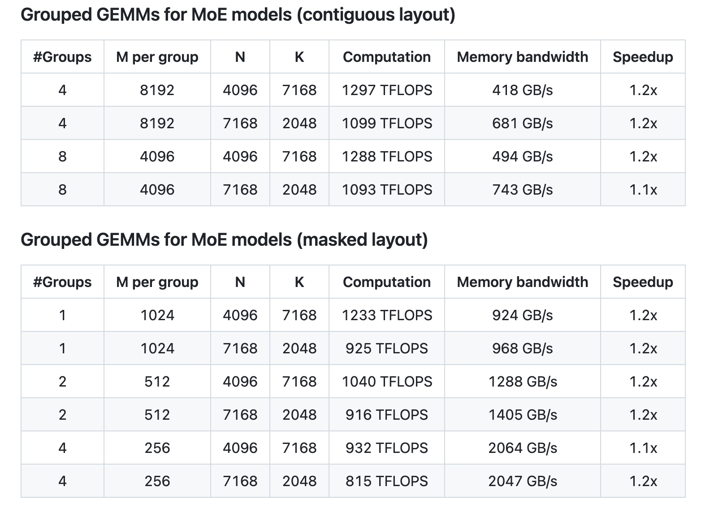

# DeepSeek AI Releases DeepGEMM: An FP8 GEMM Library that Supports both Dense and MoE GEMMs Powering V3/R1 Training and Inference

> Efficient matrix multiplications remain a critical component in modern deep learning and high-performance computing. As models become increasingly complex, conventional approaches to General Matrix Multiplication (GEMM) often face challenges related to memory bandwidth constraints, numerical precision, and suboptimal hardware utilization. These issues are further complicated by the emerging use of mixed-precision formats, such as FP8, […]

Efficient matrix multiplications remain a critical component in modern [deep learning](https://www.marktechpost.com/2025/01/15/what-is-deep-learning-2/) and high-performance computing. As models become increasingly complex, conventional approaches to General Matrix Multiplication (GEMM) often face challenges related to memory bandwidth constraints, numerical precision, and suboptimal hardware utilization. These issues are further complicated by the emerging use of mixed-precision formats, such as FP8, which demand careful handling to avoid computational inaccuracies. Recent advances in GPU architectures, particularly NVIDIA’s Hopper tensor cores, have created opportunities for improved performance—but only if software is designed to fully exploit these capabilities. In this context, there is a need for tools that not only address these performance bottlenecks but also maintain simplicity and transparency in their design.

DeepSeek AI’s release of DeepGEMM marks a thoughtful approach to enhancing FP8 GEMM operations. Designed specifically for efficient and clean FP8 matrix multiplications with fine-grained scaling, DeepGEMM supports both standard and Mix-of-Experts (MoE) grouped GEMMs. The library is written in CUDA and stands out for its use of runtime kernel compilation through a lightweight Just-In-Time (JIT) module. This design choice means that there is no need for lengthy compile-time processes during installation, making it straightforward to integrate into existing projects. DeepGEMM is tailored for NVIDIA Hopper tensor cores, ensuring that it leverages modern hardware capabilities while addressing inherent challenges such as imprecise FP8 accumulations.

### Technical Details and Benefits

At its core, DeepGEMM employs fine-grained scaling combined with FP8 arithmetic to balance speed and numerical accuracy. To counteract issues with FP8 tensor core accumulation, the library uses a two-level accumulation strategy via CUDA cores—often described as promotion. This approach minimizes errors during computation without sacrificing performance. The implementation is notably concise, with a single core kernel function encompassing around 300 lines of code. Such simplicity not only aids in understanding the underlying principles but also facilitates further refinements by the community.

DeepGEMM draws inspiration from established libraries like CUTLASS and CuTe, yet it deliberately avoids a heavy dependency on complex templates or algebraic frameworks. Instead, the focus remains on providing a clean and accessible codebase that concentrates on optimizing GEMM operations for both normal and grouped configurations. The support for grouped GEMMs, designed for MoE models, is implemented in two forms: contiguous and masked layouts. Each is carefully structured to accommodate varying token counts per expert, reflecting the practical demands of modern inference and training tasks.

### Performance Insights and Considerations

The performance data provided in the DeepGEMM repository offers clear picture of its efficiency improvements. Testing on NVIDIA H800 GPUs with NVCC 12.8 indicates that, across a range of matrix dimensions, DeepGEMM achieves speedups that compare favorably with a carefully optimized CUTLASS-based implementation. For instance, normal GEMM operations demonstrate speedup factors ranging from approximately 1.4x to 2.7x, depending on the specific matrix shape. In the context of grouped GEMMs for MoE models, both contiguous and masked layouts show consistent improvements, albeit more modest, with speedups around 1.1x to 1.2x.

These performance gains are the result of several thoughtful design decisions. The library’s JIT compilation strategy allows for dynamic optimization of kernel parameters—such as block sizes, the number of pipeline stages, and warpgroups—tailored to the specific GEMM shapes and hardware configurations. Furthermore, the utilization of Hopper’s Tensor Memory Accelerator (TMA) helps to optimize data movement, which is a significant factor in achieving high performance on modern GPU architectures. The repository also details several utility functions that assist developers in aligning tensor dimensions and configuring shared memory, ensuring that the library can be integrated smoothly into larger systems.

### Conclusion

DeepGEMM represents a measured and effective approach to the challenges of FP8 GEMM computations. By focusing on both precision and performance, the library provides an elegant solution for researchers and practitioners looking to optimize matrix multiplications on NVIDIA Hopper tensor cores. Its design emphasizes clarity and accessibility—evident in the concise codebase and the elimination of pre-compilation steps through runtime JIT compilation. Whether for standard GEMMs or the more specialized grouped GEMMs required by MoE models, DeepGEMM offers a practical, well-documented platform for enhancing computational efficiency.

For those seeking to improve their deep learning pipelines or gain insight into modern GPU optimization techniques, DeepGEMM stands as a valuable resource. The repository, released under the MIT License and supported by a community of developers, invites further exploration and refinement.

---

Check out **_the [GitHub Repo](https://github.com/deepseek-ai/DeepGEMM)._** All credit for this research goes to the researchers of this project. Also, feel free to follow us on **[Twitter](https://x.com/intent/follow?screen_name=marktechpost)** and don’t forget to join our **[80k+ ML SubReddit](https://www.reddit.com/r/machinelearningnews/)**.

**🚨 [Recommended Read- LG AI Research Releases NEXUS: An Advanced System Integrating Agent AI System and Data Compliance Standards to Address Legal Concerns in AI Datasets](https://www.marktechpost.com/2025/02/16/lg-ai-research-releases-nexus-an-advanced-system-integrating-agent-ai-system-and-data-compliance-standards-to-address-legal-concerns-in-ai-datasets/)**
