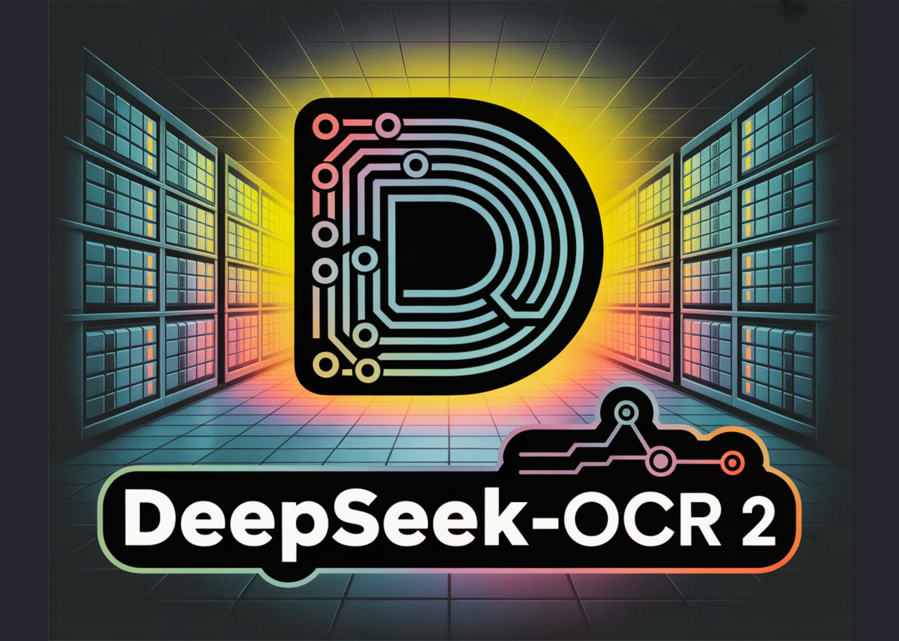

# DeepSeek AI Releases DeepSeek-OCR 2 with Causal Visual Flow Encoder for Layout Aware Document Understanding

> DeepSeek AI released DeepSeek-OCR 2, an open source document OCR and understanding system that restructures its vision encoder to read pages in a causal order that is closer to how humans scan complex documents. The key component is DeepEncoder V2, a language model style transformer that converts a 2D page into a 1D sequence of […]

DeepSeek AI released DeepSeek-OCR 2, an open source document OCR and understanding system that restructures its vision encoder to read pages in a causal order that is closer to how humans scan complex documents. The key component is DeepEncoder V2, a language model style transformer that converts a 2D page into a 1D sequence of visual tokens that already follow a learned reading flow before text decoding starts.

*https://github.com/deepseek-ai/DeepSeek-OCR-2*

### From raster order to causal visual flow

Most multimodal models still flatten images into a fixed raster sequence, top left to bottom right, and apply a transformer with static positional encodings. This is a poor match for documents with multi column layouts, nested tables, and mixed language regions. Human readers instead follow a semantic order that jumps between regions.

DeepSeek-OCR 2 keeps the encoder and decoder structure of DeepSeek-OCR, but replaces the original CLIP ViT based visual encoder with DeepEncoder V2. The decoder remains DeepSeek-3B-A500M, a MoE language model with about 3B total parameters and about 500M active parameters per token. The goal is to let the encoder perform causal reasoning over visual tokens and to hand the decoder a sequence that is already aligned with a likely reading order.

### Vision tokenizer and token budget

The vision tokenizer is inherited from DeepSeek-OCR. It uses an 80M parameter SAM base backbone followed by 2 convolution layers. This stage downsamples the image so that the visual token count is reduced by a factor of 16 and compresses features into an embedding dimension of 896.

DeepSeek-OCR 2 uses a global and local multi crop strategy to cover dense pages without letting the token count explode. A global view at 1024 × 1024 resolution produces 256 tokens. Up to 6 local crops at 768 × 768 resolution add 144 tokens each. As a result, the visual token count ranges from 256 to 1120 per page. This upper bound is slightly smaller than the 1156 token budget used in the original DeepSeek-OCR’s Gundam mode, and it is comparable to the budget used by Gemini-3 Pro on OmniDocBench.

### DeepEncoder-V2, language model as vision encoder

DeepEncoder-V2 is built by instantiating a Qwen2-0.5B style transformer as the vision encoder. The input sequence is constructed as follows. First, all visual tokens from the tokenizer form the prefix. Then a set of learnable query tokens, called causal flow tokens, is appended as the suffix. The number of causal flow tokens equals the number of visual tokens.

The attention pattern is asymmetric. Visual tokens use bidirectional attention and see all other visual tokens. Causal flow tokens use causal attention and can see all visual tokens and only previous causal flow tokens. Only the outputs at causal flow positions are passed to the decoder. In effect, the encoder learns a mapping from a 2D grid of visual tokens into a 1D causal sequence of flow tokens that encode a proposed reading order and local context.

This design decomposes the problem into 2 stages. DeepEncoder-V2 performs causal reasoning over visual structure and reading order. DeepSeek-3B-A500M then performs causal decoding over text conditioned on this reordered visual input.

*https://github.com/deepseek-ai/DeepSeek-OCR-2*

### Training pipeline

The training data pipeline follows DeepSeek-OCR and focuses on OCR intensive content. OCR data accounts for 80 percent of the mixture. The research team rebalances the sampling across text, formulas, and tables using a 3:1:1 ratio so that the model sees enough structure heavy examples.

**Training runs in 3 stages**:

**In stage 1**, encoder pretraining couples DeepEncoder-V2 to a small decoder and uses a standard language modeling objective. The model is trained at 768×768 and 1024×1024 resolutions with multi scale sampling. The vision tokenizer is initialized from the original DeepEncoder. The LLM style encoder is initialized from Qwen2-0.5B base. The optimizer is AdamW with cosine learning rate decay from 1e-4 to 1e-6 over 40k iterations. Training uses about 160 A100 GPUs, sequence length 8k with packing, and a large mixture of document image text samples.

**In stage 2**, query enhancement attaches DeepEncoder-V2 to DeepSeek-3B-A500M and introduces multi crop views. The tokenizer is frozen. The encoder and decoder are jointly trained with 4 stage pipeline parallelism and 40 data parallel replicas. The global batch size is 1280 and the schedule runs for 15k iterations with learning rate decay from 5e-5 to 1e-6.

**In stage 3**, all encoder parameters are frozen. Only the DeepSeek decoder is trained to better adapt to the reordered visual tokens. This stage uses the same batch size but a shorter schedule and a lower learning rate that decays from 1e-6 to 5e-8 over 20k iterations. Freezing the encoder more than doubles training throughput at this stage.

### Benchmark results on OmniDocBench

The main evaluation uses OmniDocBench-v1.5. This benchmark contains 1355 pages in 9 document categories in Chinese and English, including books, academic papers, forms, presentations, and newspapers. Each page is annotated with layout elements such as text spans, equations, tables, and figures.

DeepSeek-OCR 2 achieves an overall OmniDocBench score of 91.09 with a visual token maximum of 1120. The original DeepSeek-OCR baseline scores 87.36 with a token maximum of 1156. DeepSeek-OCR 2 therefore gains 3.73 points while using a slightly smaller token budget.

Reading order (R-order) Edit Distance, which measures the difference between predicted and ground truth reading sequences, drops from 0.085 to 0.057. Text edit distance falls from 0.073 to 0.048. Formula and table edit distances also decrease, which indicates better parsing of math and structured regions.

Viewed as a document parser, DeepSeek-OCR-2 achieves overall element level edit distance 0.100. The original DeepSeek-OCR reaches 0.129 and Gemini-3 Pro reaches 0.115 under similar visual token constraints. This suggests that the causal visual flow encoder improves structural fidelity without expanding the token budget.

Category wise, DeepSeek-OCR-2 improves text edit distance for most document types, such as academic papers and books. Performance is weaker on very dense newspapers, where text edit distance remains above 0.13. The research team link this to limited training data for newspapers and heavy compression on extreme text density. Reading order metrics, however, improve across all categories.

*https://github.com/deepseek-ai/DeepSeek-OCR-2*

### Key Takeaways

- DeepSeek-OCR 2 replaces a CLIP ViT style encoder with DeepEncoder-V2, a Qwen2-0.5B based language model encoder that converts a 2D document page into a 1D sequence of causal flow tokens aligned with a learned reading order.

- The vision tokenizer uses an 80M parameter SAM base backbone with convolutions, multi crop global and local views, and keeps the visual token budget between 256 and 1120 tokens per page, slightly below the original DeepSeek-OCR Gundam mode while remaining comparable to Gemini 3 Pro.

- Training follows a 3 stage pipeline, encoder pretraining, joint query enhancement with DeepSeek-3B-A500M, and decoder only fine-tuning with the encoder frozen, using an OCR heavy data mix with 80 percent OCR data and a 3 to 1 to 1 sampling ratio over text, formulas, and tables.

- On OmniDocBench v1.5 with 1355 pages and 9 document categories, DeepSeek-OCR 2 reaches an overall score of 91.09 versus 87.36 for DeepSeek-OCR, reduces reading order edit distance from 0.085 to 0.057, and achieves element level edit distance 0.100 compared with 0.129 for DeepSeek-OCR and 0.115 for Gemini-3 Pro under similar visual token budgets.

---

Check out the **[Paper](https://github.com/deepseek-ai/DeepSeek-OCR-2/blob/main/DeepSeek_OCR2_paper.pdf), [Repo](https://github.com/deepseek-ai/DeepSeek-OCR-2) and [Model weights](https://huggingface.co/deepseek-ai/DeepSeek-OCR-2)**. Also, feel free to follow us on **[Twitter](https://x.com/intent/follow?screen_name=marktechpost)** and don’t forget to join our **[100k+ ML SubReddit](https://www.reddit.com/r/machinelearningnews/)** and Subscribe to **[our Newsletter](https://www.aidevsignals.com/)**. Wait! are you on telegram? **[now you can join us on telegram as well.](https://t.me/machinelearningresearchnews)**
