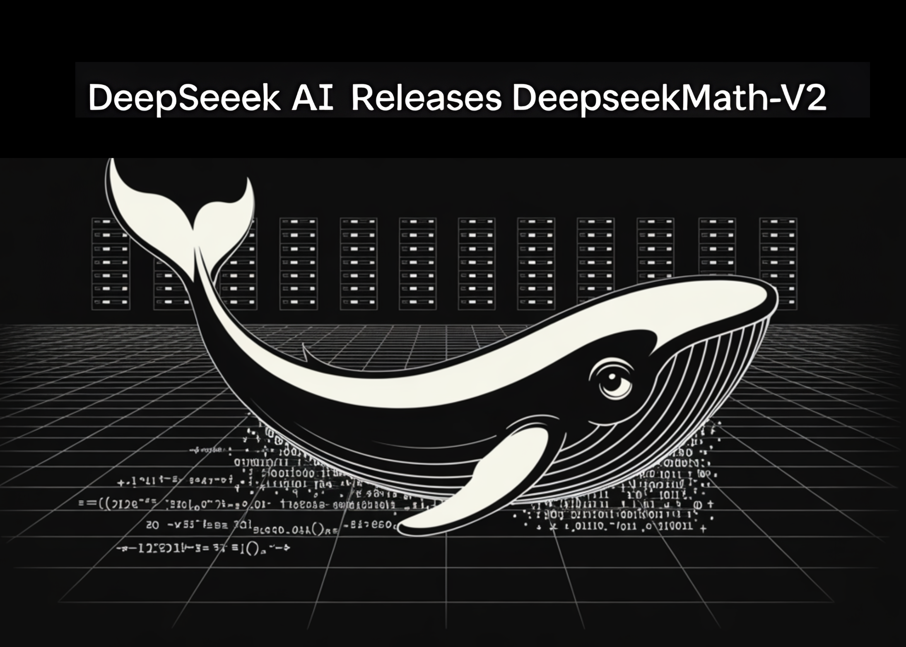

# DeepSeek AI Releases DeepSeekMath-V2: The Open Weights Maths Model That Scored 118/120 on Putnam 2024

> How can an AI system prove complex olympiad level math problems in clear natural language while also checking that its own reasoning is actually correct? DeepSeek AI has released DeepSeekMath-V2, an open weights large language model that is optimized for natural language theorem proving with self verification. The model is built on DeepSeek-V3.2-Exp-Base, runs as […]

How can an AI system prove complex olympiad level math problems in clear natural language while also checking that its own reasoning is actually correct? DeepSeek AI has released **DeepSeekMath-V2**, an open weights large language model that is optimized for natural language theorem proving with self verification. The model is built on **DeepSeek-V3.2-Exp-Base**, runs as a **685B parameter** mixture of experts, and is available on Hugging Face under an Apache 2.0 license.

In evaluations, DeepSeekMath-V2 reaches **gold level scores on IMO 2025 and CMO 2024**, and achieves **118 of 120 points on Putnam 2024** when used with scaled test time compute.

### Why Final Answer Rewards are not Enough?

Most recent math reasoning models use reinforcement learning that rewards only the **final answer** on benchmarks such as AIME and HMMT. This approach pushed models from weak baselines to near saturation on short answer contests in about one year. ([Hugging Face](https://huggingface.co/deepseek-ai/DeepSeek-Math-V2))

**However, the DeepSeek research team points out two structural problems:**

- A correct numeric answer does not guarantee correct reasoning. The model may reach the right number through algebraic mistakes that cancel out.

- Many tasks, such as olympiad proofs and theorem proving, require a complete argument in natural language. These tasks do not have a single final numeric answer, so standard answer based rewards do not apply.

DeepSeekMath-V2 therefore optimizes **proof quality** instead of pure answer accuracy. The system evaluates whether a proof is complete and logically sound, and uses that evaluation as the main learning signal.

### Training a Verifier before the Generator

The core design is **verifier first**. DeepSeek research team trains an LLM based verifier that can read a problem and a candidate proof, then output both a natural language analysis and a discrete quality score in the set {0, 0.5, 1}.

The initial reinforcement learning data comes from **Art of Problem Solving** contests. The research team crawl **17,503 proof style problems** from olympiads, team selection tests, and post 2010 problems that explicitly require proofs. These problems form the base set for cold start RL. Candidate proofs come from a DeepSeek-V3.2 reasoning model that is prompted to iteratively refine its own solutions, which increases detail but also creates many imperfect proofs. Human experts label these proofs using the 0, 0.5, 1 rubric, based on rigor and completeness.

The verifier is trained with **Group Relative Policy Optimization (GRPO)**. **The reward has two components:**

- A **format reward**, which checks that the verifier output follows a fixed template, including an analysis section and a final score in a box.

- A **score reward**, which penalizes the absolute difference between the predicted score and the expert score.

This stage produces a verifier that can grade olympiad style proofs in a consistent way.

*https://github.com/deepseek-ai/DeepSeek-Math-V2/blob/main/DeepSeekMath_V2.pdf*

### Meta Verification to Control Hallucinated Critiques

A verifier can still game the reward. It can output the correct final score while inventing fake issues in the analysis. This would satisfy the numeric objective but make the explanations unreliable.

To address this, the research team introduce a **meta verifier**. The meta verifier reads the original problem, the proof, and the verifier analysis, and then evaluates whether the analysis is faithful. It scores aspects such as restatement of steps, identification of real defects, and consistency between the narrative and the final score.

The meta verifier is also trained with GRPO, with its own format and score rewards. Its output, a meta quality score, is then used as an extra reward term for the base verifier. Analyses that hallucinate problems get low meta scores, even if the final proof score is correct. In experiments, this raises the average meta evaluated quality of analyses from around **0.85 to 0.96** on a validation split, while keeping proof score accuracy stable.

### Self Verifying Proof Generator and Sequential Refinement

Once the verifier is strong, DeepSeek research team trains the **proof generator**. The generator takes a problem and outputs both a solution and a **self analysis** that follows the same rubric as the verifier.

**The reward for the generator combines three signals:**

- The verifier score on the generated proof.

- The agreement between the self reported score and the verifier score.

- The meta verification score of the self analysis.

Formally, the main reward uses weights **α = 0.76** for the proof score and **β = 0.24** for the self analysis component, multiplied by a format term that enforces the output structure. This pushes the generator to write proofs that the verifier accepts, and to be honest about remaining issues. If it claims that a flawed proof is perfect, it loses reward through disagreement and low meta scores.

DeepSeek also exploits the **128K token context limit** of the base model. For hard problems, the generator often cannot repair all issues in a single pass, because the refined proof plus analysis would exceed context. In that case, the system runs **sequential refinement**. It generates a proof and self analysis, feeds them back as context, and asks the model to produce a new proof that fixes the previously detected issues. This loop can repeat several times, subject to the context budget.

*https://github.com/deepseek-ai/DeepSeek-Math-V2/tree/main*

### Scaling Verification and Auto Labeling

As the generator improves, it produces harder proofs, which are costly to label by hand. To keep training data fresh, the research team introduces an **automatic labeling pipeline** based on scaled verification.

For each candidate proof, the system samples multiple independent verifier analyses, then evaluates each analysis using the meta verifier. If several high quality analyses converge on the same serious issues, the proof is labeled as incorrect. If no valid issues survive meta checking, the proof is labeled as correct. In the final training iterations this pipeline replaces human labels, with spot checks confirming good agreement with experts.

### Competition and Benchmark Results

The research team evaluated DeepSeekMath-V2 on several fronts:

On an internal set of **91 CNML level problems** covering algebra, geometry, number theory, combinatorics, and inequalities, it shows that DeepSeekMath-V2 achieves the highest mean proof score among **Gemini 2.5 Pro**, **GPT 5 Thinking High**, and DeepSeekMath-V2 in every category, as measured by their verifier.

*https://github.com/deepseek-ai/DeepSeek-Math-V2/blob/main/DeepSeekMath_V2.pdf*

On **IMO Shortlist 2024**, sequential refinement with self verification improves both pass at 1 and best of 32 quality metrics as the maximum number of refinement iterations increases.

*https://github.com/deepseek-ai/DeepSeek-Math-V2/blob/main/DeepSeekMath_V2.pdf*

On **IMO ProofBench**, expert evaluation the above figure shows that DeepSeekMath-V2 outperforms **DeepMind DeepThink IMO Gold** on the Basic subset and remains competitive on the Advanced subset, while clearly beating other large models.

*https://github.com/deepseek-ai/DeepSeek-Math-V2/blob/main/DeepSeekMath_V2.pdf*

**For full competitions, it reports:**

- **IMO 2025**: 5 of 6 problems solved, gold medal level.

- **CMO 2024**: 4 problems fully solved plus partial credit on 1 more, gold medal level.

- **Putnam 2024**: 11 of 12 problems solved completely and the remaining problem with minor errors, for **118 of 120 points**, above the best human score of 90.

### Key Takeaways

- DeepSeekMath V2 is a 685B parameter model built on DeepSeek V3.2 Exp Base, designed for natural language theorem proving with self verification, and released as open weights under the Apache 2.0 license.

- The main innovation is a verifier first training pipeline with a GRPO trained verifier and meta verifier that score proofs on rigor, not only final answers, which directly addresses the gap between correct answers and correct reasoning.

- A proof generator is then trained against this verifier and meta verifier, using rewards that combine proof quality, agreement with self evaluation, and analysis faithfulness, plus sequential refinement under 128K context to iteratively repair proofs.

- With scaled test time compute and large verification budgets, DeepSeekMath V2 reaches gold level performance on IMO 2025 and CMO 2024 and scores 118 of 120 on Putnam 2024, surpassing the best human score that year.

### Editorial Notes

DeepSeekMath-V2 is an important step toward self verifiable mathematical reasoning, because it directly tackles the gap between correct final answers and correct reasoning, using a verifier, meta verifier and proof generator trained with GRPO on olympiad style proofs and deployed at 685B scale to reach gold level performance on IMO 2025, CMO 2024 and a near perfect 118 of 120 score on Putnam 2024. Overall, this release shows that self verifiable mathematical reasoning with open weights is now practically achievable for competition level problems.

---

Check out the **[Full Paper](https://github.com/deepseek-ai/DeepSeek-Math-V2/blob/main/DeepSeekMath_V2.pdf), [Model Weights on HF](https://huggingface.co/deepseek-ai/DeepSeek-Math-V2)** and** [Repo](https://github.com/deepseek-ai/DeepSeek-Math-V2/tree/main)**. Feel free to check out our **[GitHub Page for Tutorials, Codes and Notebooks](https://github.com/Marktechpost/AI-Tutorial-Codes-Included)**. Also, feel free to follow us on **[Twitter](https://x.com/intent/follow?screen_name=marktechpost)** and don’t forget to join our **[100k+ ML SubReddit](https://www.reddit.com/r/machinelearningnews/)** and Subscribe to **[our Newsletter](https://www.aidevsignals.com/)**. Wait! are you on telegram? **[now you can join us on telegram as well.](https://t.me/machinelearningresearchnews)**
