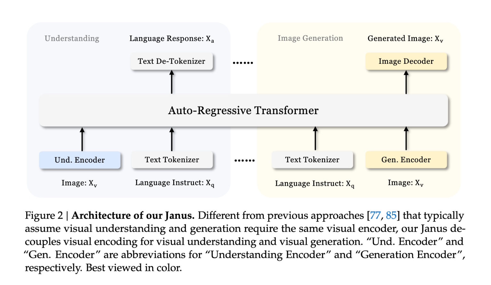

# DeepSeek AI Releases Janus: A 1.3B Multimodal Model with Image Generation Capabilities

> Multimodal AI models are powerful tools capable of both understanding and generating visual content. However, existing approaches often use a single visual encoder for both tasks, which leads to suboptimal performance due to the fundamentally different requirements of understanding and generation. Understanding requires high-level semantic abstraction, while generation focuses on local details and global consistency. […]

Multimodal AI models are powerful tools capable of both understanding and generating visual content. However, existing approaches often use a single visual encoder for both tasks, which leads to suboptimal performance due to the fundamentally different requirements of understanding and generation. Understanding requires high-level semantic abstraction, while generation focuses on local details and global consistency. This mismatch results in conflicts that limit the overall efficiency and accuracy of the model.

Researchers from DeepSeek-AI, the University of Hong Kong, and Peking University propose Janus, a novel autoregressive framework that unifies multimodal understanding and generation by employing two distinct visual encoding pathways. Unlike prior models that use a single encoder, Janus introduces a specialized pathway for each task, both of which are processed through a unified transformer. This unique design alleviates conflicts inherent in prior models and provides enhanced flexibility, enabling different encoding methods that best suit each modality. The name “Janus” aptly represents this duality, much like the Roman god, with two faces representing transitions and coexistence.

*https://arxiv.org/abs/2410.13848*

The architecture of Janus consists of two main components: an Understanding Encoder and a Generation Encoder, each tasked with handling multimodal inputs differently. For multimodal understanding, Janus uses a high-dimensional semantic feature extraction approach through SigLIP, transforming the features into a sequence compatible with the language model. For visual generation, Janus utilizes a VQ tokenizer that converts visual data into discrete representations, enabling detailed image synthesis. Both tasks are processed by a shared transformer, enabling the model to operate in an autoregressive fashion. This approach allows the model to decouple the requirements of each visual task, simplifying implementation and improving scalability.

The training is divided into three stages: training adaptors, unified pretraining, and supervised fine-tuning, all of which enhance its multimodal capabilities while maintaining consistency across different tasks.

The experimental results demonstrate that Janus significantly outperforms prior models across various benchmarks. In multimodal understanding, Janus achieved impressive results, surpassing LLaVA-v1.5 and other unified models while even matching or exceeding task-specific models in certain cases. Specifically, Janus obtained scores of 69.4, 63.7, and 87.0 on multimodal benchmarks such as MMBench, SEED-Bench, and POPE, respectively, outperforming larger models like Qwen-VL-Chat (7B). In visual generation tasks, Janus showed superior performance as well, achieving a Fréchet Inception Distance (FID) of 8.53 on MSCOCO-30K, demonstrating better consistency with user prompts than competing models such as DALL-E 2 and SDXL. Notably, these results show that Janus offers a balanced capability of understanding and generating visual content while being more parameter-efficient.

In conclusion, Janus presents a major step forward in developing unified multimodal AI models by resolving the conflicts between understanding and generation. Its decoupling approach proves to be both effective and efficient, allowing for high-quality semantic understanding alongside detailed visual generation. This flexibility makes Janus a promising candidate for future developments in multimodal AI, with potential applications extending into additional modalities, such as point clouds or audio data. The extensibility, flexibility, and robust performance of Janus highlight its potential to serve as an inspiration for the next generation of unified multimodal models.

---

Check out the** [Paper](https://arxiv.org/abs/2410.13848)**, **[Model Card on Hugging Face](https://huggingface.co/deepseek-ai/Janus-1.3B)**, and **[GitHub Page](https://github.com/deepseek-ai/Janus)**. All credit for this research goes to the researchers of this project. Also, don’t forget to follow us on **[Twitter](https://twitter.com/Marktechpost)** and join our **[Telegram Channel](https://pxl.to/at72b5j)** and [**LinkedIn Gr**](https://www.linkedin.com/groups/13668564/)[**oup**](https://www.linkedin.com/groups/13668564/). **If you like our work, you will love our**[** newsletter..**](https://marktechpost-newsletter.beehiiv.com/subscribe) Don’t Forget to join our **[50k+ ML SubReddit](https://www.reddit.com/r/machinelearningnews/)**.

**[[Upcoming Live Webinar- Oct 29, 2024] ](https://go.predibase.com/predibase-inference-engine-102924-lp?utm_medium=3rdparty&utm_source=marktechpost)****[The Best Platform for Serving Fine-Tuned Models: Predibase Inference Engine (Promoted)](https://go.predibase.com/predibase-inference-engine-102924-lp?utm_medium=3rdparty&utm_source=marktechpost)**
