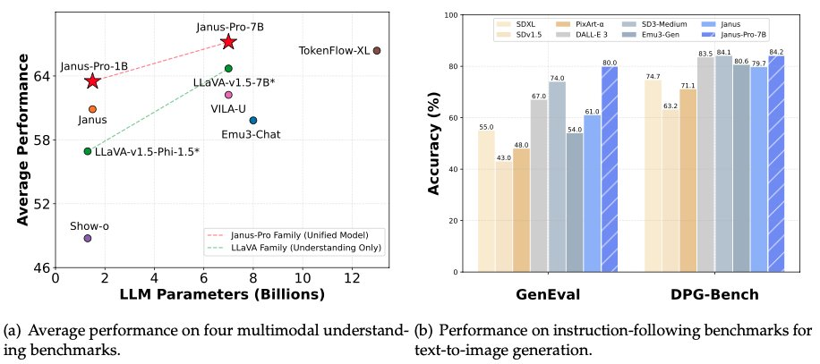

# DeepSeek-AI Releases Janus-Pro 7B: An Open-Source multimodal AI that Beats DALL-E 3 and Stable Diffusion

> Multimodal AI integrates diverse data formats, such as text and images, to create systems capable of accurately understanding and generating content. By bridging textual and visual data, these models address real-world problems like visual question answering, instruction-following, and creative content generation. They rely on advanced architectures and large-scale datasets to enhance performance, focusing on overcoming […]

Multimodal AI integrates diverse data formats, such as text and images, to create systems capable of accurately understanding and generating content. By bridging textual and visual data, these models address real-world problems like visual question answering, instruction-following, and creative content generation. They rely on advanced architectures and large-scale datasets to enhance performance, focusing on overcoming technical limitations for meaningful interactions between modalities. Despite progress, optimizing performance across understanding and generation tasks remains challenging. Shared visual encoders in many systems lead to inefficiencies due to conflicting representation requirements. Tasks like detailed text-to-image generation demand specialized features that unified encoders cannot provide. Also, limitations in training data and computational strategies have resulted in inconsistent performance and reliability, emphasizing the need for improved solutions.

Prior approaches like the [original Janus model](https://arxiv.org/abs/2410.13848) introduced decoupled encoding for understanding and generation, improving task-specific performance. However, it faced scalability constraints, computational inefficiencies, and challenges with short-prompt image generation. These issues highlighted the need for architectural and data strategy enhancements to develop more robust multimodal systems.

**Researchers at DeepSeek-AI have developed [Janus-Pro](https://github.com/deepseek-ai/Janus/blob/main/janus_pro_tech_report.pdf), a refined version of the Janus framework, to overcome the limitations of earlier models. Janus-Pro introduces three key innovations: **

- **An optimized training strategy **

- **An expanded and high-quality dataset, and **

- **Larger model variants – **[**Janus-Pro-1B**](https://huggingface.co/deepseek-ai/Janus-Pro-1B)** and **[**Janus-Pro-7B **](https://huggingface.co/deepseek-ai/Janus-Pro-7B)

These enhancements resolve inefficiencies while boosting the model’s scalability and accuracy. By leveraging advanced architectural principles and focusing on robust training, Janus-Pro establishes itself as a cutting-edge multimodal understanding and generation tool, enabling superior task performance across benchmarks.

*[**Image Source**](https://github.com/deepseek-ai/Janus/blob/main/janus_pro_tech_report.pdf)*

The architecture of Janus-Pro is designed to decouple visual encoding for understanding and generation tasks, ensuring specialized processing for each. The understanding encoder uses the SigLIP method to extract semantic features from images, while the generation encoder applies a VQ tokenizer to convert images into discrete representations. These features are then processed by a unified autoregressive transformer, which integrates the information into a multimodal feature sequence for downstream tasks. The training strategy involves three stages: prolonged pretraining on diverse datasets, efficient fine-tuning with adjusted data ratios, and supervised refinement to optimize performance across modalities. Adding 72 million synthetic aesthetic data samples and 90 million multimodal understanding datasets significantly enhances the quality and stability of Janus-Pro’s outputs, ensuring its reliability in generating detailed and visually appealing results.

*[**Image Source**](https://github.com/deepseek-ai/Janus/blob/main/janus_pro_tech_report.pdf)*

Janus-Pro’s performance is demonstrated across several benchmarks, showcasing its superiority in understanding and generation. On the MMBench benchmark for multimodal understanding, the 7B variant achieved a score of 79.2, outperforming Janus (69.4), TokenFlow-XL (68.9), and MetaMorph (75.2). In text-to-image generation tasks, Janus-Pro scored 80% overall accuracy on the GenEval benchmark, surpassing DALL-E 3 (67%) and Stable Diffusion 3 Medium (74%). Also, the model achieved 84.19 on the DPG-Bench benchmark, reflecting its capability to handle dense prompts with intricate semantic alignment. These results highlight Janus-Pro’s advanced instruction-following capabilities and ability to produce stable, high-quality visual outputs.

*[**Image Source**](https://github.com/deepseek-ai/Janus/blob/main/janus_pro_tech_report.pdf)*

The research team meticulously designed Janus-Pro’s methodology to address prior inefficiencies. They extended the training duration in the initial stage to maximize the model’s capability to learn pixel dependencies using datasets like ImageNet. The model achieved faster convergence and improved performance by eliminating redundant training steps in the second stage and focusing on detailed text-to-image data. Adjustments to the data ratio in the final stage, with a balanced mix of multimodal, textual, and image data, further enhanced its capabilities. The scaling of the model to 7 billion parameters also contributed to its ability to process complex multimodal inputs with greater precision and efficiency.

*[**Image Source**](https://github.com/deepseek-ai/Janus/blob/main/janus_pro_tech_report.pdf)*

**Janus-Pro introduces several key takeaways that set it apart in multimodal AI.  **

- The decoupling of visual encoding for understanding and generation tasks ensures task-specific optimization, mitigates conflicts and improves output quality.

- A three-stage training process and strategic data adjustments allow more efficient and effective learning.

- Including 72 million synthetic data samples and 90 million multimodal datasets enhances stability and output precision.

- Scaling the model to 7B parameters improves its capability to handle complex inputs and diverse tasks.

- Janus-Pro’s results on MMBench (79.2%), GenEval (80%), and DPG-Bench (84.19%) establish it as a leader in multimodal understanding and generation.

- Its ability to accurately follow dense prompts demonstrates its versatility in real-world applications.

In conclusion, Janus-Pro builds upon its predecessor to set a new benchmark for multimodal understanding and generation. The model achieves remarkable results in diverse tasks by addressing critical challenges through architectural innovation, optimized training, and data enhancement. Its decoupled visual encoding ensures specialized processing, while its scalability enables it to tackle complex scenarios precisely. With its exceptional performance across benchmarks, Janus-Pro sets a benchmark in its ability to integrate textual and visual data.

---

Check out **_the [Demo Chat](https://huggingface.co/spaces/deepseek-ai/Janus-Pro-7B), [Janus-Pro-7B](https://huggingface.co/deepseek-ai/Janus-Pro-7B) and [Janus-Pro-1B](https://huggingface.co/deepseek-ai/Janus-Pro-1B)._** All credit for this research goes to the researchers of this project. Also, don’t forget to follow us on **[Twitter](https://x.com/intent/follow?screen_name=marktechpost)** and join our **[Telegram Channel](https://arxiv.org/abs/2406.09406)** and [**LinkedIn Gr**](https://www.linkedin.com/groups/13668564/)[**oup**](https://www.linkedin.com/groups/13668564/). Don’t Forget to join our **[70k+ ML SubReddit](https://www.reddit.com/r/machinelearningnews/)**.

**🚨[ [Recommended Read] Nebius AI Studio expands with vision models, new language models, embeddings and LoRA](https://nebius.com/blog/posts/studio-embeddings-vision-and-language-models?utm_medium=newsletter&utm_source=marktechpost&utm_campaign=embedding-post-ai-studio) **_(Promoted)_
