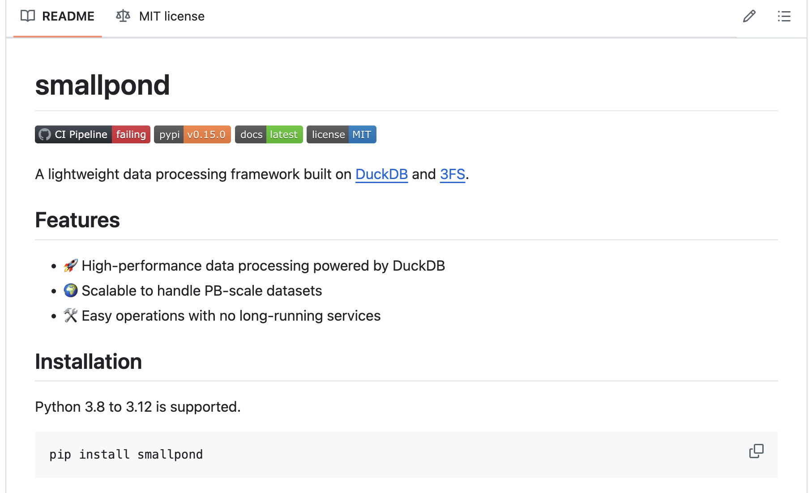

# DeepSeek AI Releases Smallpond: A Lightweight Data Processing Framework Built on DuckDB and 3FS

> Modern data workflows are increasingly burdened by growing dataset sizes and the complexity of distributed processing. Many organizations find that traditional systems struggle with long processing times, memory constraints, and managing distributed tasks effectively. In this environment, data scientists and engineers often spend excessive time on system maintenance rather than extracting insights from data. The […]

Modern data workflows are increasingly burdened by growing dataset sizes and the complexity of distributed processing. Many organizations find that traditional systems struggle with long processing times, memory constraints, and managing distributed tasks effectively. In this environment, data scientists and engineers often spend excessive time on system maintenance rather than extracting insights from data. The need for a tool that simplifies these processes—without sacrificing performance—is clear.

DeepSeek AI recently released Smallpond, a lightweight data processing framework built on DuckDB and 3FS. Smallpond aims to extend DuckDB’s efficient, in-process SQL analytics into a distributed setting. By coupling DuckDB with 3FS—a high-performance, distributed file system optimized for modern SSDs and RDMA networks—Smallpond provides a practical solution for processing large datasets without the complexity of long-running services or heavy infrastructure overhead.

### Technical Details and Benefits

Smallpond is designed to work seamlessly with Python, supporting versions 3.8 through 3.12. Its design philosophy is grounded in simplicity and modularity. Users can quickly install the framework via pip and begin processing data with minimal setup. One key feature is the ability to partition data manually. Whether partitioning by file count, row numbers, or by a specific column hash, this flexibility allows users to tailor the processing to their particular data and infrastructure.

Under the hood, Smallpond leverages DuckDB for its robust, native-level performance in executing SQL queries. The framework further integrates with Ray to enable parallel processing across distributed compute nodes. This combination not only simplifies scaling but also ensures that workloads can be handled efficiently across multiple nodes. Additionally, by avoiding persistent services, Smallpond reduces the operational overhead typically associated with distributed systems.

#### Installation

Python 3.8 to 3.12 is supported.

Copy CodeCopiedUse a different Browser
```
pip install smallpond
```

#### Quick Start

Copy CodeCopiedUse a different Browser
```
# Download example data
wget https://duckdb.org/data/prices.parquet
```

Copy CodeCopiedUse a different Browser
```
import smallpond

# Initialize session
sp = smallpond.init()

# Load data
df = sp.read_parquet("prices.parquet")

# Process data
df = df.repartition(3, hash_by="ticker")
df = sp.partial_sql("SELECT ticker, min(price), max(price) FROM {0} GROUP BY ticker", df)

# Save results
df.write_parquet("output/")
# Show results
print(df.to_pandas())
```

### Performance and Insights

In performance tests using the GraySort benchmark, Smallpond demonstrated its capacity by sorting 110.5TiB of data in just over 30 minutes, achieving an average throughput of 3.66TiB per minute. These results illustrate how effectively the framework harnesses the combined strengths of DuckDB and 3FS for both compute and storage. Such performance metrics provide reassurance that Smallpond can meet the needs of organizations dealing with terabytes to petabytes of data. The open source nature of the project also means that users and developers can collaborate on further optimizations and tailor the framework to a variety of use cases.

### Conclusion

Smallpond represents a measured yet significant step forward in distributed data processing. It addresses core challenges by extending the proven efficiency of DuckDB into a distributed environment, backed by the high-throughput capabilities of 3FS. With a focus on simplicity, flexibility, and performance, Smallpond offers a practical tool for data scientists and engineers tasked with processing large datasets. As an open source project, it invites contributions and continuous improvement from the community, making it a valuable addition to modern data engineering toolkits. Whether managing modest datasets or scaling up to petabyte-level operations, Smallpond provides a robust framework that is both effective and accessible.

---

Check out **_the [GitHub Repo](https://github.com/deepseek-ai/smallpond?tab=readme-ov-file)._** All credit for this research goes to the researchers of this project. Also, feel free to follow us on **[Twitter](https://x.com/intent/follow?screen_name=marktechpost)** and don’t forget to join our **[80k+ ML SubReddit](https://www.reddit.com/r/machinelearningnews/)**.

**🚨 [Recommended Read- LG AI Research Releases NEXUS: An Advanced System Integrating Agent AI System and Data Compliance Standards to Address Legal Concerns in AI Datasets](https://www.marktechpost.com/2025/02/16/lg-ai-research-releases-nexus-an-advanced-system-integrating-agent-ai-system-and-data-compliance-standards-to-address-legal-concerns-in-ai-datasets/)**
