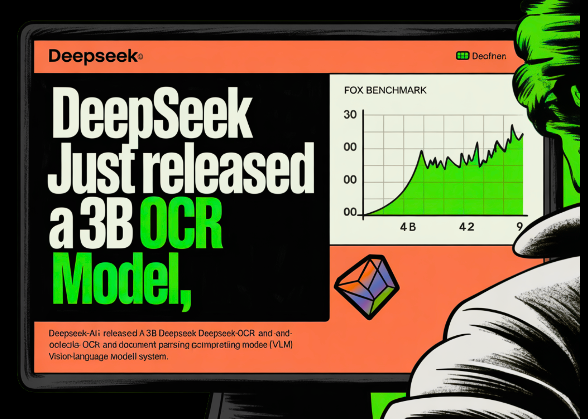

# DeepSeek Just Released a 3B OCR Model: A 3B VLM Designed for High-Performance OCR and Structured Document Conversion

> DeepSeek-AI released 3B DeepSeek-OCR, an end to end OCR and document parsing Vision-Language Model (VLM) system that compresses long text into a small set of vision tokens, then decodes those tokens with a language model. The method is simple, images carry compact representations of text, which reduces sequence length for the decoder. The research team […]

DeepSeek-AI released 3B DeepSeek-OCR, an end to end OCR and document parsing Vision-Language Model (VLM) system that compresses long text into a small set of vision tokens, then decodes those tokens with a language model. The method is simple, images carry compact representations of text, which reduces sequence length for the decoder. The research team reports 97% decoding precision when text tokens are within 10 times the vision tokens on Fox benchmark, and useful behavior even at 20 times compression. It also reports competitive results on OmniDocBench with far fewer tokens than common baselines.

*https://github.com/deepseek-ai/DeepSeek-OCR/blob/main/DeepSeek_OCR_paper.pdf*

### Architecture, what is actually new?

DeepSeek-OCR-3B has two components, a vision encoder named DeepEncoder and a Mixture of Experts decoder named DeepSeek3B-MoE-A570M. The encoder is designed for high resolution inputs with low activation cost and with few output tokens. It uses a window attention stage based on SAM for local perception, a 2 layer convolutional compressor for 16× token downsampling, and a dense global attention stage based on CLIP for visual knowledge aggregation. This design keeps activation memory controlled at high resolution, and keeps the vision token count low. The decoder is a 3B parameter MoE model (named as DeepSeek3B-MoE-A570M) with about 570M active parameters per token.

*https://github.com/deepseek-ai/DeepSeek-OCR/blob/main/DeepSeek_OCR_paper.pdf*

### Multi resolution modes, engineered for token budgets

DeepEncoder supports native modes and dynamic modes. Native modes are Tiny with 64 tokens at 512 by 512 pixels, Small with 100 tokens at 640 by 640, Base with 256 tokens at 1024 by 1024, and Large with 400 tokens at 1280 by 1280. Dynamic modes named Gundam and Gundam-Master mix tiled local views with a global view. Gundam yields n×100 plus 256 tokens, or n×256 plus 400 tokens, with n in the range 2 to 9. For padded modes, the research team gives a formula for valid tokens, which is lower than the raw token count, and depends on the aspect ratio. These modes let AI developers and researchers align token budgets with page complexity.

*https://github.com/deepseek-ai/DeepSeek-OCR/blob/main/DeepSeek_OCR_paper.pdf*

*https://github.com/deepseek-ai/DeepSeek-OCR/blob/main/DeepSeek_OCR_paper.pdf*

### Compression results, what the numbers say…..

The Fox benchmark study measures precision as exact text match after decoding. With 100 vision tokens, pages with 600 to 700 text tokens reach 98.5% precision at 6.7× compression. Pages with 900 to 1000 text tokens reach 96.8% precision at 9.7× compression. With 64 vision tokens, precision decreases as compression increases, for example 59.1% at about 19.7× for 1200 to 1300 text tokens. These values come directly from Table 2.

*https://github.com/deepseek-ai/DeepSeek-OCR/blob/main/DeepSeek_OCR_paper.pdf*

On OmniDocBench, the abstract reports that DeepSeek-OCR surpasses GOT-OCR 2.0 when using only 100 vision tokens per page, and that under 800 vision tokens it outperforms MinerU 2.0, which uses over 6000 tokens per page on average. The benchmark section presents overall performance in terms of edit distance.

*https://github.com/deepseek-ai/DeepSeek-OCR/blob/main/DeepSeek_OCR_paper.pdf*

### Training details that matter….

The research team describes a two phase training pipeline. It first trains DeepEncoder with next token prediction on OCR 1.0 and OCR 2.0 data and 100M LAION samples, then trains the full system with pipeline parallelism across 4 partitions. For hardware, the run used 20 nodes, each with 8 A100 40G GPUs, and used AdamW. The team reports a training speed of 90B tokens per day on text only data, and 70B tokens per day on multimodal data. In production, it reports the ability to generate over 200k pages per day on a single A100 40G node.

### How to evaluate it in a practical stack

If your target documents are typical reports or books, start with Small mode at 100 tokens, then adjust upward only if the edit distance is unacceptable. If your pages contain dense small fonts or very high token counts, use a Gundam mode, since it combines global and local fields of view with explicit token budgeting. If your workload includes charts, tables, or chemical structures, review the “Deep parsing” qualitative section, which shows conversions to HTML tables and SMILES and structured geometry, then design outputs that are easy to validate.

*https://github.com/deepseek-ai/DeepSeek-OCR/blob/main/DeepSeek_OCR_paper.pdf*

### Key Takeaways

- DeepSeek OCR targets token efficiency using optical context compression with near lossless decoding at about 10 times compression, and around 60 percent precision at about 20 times compression.

- The HF release expose explicit token budgets, Tiny uses 64 tokens at 512 by 512, Small uses 100 tokens at 640 by 640, Base uses 256 tokens at 1024 by 1024, Large uses 400 tokens at 1280 by 1280, and Gundam composes n views at 640 by 640 plus one global view at 1024 by 1024.

- The system structure is a DeepEncoder that compresses pages into vision tokens and a DeepSeek3B MoE decoder with about 570M active parameters, as described by the research team in the technical report.

- The Hugging Face model card documents a tested setup for immediate use, Python 3.12.9, CUDA 11.8, PyTorch 2.6.0, Transformers 4.46.3, Tokenizers 0.20.3, and Flash Attention 2.7.3.

### Editorial Comments

DeepSeek OCR is a practical step for document AI, it treats pages as compact optical carriers that reduce decoder sequence length without discarding most information, the model card and technical report describe 97 percent decoding precision at about 10 times compression on Fox benchmark, which is the key claim to test in real workloads. The released model is a 3B MoE decoder with a DeepEncoder front end, packaged for Transformers, with tested versions for PyTorch 2.6.0, CUDA 11.8, and Flash Attention 2.7.3, which lowers setup cost for engineers. The repository shows a single 6.67 GB safetensors shard, which suits common GPUs. Overall, DeepSeek OCR operationalizes optical context compression with a 3B MoE decoder, reports about 97% decoding precision at 10x compression on Fox, provides explicit token budget modes, and includes a tested Transformers setup, validate the throughput claim in your own pipeline.

---

Check out the **[Technical Paper](https://github.com/deepseek-ai/DeepSeek-OCR/blob/main/DeepSeek_OCR_paper.pdf), [Model on HF](https://huggingface.co/deepseek-ai/DeepSeek-OCR) **and** [GitHub Repo](https://github.com/deepseek-ai/DeepSeek-OCR/tree/main)**. Feel free to check out our **[GitHub Page for Tutorials, Codes and Notebooks](https://github.com/Marktechpost/AI-Tutorial-Codes-Included)**. Also, feel free to follow us on **[Twitter](https://x.com/intent/follow?screen_name=marktechpost)** and don’t forget to join our **[100k+ ML SubReddit](https://www.reddit.com/r/machinelearningnews/)** and Subscribe to **[our Newsletter](https://www.aidevsignals.com/)**. Wait! are you on telegram? **[now you can join us on telegram as well.](https://t.me/machinelearningresearchnews)**
