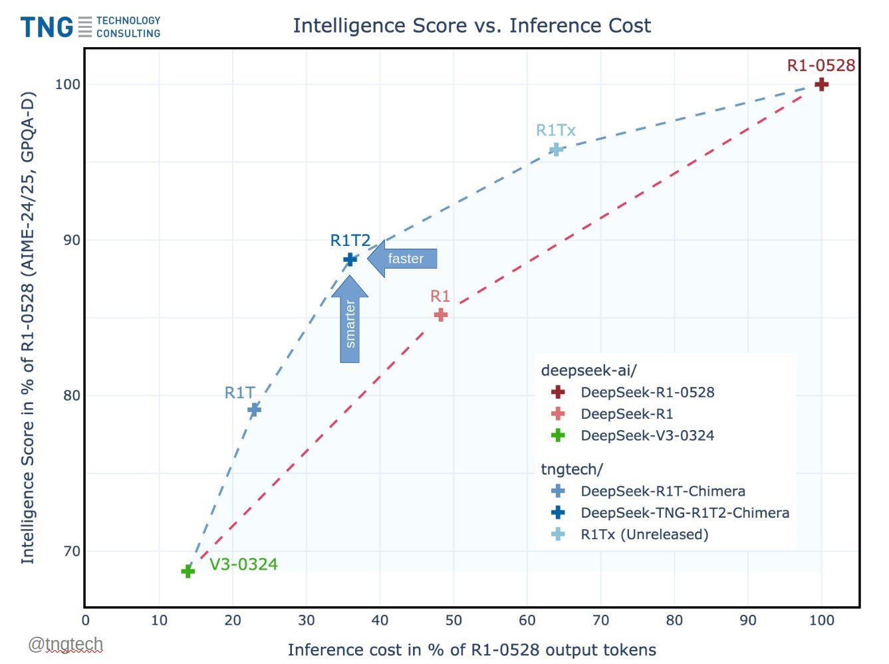

# DeepSeek R1T2 Chimera: 200% Faster Than R1-0528 With Improved Reasoning and Compact Output

> TNG Technology Consulting has unveiled DeepSeek-TNG R1T2 Chimera, a new Assembly-of-Experts (AoE) model that blends intelligence and speed through an innovative model merging strategy. Built from three high-performing parent models—R1-0528, R1, and V3-0324—R1T2 demonstrates how expert-layer interpolation at scale can unlock new efficiencies in large language models (LLMs). Assembly-of-Experts: Efficient Model Composition at Scale Traditional […]

TNG Technology Consulting has unveiled DeepSeek-TNG R1T2 Chimera, a new Assembly-of-Experts (AoE) model that blends intelligence and speed through an innovative model merging strategy. Built from three high-performing parent models—R1-0528, R1, and V3-0324—R1T2 demonstrates how expert-layer interpolation at scale can unlock new efficiencies in large language models (LLMs).

### Assembly-of-Experts: Efficient Model Composition at Scale

Traditional LLM training and fine-tuning require massive compute resources. TNG addresses this with its Assembly-of-Experts (AoE) approach, merging large-scale Mixture-of-Experts (MoE) models at the weight tensor level without retraining. This strategy enables linear-time construction of new models that inherit capabilities from multiple parents. R1T2’s architecture combines expert tensors from R1 with the base of V3-0324 and selectively includes improvements from R1-0528, optimizing the tradeoff between inference cost and reasoning quality.

### Speed Gains and Intelligence Tradeoffs

In benchmark comparisons, R1T2 is over 20% faster than R1 and more than twice as fast as R1-0528. These performance gains are largely attributed to its reduced output token length and selective expert tensor integration. While it falls slightly short of R1-0528 in raw intelligence, it significantly outperforms R1 across high-level benchmarks like GPQA Diamond and AIME-2024/2025.

Moreover, the model retains the …n reasoning traces, which emerge only when R1’s contribution to the merge crosses a specific threshold. This behavioral consistency is vital for applications requiring step-by-step chain-of-thought reasoning.

### Emergent Properties in the Parameter Space

R1T2 confirms findings from the accompanying research paper that model merging can yield viable models throughout the interpolation space. Interestingly, intelligence properties change gradually, but behavioral markers (like consistent use of ) emerge abruptly near a 50% R1 weight ratio. This indicates that certain traits reside in distinct subspaces of the LLM weight landscape.

By merging only the routed expert tensors and leaving other components (e.g., attention and shared MLPs) from V3-0324 intact, R1T2 maintains a high reasoning score while avoiding verbosity. This design leads to what TNG calls “think-token consistency,” a behavioral trait where reasoning is not only accurate but also concise.

### Reddit Community Feedback

Early discussions from the [Reddit LocalLLaMA community](https://www.reddit.com/r/LocalLLaMA/comments/1k8yk8w/tng_tech_releases_deepseekr1chimera_adding_r1/) highlight practical impressions of R1T2. Users [praise the model’s responsiveness](https://www.reddit.com/r/LocalLLaMA/comments/1lqbmwa/deepseektngr1t2chimera_200_faster_than_r10528_20/), token efficiency, and balance between speed and coherence. One user noted, “It’s the first time a Chimera model feels like a real upgrade in both speed and quality.” Another pointed out that it performs better in math-heavy contexts compared to previous R1 variants.

A few Redditors also observed that R1T2 exhibits a more grounded persona, avoiding hallucinations more consistently than R1 or V3-based models. Such emergent traits are particularly relevant for developers seeking stable LLM backends for production environments.

### Open-Weights and Availability

R1T2 is publicly available under the MIT License on Hugging Face: [DeepSeek-TNG R1T2 Chimera](https://huggingface.co/tngtech/DeepSeek-TNG-R1T2-Chimera). The release encourages community experimentation, including downstream fine-tuning and reinforcement learning. According to TNG, internal deployments via the Chutes serverless inference platform are already processing close to 5 billion tokens daily.

### Conclusion

DeepSeek-TNG R1T2 Chimera showcases the potential of Assembly-of-Experts construction to generate performant, efficient LLMs without the need for gradient-based training. By strategically combining the reasoning capabilities of R1, the token-efficient design of V3-0324, and enhancements from R1-0528, R1T2 establishes a new standard for balanced model design. Its open-weight release under the MIT license ensures accessibility, making it a strong candidate for developers looking for fast, capable, and customizable large language models.

With model merging proving viable even at the 671B-parameter scale, TNG’s R1T2 may serve as a blueprint for future experiments in parameter space interpolation, enabling more modular and interpretable LLM development.

---

Check out the** _[Paper](https://arxiv.org/pdf/2506.14794) and [Open Weights on Hugging Face](https://huggingface.co/tngtech/DeepSeek-TNG-R1T2-Chimera)._** All credit for this research goes to the researchers of this project. Also, feel free to follow us on **[Twitter](https://x.com/intent/follow?screen_name=marktechpost)** and don’t forget to join our **[100k+ ML SubReddit](https://www.reddit.com/r/machinelearningnews/)** and Subscribe to **[our Newsletter](https://www.airesearchinsights.com/subscribe)**.
