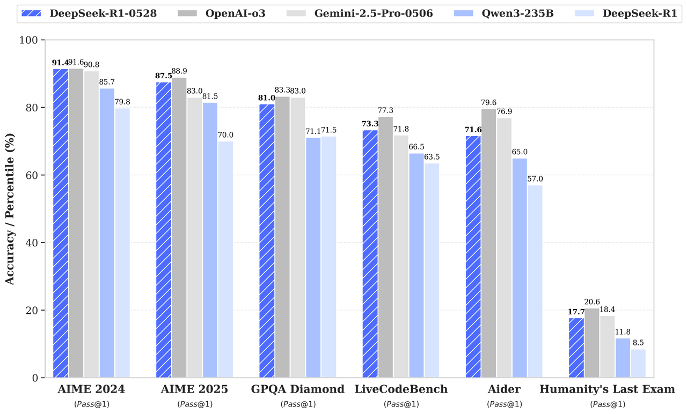

# DeepSeek Releases R1-0528: An Open-Source Reasoning AI Model Delivering Enhanced Math and Code Performance with Single-GPU Efficiency

> DeepSeek, the Chinese AI Unicorn, has released an updated version of its R1 reasoning model, named DeepSeek-R1-0528. This release enhances the model’s capabilities in mathematics, programming, and general logical reasoning, positioning it as a formidable open-source alternative to leading models like OpenAI’s o3 and Google’s Gemini 2.5 Pro. Technical Enhancements The R1-0528 update introduces significant […]

DeepSeek, the Chinese AI Unicorn, has released an updated version of its R1 reasoning model, named DeepSeek-R1-0528. This release enhances the model’s capabilities in mathematics, programming, and general logical reasoning, positioning it as a formidable open-source alternative to leading models like OpenAI’s o3 and Google’s Gemini 2.5 Pro.

### Technical Enhancements

The R1-0528 update introduces significant improvements in reasoning depth and inference accuracy. Notably, the model’s performance on the AIME 2025 math benchmark has increased from 70% to 87.5%, reflecting a more profound reasoning process that averages 23,000 tokens per question, up from 12,000 in the previous version. This enhancement is attributed to increased computational resources and algorithmic optimizations applied during post-training.

In addition to mathematical reasoning, the model has shown improved performance in code generation tasks. According to LiveCodeBench benchmarks, R1-0528 ranks just below OpenAI’s o4 mini and o3 models, outperforming xAI’s Grok 3 mini and Alibaba’s Qwen 3 in code generation tasks.

### Open-Source Model Weights

DeepSeek continues its commitment to open-source and open weights AI by releasing R1-0528 under the MIT license, allowing developers to modify and deploy the model freely. The model’s weights are available on Hugging Face, and detailed documentation is provided for local deployment and API integration . This approach contrasts with the proprietary nature of many leading AI models, promoting transparency and accessibility in AI development.

### Distilled Model for Lightweight Deployment

Recognizing the need for more accessible AI solutions, DeepSeek has also released a distilled version of R1-0528, named DeepSeek-R1-0528-Qwen3-8B. This model, fine-tuned from Alibaba’s Qwen3-8B using text generated by R1-0528, achieves state-of-the-art performance among open-source models on the AIME 2024 benchmark. It is designed to run efficiently on a single GPU, making advanced AI capabilities more accessible to developers with limited computational resources[.](https://www.aihub.cn/tools/llm/deepseek-r1-lite/?utm_source=chatgpt.com)

### Censorship Considerations

While [DeepSeek’s advancements in AI are noteworthy, the R1-0528 model has been observed to exhibit stricter content moderation compared to its predecessors](https://x.com/xlr8harder/status/1927964895569445314?ref_src=twsrc%5Etfw%7Ctwcamp%5Etweetembed%7Ctwterm%5E1927964898325045455%7Ctwgr%5E1c8b4c7f2d1f3330327a91ffd85f5b6beaa1c762%7Ctwcon%5Es2_&ref_url=https%3A%2F%2Ftechcrunch.com%2F2025%2F05%2F29%2Fdeepseeks-updated-r1-ai-model-is-more-censored-test-finds%2F). Independent testing revealed that the model avoids or provides limited responses to politically sensitive topics, such as the Tiananmen Square protests and the status of Taiwan, aligning with Chinese regulations that mandate AI models to adhere to content restrictions .

> Here are the reasoning traces on the internment camps question–again mentioning Xianjiang, and reasoning quite clearly about why it's not complying. [pic.twitter.com/ooEwmF23TY](https://t.co/ooEwmF23TY)— xlr8harder (@xlr8harder) [May 29, 2025](https://twitter.com/xlr8harder/status/1927964895569445314?ref_src=twsrc%5Etfw)

### Global Implications

The release of R1-0528 underscores China’s growing influence in the AI sector, challenging the dominance of U.S.-based companies. DeepSeek’s ability to develop competitive AI models at a fraction of the cost of their Western counterparts has prompted responses from companies like OpenAI, which have expressed concerns about the potential for these models to be manipulated by the Chinese government . This development highlights the shifting dynamics in global AI development and the increasing importance of open-source models in fostering innovation and competition.

### Conclusion

DeepSeek’s R1-0528 model represents a significant advancement in open-source AI, offering enhanced reasoning capabilities and accessibility for developers. By providing both a full-scale model and a distilled version suitable for single-GPU deployment, DeepSeek is making strides in democratizing AI technology. However, the model’s adherence to content moderation policies reflects the complex interplay between technological advancement and regulatory compliance. As the AI landscape continues to evolve, DeepSeek’s developments will likely play a pivotal role in shaping the future of open-source AI.

---

**Check out the [Open-Source Weights](https://huggingface.co/deepseek-ai/DeepSeek-R1-0528)** and **[Try it now](https://chat.deepseek.com/sign_in)_._** All credit for this research goes to the researchers of this project. Also, feel free to follow us on **[Twitter](https://x.com/intent/follow?screen_name=marktechpost)** and don’t forget to join our **[95k+ ML SubReddit](https://www.reddit.com/r/machinelearningnews/)** and Subscribe to **[our Newsletter](https://www.airesearchinsights.com/subscribe)**.
