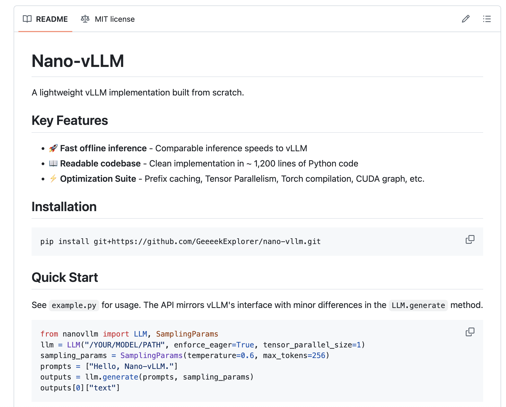

# DeepSeek Researchers Open-Sourced a Personal Project named ‘nano-vLLM’: A Lightweight vLLM Implementation Built from Scratch

> The DeepSeek Researchers just released a super cool personal project named ‘nano-vLLM‘, a minimalistic and efficient implementation of the vLLM (virtual Large Language Model) engine, designed specifically for users who value simplicity, speed, and transparency. Built entirely from scratch in Python, nano-vLLM distills the essence of high-performance inference pipelines into a concise, readable codebase of […]

The DeepSeek Researchers just released a super cool personal project named ‘[nano-vLLM](https://github.com/GeeeekExplorer/nano-vllm)‘, a minimalistic and efficient implementation of the vLLM (virtual Large Language Model) engine, designed specifically for users who value simplicity, speed, and transparency. Built entirely from scratch in Python, nano-vLLM distills the essence of high-performance inference pipelines into a concise, readable codebase of around 1,200 lines. Despite its small footprint, it matches the inference speed of the original vLLM engine in many offline scenarios.

Traditional inference frameworks like vLLM provide impressive performance by introducing sophisticated scheduling and optimization strategies. However, they often come with large and complex codebases that pose a barrier to understanding, modification, or deployment in constrained environments. Nano-vLLM is designed to be lightweight, auditable, and modular. The authors built it as a clean reference implementation that strips away auxiliary complexity while retaining core performance characteristics.

### Key Features

**1. Fast Offline Inference**
Nano-vLLM achieves near-parity with vLLM in terms of raw offline inference speed. By focusing on a leaner execution pipeline, it eliminates runtime overhead and simplifies deployment, making it suitable for research experiments, small-scale deployments, or educational purposes.

**2. Clean and Readable Codebase**
The entire engine is implemented in ~1,200 lines of Python code, without hidden abstractions or excessive dependency layers. This makes it an excellent tool for learning how LLM inference systems are architected, offering a step-by-step view of token sampling, cache management, and parallel execution.

**3. Optimization Suite**
nano-vLLM incorporates a robust set of optimization strategies to maximize throughput:

- **Prefix Caching**: Reuses past key-value cache states across prompt repetitions, reducing redundant computation.

- **Tensor Parallelism**: Distributes model layers across multiple GPUs to scale inference with hardware.

- **Torch Compilation**: Leverages `torch.compile()` to fuse operations and reduce Python overhead.

- **CUDA Graphs**: Pre-captures and reuses GPU execution graphs, minimizing launch latency.

These optimizations, though implemented minimally, align with the techniques used in production-scale systems and provide real performance gains in practice.

### Architecture Overview

Nano-vLLM uses a straightforward architecture:

- **Tokenizer and Input Handling**: Manages prompt parsing and token ID conversion via Hugging Face tokenizers.

- **Model Wrapper**: Loads transformer-based LLMs using PyTorch, applying tensor parallel wrappers where needed.

- **KV Cache Management**: Handles dynamic cache allocation and retrieval with support for prefix reuse.

- **Sampling Engine**: Implements top-k/top-p sampling, temperature scaling, and other decoding strategies.

By limiting the number of moving parts, nano-vLLM ensures that the execution path from input prompt to generated output remains clear and traceable.

### Use Cases and Limitations

Nano-vLLM is best suited for:

- Researchers building custom LLM applications

- Developers exploring inference-level optimizations

- Educators teaching [deep learning](https://www.marktechpost.com/2025/01/15/what-is-deep-learning-2/) infrastructure

- Engineers deploying inference on edge or low-resource systems

**However, as a minimal implementation, it omits many advanced features found in production-grade systems:**

- No dynamic batching or request scheduling

- No streaming/token-by-token generation for real-time serving

- Limited support for multiple concurrent users

These trade-offs are intentional and contribute to the codebase’s clarity and performance in single-threaded offline scenarios.

### Conclusion

Nano-vLLM reflects a thoughtful balance between simplicity and performance. While it doesn’t aim to replace full-featured inference engines in production, it succeeds as a fast, understandable, and modular alternative. For practitioners seeking to understand the nuts and bolts of modern LLM inference or to build their own variants from a clean slate, nano-vLLM offers a solid starting point. With support for key optimizations and a clearly structured design, it has the potential to become a go-to tool for educational use and lightweight LLM deployments.

---

Check out the** [GitHub Page](https://github.com/GeeeekExplorer/nano-vllm)_._** All credit for this research goes to the researchers of this project. Also, feel free to follow us on **[Twitter](https://x.com/intent/follow?screen_name=marktechpost)** and don’t forget to join our **[100k+ ML SubReddit](https://www.reddit.com/r/machinelearningnews/)** and Subscribe to **[our Newsletter](https://www.airesearchinsights.com/subscribe)**.
