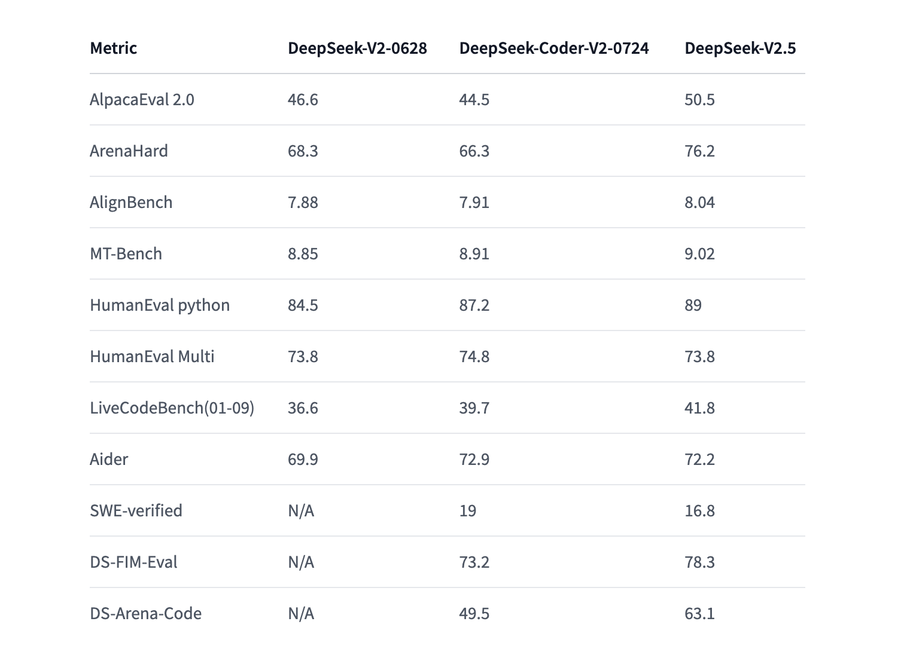

# DeepSeek-V2.5 Released by DeepSeek-AI: A Cutting-Edge 238B Parameter Model Featuring Mixture of Experts (MoE) with 160 Experts, Advanced Chat, Coding, and 128k Context Length Capabilities

> DeepSeek-AI has released DeepSeek-V2.5, a powerful Mixture of Experts (MOE) model with 238 billion parameters, featuring 160 experts and 16 billion active parameters for optimized performance. The model excels in chat and coding tasks, with cutting-edge capabilities such as function calls, JSON output generation, and Fill-in-the-Middle (FIM) completion. With an impressive 128k context length, DeepSeek-V2.5 […]

DeepSeek-AI has released [**DeepSeek-V2.5**](https://huggingface.co/deepseek-ai/DeepSeek-V2.5), a powerful Mixture of Experts (MOE) model with 238 billion parameters, featuring 160 experts and 16 billion active parameters for optimized performance. The model excels in chat and coding tasks, with cutting-edge capabilities such as function calls, JSON output generation, and Fill-in-the-Middle (FIM) completion. With an impressive 128k context length, DeepSeek-V2.5 is designed to easily handle extensive, complex inputs, pushing the boundaries of AI-driven solutions. This upgraded version combines two of its previous models: DeepSeekV2-Chat and DeepSeek-Coder-V2-Instruct. The new release promises an improved user experience, enhanced coding abilities, and better alignment with human preferences.

**The Evolution of DeepSeek**

Since its inception, DeepSeek-AI has been known for producing powerful models tailored to meet the growing needs of developers and non-developers alike. The DeepSeek-V2 series, in particular, has become a go-to solution for complex AI tasks, combining chat and coding functionalities with cutting-edge deep learning techniques.

*[**Image Source**](https://x.com/deepseek_ai/status/1832026579180163260)*

DeepSeek-V2.5 builds on the success of its predecessors by integrating the best features of DeepSeekV2-Chat, which was optimized for conversational tasks, and DeepSeek-Coder-V2-Instruct, known for its prowess in generating and understanding code. This combination allows DeepSeek-V2.5 to cater to a broader audience while delivering enhanced performance across various use cases. The model’s architecture has been meticulously designed to improve responsiveness, ability to follow instructions, and adaptability to different contexts.

**Key Features of DeepSeek-V2.5**

- **Improved Alignment with Human Preferences: **One of DeepSeek-V2.5’s primary focuses is better aligning with human preferences. This means the model has been optimized to follow instructions more accurately and provide more relevant and coherent responses. This improvement is especially crucial for businesses and developers who require reliable AI solutions that can adapt to specific demands with minimal intervention.

- **Enhanced Writing and Instruction Following:** DeepSeek-V2.5 offers improvements in writing, generating more natural-sounding text and following complex instructions more efficiently than previous versions. Whether used in chat-based interfaces or for generating extensive coding instructions, this model provides users with a robust AI solution that can easily handle various tasks.

- **General and Coding Abilities:** By merging the capabilities of DeepSeekV2-Chat and DeepSeek-Coder-V2-Instruct, the model bridges the gap between conversational AI and coding assistance. This integration means that DeepSeek-V2.5 can be used for general-purpose tasks like customer service automation and more specialized functions like code generation and debugging.

- **Optimized Inference Requirements: **Running DeepSeek-V2.5 locally requires significant computational resources, as the model utilizes 236 billion parameters in BF16 format, demanding 80GB*8 GPUs. However, the model offers high performance with impressive speed and accuracy for those with the necessary hardware. For users who lack access to such advanced setups, DeepSeek-V2.5 can also be run via Hugging Face’s Transformers or vLLM, both of which offer cloud-based inference solutions.

*[**Image Source**](https://x.com/deepseek_ai/status/1832026579180163260)*

**Performance Metrics**

The improvements in DeepSeek-V2.5 are reflected in its performance metrics across various benchmarks. On AlpacaEval 2.0, DeepSeek-V2.5 scored 50.5, increasing from 46.6 in the DeepSeek-V2 model. Similarly, in the HumanEval Python test, the model improved its score from 84.5 to 89. These metrics are a testament to the significant advancements in general-purpose reasoning, coding abilities, and human-aligned responses.

*[**Image Source**](https://x.com/deepseek_ai/status/1832026579180163260)*

In addition to these benchmarks, the model also performed well in ArenaHard and MT-Bench evaluations, demonstrating its versatility and capability to adapt to various tasks and challenges. These improvements translate into tangible user benefits, especially in industries where accuracy, reliability, and adaptability are critical.

**Inference and Usage**

DeepSeek-AI has provided multiple ways for users to take advantage of DeepSeek-V2.5. For those who want to run the model locally, Hugging Face’s Transformers offers a simple way to integrate the model into their workflow. Users can easily load the model and tokenizer, ensuring compatibility with existing infrastructure. The ability to generate responses via the vLLM library is also available, allowing for faster inference and more efficient use of resources, particularly in distributed environments.

DeepSeek-V2.5 offers function calling capabilities, enabling it to interact with external tools to enhance its overall functionality. This feature is useful for developers who need the model to perform tasks like retrieving current weather data or performing API calls.

**Licensing and Commercial Use**

One of the standout aspects of DeepSeek-V2.5 is its MIT License, which allows for flexible use in both commercial and non-commercial applications. This licensing model ensures businesses and developers can incorporate DeepSeek-V2.5 into their products and services without worrying about restrictive terms. The model agreement for the DeepSeek-V2 series supports commercial use, further enhancing its appeal for organizations looking to leverage state-of-the-art AI solutions.

**Conclusion**

With the release of DeepSeek-V2.5, which combines the best elements of its previous models and optimizes them for a broader range of applications, DeepSeek-V2.5 is poised to become a key player in the AI landscape. Whether used for general-purpose tasks or highly specialized coding projects, this new model promises superior performance, enhanced user experience, and greater adaptability, making it an invaluable tool for developers, researchers, and businesses.

DeepSeek-AI continues to refine and expand its AI models, so DeepSeek-V2.5 represents a significant step forward. It ensures that users have access to a powerful and flexible AI solution capable of meeting the ever-evolving demands of modern technology.

---

Check out the **[Model](https://huggingface.co/deepseek-ai/DeepSeek-V2.5).** All credit for this research goes to the researchers of this project. Also, don’t forget to follow us on **[Twitter](https://twitter.com/Marktechpost)** and [**LinkedIn**](https://www.linkedin.com/company/marktechpost/?viewAsMember=true). Join our **[Telegram Channel](https://www.zyphra.com/post/zamba2-mini)**.

**If you like our work, you will love our**[** newsletter..**](https://marktechpost-newsletter.beehiiv.com/subscribe)

Don’t Forget to join our **[50k+ ML SubReddit](https://www.reddit.com/r/machinelearningnews/)**
