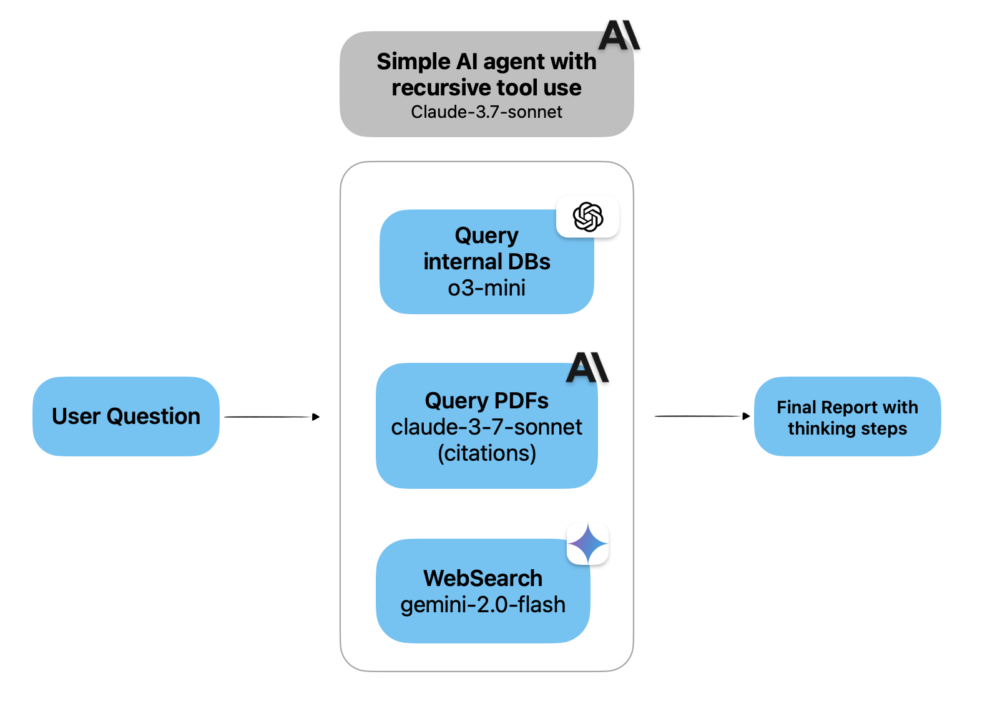

# Defog AI Open Sources Introspect: MIT-Licensed Deep-Research for Your Internal Data

> Modern enterprises face a myriad of challenges when it comes to internal data research. Data today is scattered across various sources—spreadsheets, databases, PDFs, and even online platforms—making it difficult to extract coherent insights. Many organizations struggle with disjointed systems where structured SQL queries and unstructured documents do not easily speak the same language. This fragmentation […]

Modern enterprises face a myriad of challenges when it comes to internal data research. Data today is scattered across various sources—spreadsheets, databases, PDFs, and even online platforms—making it difficult to extract coherent insights. Many organizations struggle with disjointed systems where structured SQL queries and unstructured documents do not easily speak the same language. This fragmentation not only hinders decision-making but also slows down innovation. Without an integrated approach, data analysts and business leaders spend precious time wrestling with data silos, manually merging insights, and reformatting data to answer critical questions.

**[Defog AI](https://defog.ai/)** Open Sources **[Introspect](https://github.com/defog-ai/introspect)**: MIT-licensed Deep-Research for your internal data. It works with spreadsheets, databases, PDFs, and web search. Has a remarkably simple architecture – Sonnet agent armed with recursive tool calling and 3 default tools. Best for use-cases where you want to combine insights from SQL with unstructured data + data from the web. This open-source project streamlines the research process by integrating various data sources into a single, cohesive workflow. With a focus on simplicity, the tool enables users to conduct deep research across diverse datasets, automating the extraction of insights that were previously buried in disparate formats.

### Technical Details and Benefits

At its core, Introspect employs a straightforward yet powerful design. It utilizes a Sonnet agent that orchestrates recursive tool calls to answer complex user queries. The agent is equipped with three primary tools: `text_to_sql` for querying databases, `web_search` for gathering external context, and `pdf_with_citations` for analyzing document-based content. By recursively querying until sufficient context is achieved, the system bridges the gap between structured data (such as SQL databases) and unstructured sources (like PDFs and web content). This innovative approach not only improves the efficiency of data research but also ensures that the insights generated are both comprehensive and contextually rich. Additionally, it supports most popular database connectors—including PostgreSQL, MySQL, SQLite, BigQuery, Redshift, Snowflake, and Databricks—making it adaptable to varied enterprise environments.

### Results and Insights

The GitHub repository showcases tangible results and a user-friendly demo environment, available at [demo.defog.ai/reports](https://demo.defog.ai/reports) (user id: `admin`, password: `admin`) that illustrates its capabilities in real-time. The repository includes detailed quick start guides—such as setting up environment variables for API keys and running services via Docker Compose—which demonstrates its ease of deployment and immediate utility. With 31 stars and an active community of contributors, the project reflects a growing interest in leveraging AI for comprehensive internal data research. Furthermore, the integration of a 150-second demo video provides potential users with a clear overview of how the tool works in practice, showcasing the recursive tool-calling mechanism and the unified interface for diverse data sources.

### Conclusion

In conclusion, Defog AI’s Introspect addresses a critical need in today’s data-driven world. By seamlessly merging structured SQL insights with unstructured data and real-time web information, it empowers organizations to conduct deep research with minimal friction. Its MIT-licensed, open-source nature encourages community contributions and rapid innovation, ensuring the tool remains at the forefront of data research technology. Whether you are an enterprise looking to streamline your data workflows or a developer eager to experiment with advanced AI-driven research, Introspect offers a compelling, accessible solution to the challenges of modern internal data analysis.

---

Check out **_the [GitHub Page](https://github.com/defog-ai/introspect)._** All credit for this research goes to the researchers of this project. Also, feel free to follow us on **[Twitter](https://x.com/intent/follow?screen_name=marktechpost)** and don’t forget to join our **[80k+ ML SubReddit](https://www.reddit.com/r/machinelearningnews/)**.

**🚨 [Recommended Read- LG AI Research Releases NEXUS: An Advanced System Integrating Agent AI System and Data Compliance Standards to Address Legal Concerns in AI Datasets](https://www.marktechpost.com/2025/02/16/lg-ai-research-releases-nexus-an-advanced-system-integrating-agent-ai-system-and-data-compliance-standards-to-address-legal-concerns-in-ai-datasets/)**
