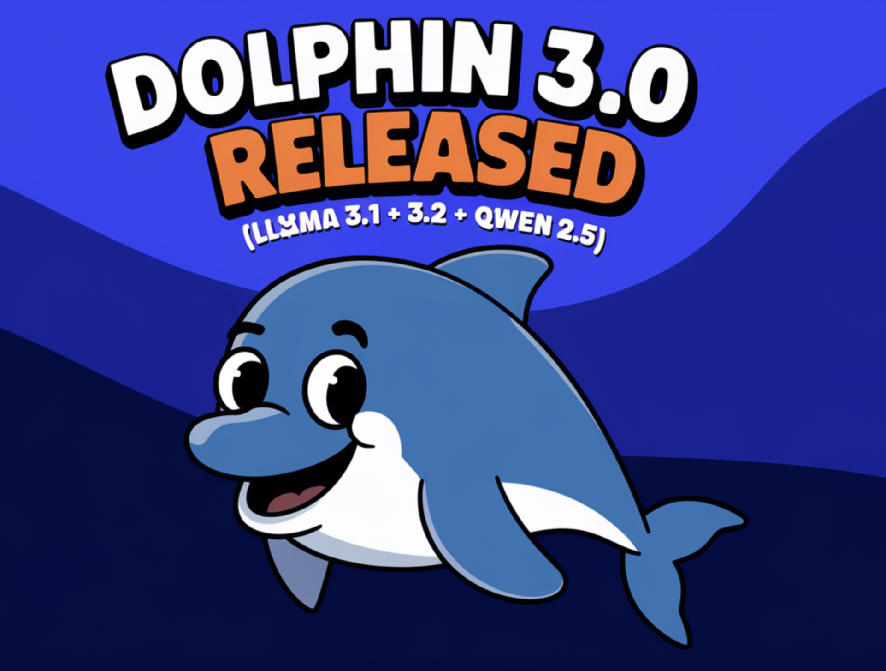

# Dolphin 3.0 Released (Llama 3.1 + 3.2 + Qwen 2.5): A Local-First, Steerable AI Model that Puts You in Control of Your AI Stack and Alignment

> Artificial intelligence has come a long way, transforming the way we work, live, and interact. Yet, challenges remain. Many AI systems rely heavily on cloud-based infrastructure, which raises valid privacy concerns. Others offer limited user control, making customization a difficult task. On top of that, aligning AI behavior with specific needs is often more complicated […]

Artificial intelligence has come a long way, transforming the way we work, live, and interact. Yet, challenges remain. Many AI systems rely heavily on cloud-based infrastructure, which raises valid privacy concerns. Others offer limited user control, making customization a difficult task. On top of that, aligning AI behavior with specific needs is often more complicated than it should be. Many advanced models also prioritize performance at the cost of accessibility, leaving users struggling to deploy them in local environments. Clearly, there’s a need for a more balanced approach—one that combines innovation with usability and control.

Dolphin 3.0 addresses these challenges head-on. Various versions based on Llama 3.1, Llama 3.2, and Qwen 2.5 into one cohesive framework offer a local-first, steerable AI solution. This model gives users greater control over their AI stack, allowing them to shape the system according to their needs. Unlike many cloud-reliant models, Dolphin 3.0 focuses on privacy, adaptability, and scalability. Its design is modular, enabling users to guide the AI’s behavior in ways that fit their specific workflows, making it a secure and flexible choice.

**At its core, Dolphin 3.0 has three versions:**

- **Llama 3.1 and Llama 3.2**: These models are recognized for their strong capabilities in natural language understanding and generation, handling a wide variety of tasks efficiently.

- **Qwen 2.5**: This multimodal model supports applications that involve both text and image processing, offering a versatile approach to complex problems.

The model’s parameter configurations range from 0.5 billion to 8 billion, ensuring flexibility for different use cases. Whether it’s lightweight models for local deployment or more robust versions for demanding applications, Dolphin 3.0 adapts to the needs of organizations without requiring a complete overhaul of their infrastructure.

**From a technical standpoint, Dolphin 3.0 offers some significant innovations:**

- **Local-First Architecture**: Prioritizing on-device computation, Dolphin 3.0 reduces dependency on cloud services. This not only improves latency but also ensures data remains private and secure.

- **Steerable AI Framework**: Users can fine-tune the model’s behavior based on predefined rules or feedback, making it easier to align the AI with specific goals.

- **Enhanced Multimodal Capabilities**: With Qwen 2.5, the model handles inputs across multiple formats, making it suitable for tasks like document analysis, visual question answering, and contextual search.

**The benefits of Dolphin 3.0 go beyond its technical capabilities:**

- **Privacy**: By keeping computations local, users can ensure that sensitive data stays secure and meets compliance requirements.

- **Cost-Efficiency**: Reducing reliance on cloud-based APIs can lead to significant cost savings.

- **Customization**: The steerable framework allows organizations to adapt the AI’s outputs to meet specific objectives, improving relevance and efficiency.

Performance data from the provided resources demonstrates the capabilities of Dolphin 3.0. For instance, the Dolphin 3.0 Llama 3.2 models exhibit strong performance across tasks, with configurations ranging from 1 billion to 3 billion parameters showing notable efficiency. Similarly, the Qwen 2.5 models, ranging from 0.5 billion to 3 billion parameters, excel in multimodal applications, balancing computational requirements with task accuracy. The Llama 3.1 8B model, tailored for larger-scale tasks, further enhances the framework’s flexibility and scalability. These insights highlight how Dolphin 3.0 delivers practical solutions for a variety of scenarios.

Early adopters have shared encouraging feedback, emphasizing the productivity gains achieved through seamless integration and the benefits of local-first deployment. The steerable AI framework has been particularly appreciated for its role in adapting the model’s behavior to specific needs without unnecessary complexity.

In summary, Dolphin 3.0 provides a thoughtful and practical approach to AI. By integrating Llama 3.1, Llama 3.2, and Qwen 2.5, it strikes a balance between performance, privacy, and user control. For organizations looking for AI solutions that adapt to their unique needs, Dolphin 3.0 stands out as a reliable and versatile option. Whether for developers, researchers, or enterprises, it offers a strong foundation for building AI applications that are not just powerful, but also aligned with the demands of modern users.

---

Check out **_the [Model Series on Hugging Face](https://huggingface.co/collections/cognitivecomputations/dolphin-30-677ab47f73d7ff66743979a3)._** All credit for this research goes to the researchers of this project. Also, don’t forget to follow us on **[Twitter](https://twitter.com/Marktechpost)** and join our **[Telegram Channel](https://github.com/XGenerationLab/XiYan-SQL)** and [**LinkedIn Gr**](https://www.linkedin.com/groups/13668564/)[**oup**](https://www.linkedin.com/groups/13668564/). Don’t Forget to join our **[60k+ ML SubReddit](https://www.reddit.com/r/machinelearningnews/)**.

**🚨 FREE UPCOMING AI WEBINAR (JAN 15, 2025): [Boost LLM Accuracy with Synthetic Data and Evaluation Intelligence](https://info.gretel.ai/boost-llm-accuracy-with-sd-and-evaluation-intelligence?utm_source=marktechpost&utm_medium=newsletter&utm_campaign=202501_gretel_galileo_webinar)**–**[Join this webinar to gain actionable insights into boosting LLM model performance and accuracy while safeguarding data privacy](https://info.gretel.ai/boost-llm-accuracy-with-sd-and-evaluation-intelligence?utm_source=marktechpost&utm_medium=newsletter&utm_campaign=202501_gretel_galileo_webinar).**
