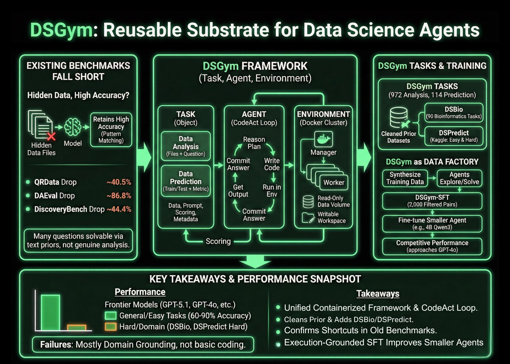

# DSGym Offers a Reusable Container Based Substrate for Building and Benchmarking Data Science Agents

> Data science agents should inspect datasets, design workflows, run code, and return verifiable answers, not just autocomplete Pandas code. DSGym, introduced by researchers from Stanford University, Together AI, Duke University, and Harvard University, is a framework that evaluates and trains such agents across more than 1,000 data science challenges with expert curated ground truth and […]

Data science agents should inspect datasets, design workflows, run code, and return verifiable answers, not just autocomplete Pandas code. DSGym, introduced by researchers from Stanford University, Together AI, Duke University, and Harvard University, is a framework that evaluates and trains such agents across more than 1,000 data science challenges with expert curated ground truth and a consistent post training pipeline.

*https://arxiv.org/pdf/2601.16344*

### Why existing benchmarks fall short?

The research team first probe existing benchmarks that claim to test data aware agents. When data files are hidden, models still retain high accuracy. On QRData the average drop is 40.5 percent, on DAEval it is 86.8 percent, and on DiscoveryBench it is 44.4 percent. Many questions are solvable using priors and pattern matching on the text alone instead of genuine data analysis, and they also find annotation errors and inconsistent numerical tolerances.

### Task, Agent, and Environment

DSGym standardizes evaluation into **three objects, Task, Agent, and Environment**. Tasks are either Data Analysis or Data Prediction. Data Analysis tasks provide one or more files along with a natural language question that must be answered through code. Data Prediction tasks provide train and test splits along with an explicit metric and require the agent to build a modeling pipeline and output predictions.

Each task is packed into a Task Object that holds the data files, query prompt, scoring function, and metadata. Agents interact through a CodeAct style loop. At each turn, the agent writes a reasoning block that describes its plan, a code block that runs inside the environment, and an answer block when it is ready to commit. The Environment is implemented as a manager and worker cluster of Docker containers, where each worker mounts data as read only volumes, exposes a writable workspace, and ships with domain specific Python libraries.

### DSGym Tasks, DSBio, and DSPredict

On top of this runtime, DSGym Tasks aggregates and refines existing datasets and adds new ones. The research team clean QRData, DAEval, DABStep, MLEBench Lite, and others by dropping unscorable items and applying a shortcut filter that removes questions solved easily by multiple models without data access.

To cover scientific discovery, they introduce DSBio, a suite of 90 bioinformatics tasks derived from peer reviewed papers and open source datasets. Tasks cover single cell analysis, spatial and multi-omics, and human genetics, with deterministic numerical or categorical answers supported by expert reference notebooks.

DSPredict targets modeling on real Kaggle competitions. A crawler collects recent competitions that accept CSV submissions and satisfy size and clarity rules. After preprocessing, the suite is split into DSPredict Easy with 38 playground style and introductory competitions, and DSPredict Hard with 54 high complexity challenges. In total, DSGym Tasks includes 972 data analysis tasks and 114 prediction tasks.

### What current agents can and cannot do

The evaluation covers closed source models such as GPT-5.1, GPT-5, and GPT-4o, open weights models such as Qwen3-Coder-480B, Qwen3-235B-Instruct, and GPT-OSS-120B, and smaller models such as Qwen2.5-7B-Instruct and Qwen3-4B-Instruct. All are run with the same CodeAct agent, temperature 0, and tools disabled.

On cleaned general analysis benchmarks, such as QRData Verified, DAEval Verified, and the easier split of DABStep, top models reach between 60 percent and 90 percent exact match accuracy. On DABStep Hard, accuracy drops for every model, which shows that multi step quantitative reasoning over financial tables is still brittle.

DSBio exposes a more severe weakness. Kimi-K2-Instruct achieves the best overall accuracy of 43.33 percent. For all models, between 85 and 96 percent of inspected failures on DSBio are domain grounding errors, including misuse of specialized libraries and incorrect biological interpretations, rather than basic coding mistakes.

On MLEBench Lite and DSPredict Easy, most frontier models achieve near perfect Valid Submission Rate above 80 percent. On DSPredict Hard, valid submissions rarely exceed 70 percent and medal rates on Kaggle leaderboards are near 0 percent. This pattern supports the research team’s observation of a simplicity bias where agents stop after a baseline solution instead of exploring more competitive models and hyperparameters.

### DSGym as a data factory and training ground

The same environment can also synthesize training data. Starting from a subset of QRData and DABStep, the research team ask agents to explore datasets, propose questions, solve them with code, and record trajectories, which yields 3,700 synthetic queries. A judge model filters these to a set of 2,000 high quality query plus trajectory pairs called DSGym-SFT, and fine-tuning a 4B Qwen3 based model on DSGym-SFT produces an agent that reaches competitive performance with GPT-4o on standardized analysis benchmarks despite having far fewer parameters.

*source: marktechpost.com*

### Key Takeaways

- DSGym provides a unified Task, Agent, and Environment framework, with containerized execution and a CodeAct style loop, to evaluate data science agents on real code based workflows instead of static prompts.

- The benchmark suite, DSGym-Tasks, consolidates and cleans prior datasets and adds DSBio and DSPredict, reaching 972 data analysis tasks and 114 prediction tasks across domains such as finance, bioinformatics, and earth science.

- Shortcut analysis on existing benchmarks shows that removing data access only moderately reduces accuracy in many cases, which confirms that prior evaluations often measure pattern matching on text rather than genuine data analysis.

- Frontier models achieve strong performance on cleaned general analysis tasks and on easier prediction tasks, but they perform poorly on DSBio and DSPredict-Hard, where most errors come from domain grounding issues and conservative, under tuned modeling pipelines.

- The DSGym-SFT dataset, built from 2,000 filtered synthetic trajectories, enables a 4B Qwen3 based agent to approach GPT-4o level accuracy on several analysis benchmarks, which shows that execution grounded supervision on structured tasks is an effective way to improve data science agents.

---

Check out the[ **Paper**](https://arxiv.org/pdf/2601.16344)**, **and** [Repo](https://github.com/fannie1208/DSGym)**. Also, feel free to follow us on **[Twitter](https://x.com/intent/follow?screen_name=marktechpost)** and don’t forget to join our **[100k+ ML SubReddit](https://www.reddit.com/r/machinelearningnews/)** and Subscribe to **[our Newsletter](https://www.aidevsignals.com/)**. Wait! are you on telegram? **[now you can join us on telegram as well.](https://t.me/machinelearningresearchnews)**
