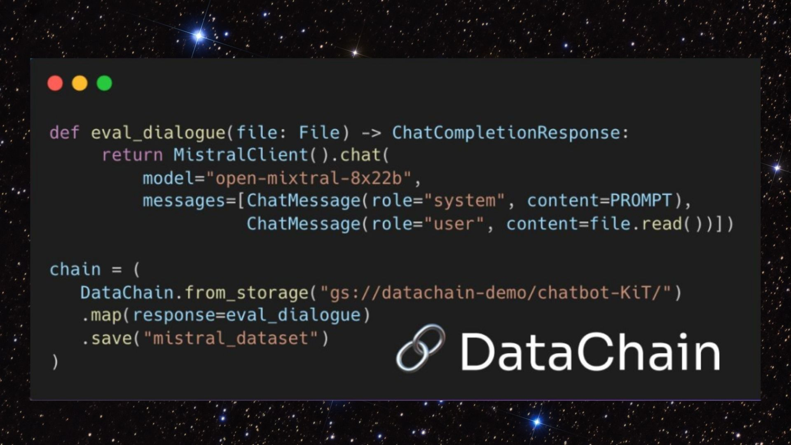

# DVC.ai Released DataChain: A Groundbreaking Open-Source Python Library for Large-Scale Unstructured Data Processing and Curation

> DVC.ai has announced the release of DataChain, a revolutionary open-source Python library designed to handle and curate unstructured data at an unprecedented scale. By incorporating advanced AI and machine learning capabilities, DataChain aims to streamline the data processing workflow, making it invaluable for data scientists and developers. Key Features of DataChain: DataChain is designed to […]

DVC.ai has announced the release of [**DataChain**](https://github.com/iterative/datachain?trk=public_post_comment-text), a revolutionary open-source Python library designed to handle and curate unstructured data at an unprecedented scale. By incorporating advanced AI and machine learning capabilities, DataChain aims to streamline the data processing workflow, making it invaluable for data scientists and developers.

**Key Features of DataChain:**

- **AI-Driven Data Curation:** DataChain utilizes local machine learning models and large language (LLM) API calls to enrich datasets. This combination ensures the data processed is structured and enhanced with meaningful annotations, adding significant value for subsequent analysis and applications.

- **GenAI Dataset Scale:** The library is built to handle tens of millions of files or snippets, making it ideal for extensive data projects. This scalability is crucial for enterprises and researchers who manage large datasets, enabling them to process and analyze data efficiently.

- **Python-Friendly:** DataChain employs strictly typed Pydantic objects instead of JSON, providing a more intuitive and seamless experience for Python developers. This approach integrates well with the existing Python ecosystem, allowing for smoother development and implementation.

DataChain is designed to facilitate the parallel processing of multiple data files or samples. It supports various operations such as filtering, aggregating, and merging datasets. These operations can be chained together, enabling complex data processing workflows to be executed efficiently. The resulting datasets can be saved, versioned, and extracted as files or converted into PyTorch data loaders, facilitating their use in machine learning workflows.

*[**Image Source**](https://github.com/iterative/datachain?trk=public_post_comment-text)*

DataChain leverages Pydantic to serialize Python objects into an embedded SQLite database. This functionality allows for efficient storage and retrieval of complex data structures. The library also supports vectorized analytical queries directly within the database, eliminating the need for deserialization. This capability enhances the performance of analytical tasks, making it possible to execute them at scale.

**Typical Use Cases of DataChain**

- LLM Dialogues Judging: DataChain can be employed to evaluate dialogues generated by LLMs, ensuring the quality and relevance of AI-generated content. This is particularly useful for applications requiring high-quality conversational agents.

- Auto-Deserializing LLM Responses: The library can automatically deserialize LLM responses into structured Python objects, simplifying the handling and processing AI outputs.

- Vectorized Analytics: By enabling vectorized analytics over Python objects, DataChain allows for efficient execution of complex data analysis tasks, enhancing the overall data processing pipeline.

- Annotating Cloud Images: DataChain supports annotating images using local machine learning models, facilitating the creation of labeled datasets for computer vision tasks. This is particularly beneficial for developing and training image recognition systems.

- Dataset Curation: The library can curate datasets with AI-driven annotations, enhancing the quality and usability of large data collections. This feature is needed for organizations that rely on high-quality, annotated data for training machine learning models.

DataChain excels at optimizing batch operations, such as parallelizing synchronous API calls and handling heavy batch processing tasks. This optimization is critical for applications that prompt processing of large volumes of data. The library’s ability to handle out-of-memory computing ensures that even the largest datasets can be processed efficiently.

In conclusion, with the release of DataChain, DVC.ai has become a powerful tool for the data science and AI community. Its ability to process and curate unstructured data at scale and its Python-friendly design make it a valuable asset for developers and researchers. DataChain sets the foundation for future advancements in data wrangling and AI-driven curation solutions, promising to streamline and enhance the workflow of handling large datasets.
