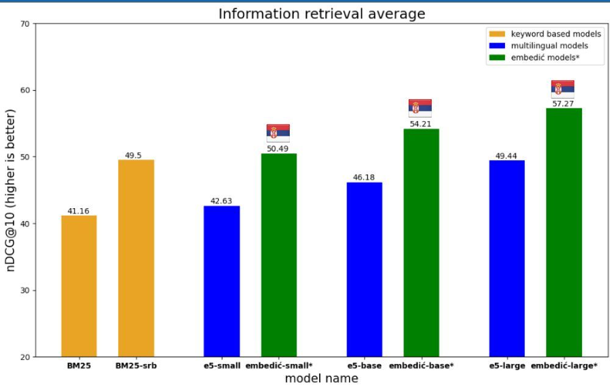

# Embedić Released: A Suite of Serbian Text Embedding Models Optimized for Information Retrieval and RAG

> Novak Zivanic has made a significant contribution to the field of Natural Language Processing with the release of Embedić, a suite of Serbian text embedding models. These models are specifically designed for Information Retrieval and Retrieval-Augmented Generation (RAG) tasks. Specifically, the smallest model in the suite has achieved a remarkable feat, surpassing the previous state-of-the-art […]

Novak Zivanic has made a significant contribution to the field of Natural Language Processing with the release of **_Embedić_**, a suite of Serbian text embedding models. These models are specifically designed for Information Retrieval and Retrieval-Augmented Generation (RAG) tasks. Specifically, the smallest model in the suite has achieved a remarkable feat, surpassing the previous state-of-the-art performance while using 5 times fewer parameters. This breakthrough demonstrates the efficiency and effectiveness of the Embedić models in handling Serbian language processing tasks.

**Embedić models are fine-tuned from multilingual-e5 models, and they come in 3 sizes (small, base, and large).**

The Embedić suite demonstrates impressive versatility in its language capabilities. While specialized for Serbian, including both Cyrillic and Latin scripts, these models also exhibit cross-lingual functionality, understanding English as well. This feature allows users to embed documents in English, Serbian, or a combination of both languages. Utilizing the sentence-transformers framework, Embedić maps sentences and paragraphs to a _786-dimensional dense vector space_. This representation makes the models particularly useful for tasks such as clustering and semantic search, enhancing their practical applications in various linguistic contexts.

When using Embedić, it’s crucial to note some important usage guidelines. The use of “ošišana latinica” (simplified Latin script without diacritics) can significantly decrease search quality, so it’s advisable to use proper Serbian orthography. In addition, employing uppercase letters for named entities can notably improve search results. 

The Embedić suite offers three model sizes: small, base, and large, all fine-tuned from multilingual-e5 models. The training process, conducted on a single 4070ti Super GPU, involves a three-step approach: distillation, training on (query, text) pairs, and final fine-tuning with triplets.

The Embedić models underwent rigorous evaluation across three critical tasks: Information Retrieval, Sentence Similarity, and Bitext mining. To ensure a comprehensive assessment, significant effort and resources were invested in creating suitable Serbian language datasets. The developer personally translated the STS17 cross-lingual evaluation dataset, demonstrating a commitment to accuracy. In addition to this, a substantial investment of $6,000 was made in Google’s translation API to convert four Information Retrieval evaluation datasets into Serbian. This meticulous approach to dataset preparation underscores the thoroughness of the evaluation process and the models’ potential effectiveness in Serbian language tasks.

The release of Embedić marks a significant advancement in Serbian language processing. Developed by Novak Zivanic, this suite of text embedding models offers state-of-the-art performance for Information Retrieval and RAG tasks, with the smallest model outperforming previous benchmarks using significantly fewer parameters. The models, available in three sizes, are fine-tuned from multilingual-e5 and offer cross-lingual capabilities, understanding both Serbian (Cyrillic and Latin scripts) and English.

Embedić utilizes the sentence-transformers framework, mapping text to a 786-dimensional vector space, making it ideal for clustering and semantic search tasks. The development process involved meticulous training and evaluation, including personal translation efforts and substantial investment in creating comprehensive Serbian datasets.

---

Check out the **[Model Card on HF](https://huggingface.co/collections/djovak/embedic-66dee0776e8408202d226d85)**.. All credit for this research goes to the researchers of this project. Also, don’t forget to follow us on **[Twitter](https://twitter.com/Marktechpost)** and join our **[Telegram Channel](https://pxl.to/at72b5j)** and [**LinkedIn Gr**](https://www.linkedin.com/groups/13668564/)[**oup**](https://www.linkedin.com/groups/13668564/). **If you like our work, you will love our**[** newsletter..**](https://marktechpost-newsletter.beehiiv.com/subscribe)

Don’t Forget to join our **[50k+ ML SubReddit](https://www.reddit.com/r/machinelearningnews/)**

**[⏩ ⏩ FREE AI WEBINAR: ‘SAM 2 for Video: How to Fine-tune On Your Data’ (Wed, Sep 25, 4:00 AM – 4:45 AM EST)](https://encord.com/webinar/sam2-for-video/?utm_medium=affiliate&utm_source=newsletter&utm_campaign=marktechpost&utm_content=sam2video)**
