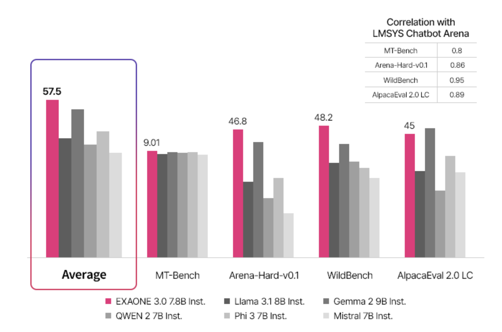

# EXAONE 3.0 Released: A 7.8B Open-Sourced State of the Art Language Model from LG AI Research

> LG AI Research has recently announced the release of EXAONE 3.0. This latest third version in the series upgrades EXAONE’s already impressive capabilities. The release as an open-source large language model is unique to the current version with great results and 7.8B parameters. With the introduction of EXAONE 3.0, LG AI Research is driving a […]

LG AI Research has recently announced the release of [**EXAONE 3.0**](https://huggingface.co/LGAI-EXAONE/EXAONE-3.0-7.8B-Instruct). This latest third version in the series upgrades EXAONE’s already impressive capabilities. The release as an open-source large language model is unique to the current version with great results and 7.8B parameters. With the introduction of EXAONE 3.0, LG AI Research is driving a new development direction, marking it competitive with the latest technology trends.

*[**Image Source**](https://www.lgresearch.ai/blog/view)*

**Enhanced Capabilities and Features**

EXAONE 3.0 has many new features and enhancements that set it apart from its predecessors. One of the most notable improvements is the increased processing power, allowing faster and more efficient data analysis. This enhancement is crucial in handling the massive datasets that modern AI systems must process to deliver accurate and reliable results. The increased computational capacity also enables EXAONE 3.0 to perform complex tasks more precisely, making it a valuable tool for various industries.

*[**Image Source**](https://www.lgresearch.ai/blog/view)*

EXAONE 3.0 introduces advanced natural language processing (NLP) capabilities. These enhancements allow the AI to understand and interpret human language better, making interactions with the AI more intuitive and seamless. The improved NLP capabilities are expected to significantly enhance user experience, particularly in applications where human-AI interaction is critical, such as customer service, virtual assistants, and automated content generation.

**AI Ethics and Responsible Innovation**

In developing EXAONE 3.0, LG AI Research has strongly emphasized ethical AI development. The research team has integrated advanced safeguards into the system to ensure that the AI operates within ethical boundaries and adheres to guidelines that promote fairness, transparency, and accountability. This focus on AI ethics reflects LG’s commitment to responsible innovation, recognizing the potential impacts of AI technology on society and taking proactive steps to mitigate risks.

*[**Image Source**](https://www.lgresearch.ai/blog/view)*

EXAONE 3.0’s ethical framework includes mechanisms to prevent data processing and decision-making bias, ensuring that the AI’s outputs are equitable and unbiased. Furthermore, LG AI Research has implemented stringent data privacy measures, ensuring that the AI system handles personal and sensitive data with the highest standards of security and confidentiality.

**Applications Across Multiple Industries**

EXAONE 3.0 is designed to be versatile, with applications spanning various industries. AI’s enhanced data processing capabilities can be leveraged in the healthcare sector for more accurate diagnostic tools, predictive analytics, and personalized medicine. The ability to process and analyze large volumes of medical data quickly and accurately could revolutionize patient care.

EXAONE 3.0’s advanced analytics can be applied to risk assessment, fraud detection, and market analysis in the financial industry. The AI’s ability to identify patterns and trends in large datasets can provide financial institutions with deeper insights.

The AI’s improved NLP features also significantly affect the media and entertainment industries. EXAONE 3.0 can automate content creation, generate realistic simulations, and enhance user experiences in gaming and virtual environments. These capabilities open up new possibilities for creative professionals.

**LG AI Research’s Vision**

The research team is committed to further refining and expanding EXAONE’s capabilities to make AI an integral part of everyday life. LG AI Research envisions a future where AI plays a main role in solving some of the world’s most pressing challenges, from healthcare and education to climate change and global security.

*[**Image Source**](https://www.lgresearch.ai/blog/view)*

In conclusion, EXAONE 3.0 combines enhanced capabilities with a strong ethical foundation. LG AI Research’s commitment to innovation and responsible AI development is evident in this latest release, poised to impact multiple industries significantly.

---

Check out the **[Paper](https://arxiv.org/abs/2408.03541)** and [**HF Model Page**.](https://www.lgresearch.ai/blog/view?seq=460) All credit for this research goes to the researchers of this project. Also, don’t forget to follow us on **[Twitter](https://twitter.com/Marktechpost)** and join our **[Telegram Channel](https://pxl.to/at72b5j)** and [**LinkedIn Gr**](https://www.linkedin.com/groups/13668564/)[**oup**](https://www.linkedin.com/groups/13668564/). **If you like our work, you will love our**[** newsletter..**](https://marktechpost-newsletter.beehiiv.com/subscribe)

Don’t Forget to join our **[48k+ ML SubReddit](https://www.reddit.com/r/machinelearningnews/)**

**Find Upcoming [AI Webinars here](https://www.marktechpost.com/ai-webinars-list-llms-rag-generative-ai-ml-vector-database/)**

---

> [Arcee AI Released DistillKit: An Open Source, Easy-to-Use Tool Transforming Model Distillation for Creating Efficient, High-Performance Small Language Models](https://www.marktechpost.com/2024/08/01/arcee-ai-released-distillkit-an-open-source-easy-to-use-tool-transforming-model-distillation-for-creating-efficient-high-performance-small-language-models/)
