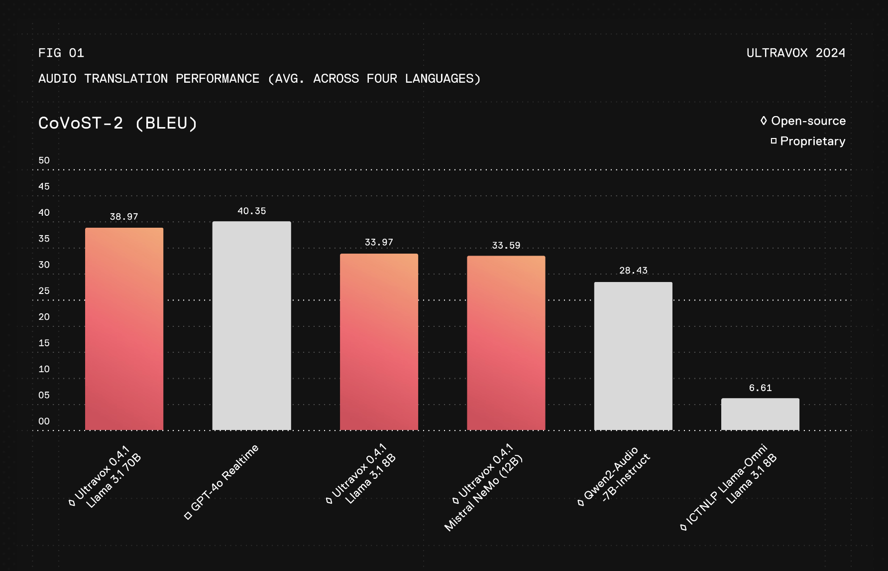

# Fixie AI Introduces Ultravox v0.4.1: A Family of Open Speech Models Trained Specifically for Enabling Real-Time Conversation with LLMs and An Open-Weight Alternative to GPT-4o Realtime

> Interacting seamlessly with artificial intelligence in real time has always been a complex endeavor for developers and researchers. A significant challenge lies in integrating multi-modal information—such as text, images, and audio—into a cohesive conversational system. Despite advancements in large language models like GPT-4, many AI systems still encounter difficulties in achieving real-time conversational fluency, contextual […]

Interacting seamlessly with artificial intelligence in real time has always been a complex endeavor for developers and researchers. A significant challenge lies in integrating multi-modal information—such as text, images, and audio—into a cohesive conversational system. Despite advancements in large language models like GPT-4, many AI systems still encounter difficulties in achieving real-time conversational fluency, contextual awareness, and multi-modal understanding, which limits their effectiveness for practical applications. Additionally, the computational demands of these models make real-time deployment challenging without considerable infrastructure.

### Introducing Fixie AI’s Ultravox v0.4.1

Fixie AI introduces Ultravox v0.4.1, a family of multi-modal, open-source models trained specifically for enabling real-time conversations with AI. Designed to overcome some of the most pressing challenges in real-time AI interaction, Ultravox v0.4.1 incorporates the ability to handle multiple input formats, such as text, images, and other sensory data. This latest release aims to provide an alternative to closed-source models like GPT-4, focusing not only on language proficiency but also on enabling fluid, context-aware dialogues across different types of media. By being open-source, Fixie AI also aims to democratize access to state-of-the-art conversation technologies, allowing developers and researchers worldwide to adapt and fine-tune Ultravox for diverse applications—from customer support to entertainment.

### Technical Details and Key Benefits

The Ultravox v0.4.1 models are built using a transformer-based architecture optimized to process multiple types of data in parallel. Leveraging a technique called cross-modal attention, these models can integrate and interpret information from various sources simultaneously. This means users can present an image to the AI, type in a question about it, and receive an informed response in real time. The open-source models are hosted on Hugging Face at [Fixie AI on Hugging Face](https://huggingface.co/fixie-ai), making it convenient for developers to access and experiment with the models. Fixie AI has also provided a well-documented API to facilitate seamless integration into real-world applications. The models boast impressive latency reduction, allowing interactions to take place almost instantly, making them suitable for real-time scenarios like live customer interactions and educational assistance.

Ultravox v0.4.1 represents a notable advancement in conversational AI systems. Unlike proprietary models, which often operate as opaque black boxes, Ultravox offers an open-weight alternative with performance comparable to GPT-4 while also being highly adaptable. Analysis based on Figure 1 from recent evaluations shows that Ultravox v0.4.1 achieves significantly lower response latency—approximately 30% faster than leading commercial models—while maintaining equivalent accuracy and contextual understanding. The model’s cross-modal capabilities make it effective for complex use cases, such as integrating images with text for comprehensive analysis in healthcare or delivering enriched interactive educational content. The open nature of Ultravox facilitates continuous community-driven development, enhancing flexibility and fostering transparency. By mitigating the computational overhead associated with deploying such models, Ultravox makes advanced conversational AI more accessible to smaller entities and independent developers, bridging the gap previously imposed by resource constraints.

### Conclusion

Ultravox v0.4.1 by Fixie AI marks a significant milestone for the AI community by addressing critical issues in real-time conversational AI. With its multi-modal capabilities, open-source model weights, and a focus on reducing response latency, Ultravox paves the way for more engaging and accessible AI experiences. As more developers and researchers start experimenting with Ultravox, it has the potential to foster innovative applications across industries that demand real-time, context-rich, and multi-modal conversations.

---

Check out the **[Details here](https://www.ultravox.ai/blog/ultravox-an-open-weight-alternative-to-gpt-4o-realtime), [Models on Hugging Face](https://huggingface.co/fixie-ai), and [GitHub Page](https://github.com/fixie-ai/ultravox/)**. All credit for this research goes to the researchers of this project. Also, don’t forget to follow us on **[Twitter](https://twitter.com/Marktechpost)** and join our **[Telegram Channel](https://pxl.to/at72b5j)** and [**LinkedIn Gr**](https://www.linkedin.com/groups/13668564/)[**oup**](https://www.linkedin.com/groups/13668564/). **If you like our work, you will love our**[** newsletter..**](https://marktechpost-newsletter.beehiiv.com/subscribe) Don’t Forget to join our **[55k+ ML SubReddit](https://www.reddit.com/r/machinelearningnews/)**.

**[[FREE AI WEBINAR](https://landing.deepset.ai/webinar-implementing-idp-with-genai-in-financial-services?utm_campaign=2411%20-%20webinar%20-%20credX%20-%20IDP%20with%20GenAI%20in%20Financial%20Services&utm_source=marktechpost&utm_medium=newsletter)] ****[Implementing Intelligent Document Processing with GenAI in Financial Services and Real Estate Transactions](https://landing.deepset.ai/webinar-implementing-idp-with-genai-in-financial-services?utm_campaign=2411%20-%20webinar%20-%20credX%20-%20IDP%20with%20GenAI%20in%20Financial%20Services&utm_source=marktechpost&utm_medium=newsletter)**
