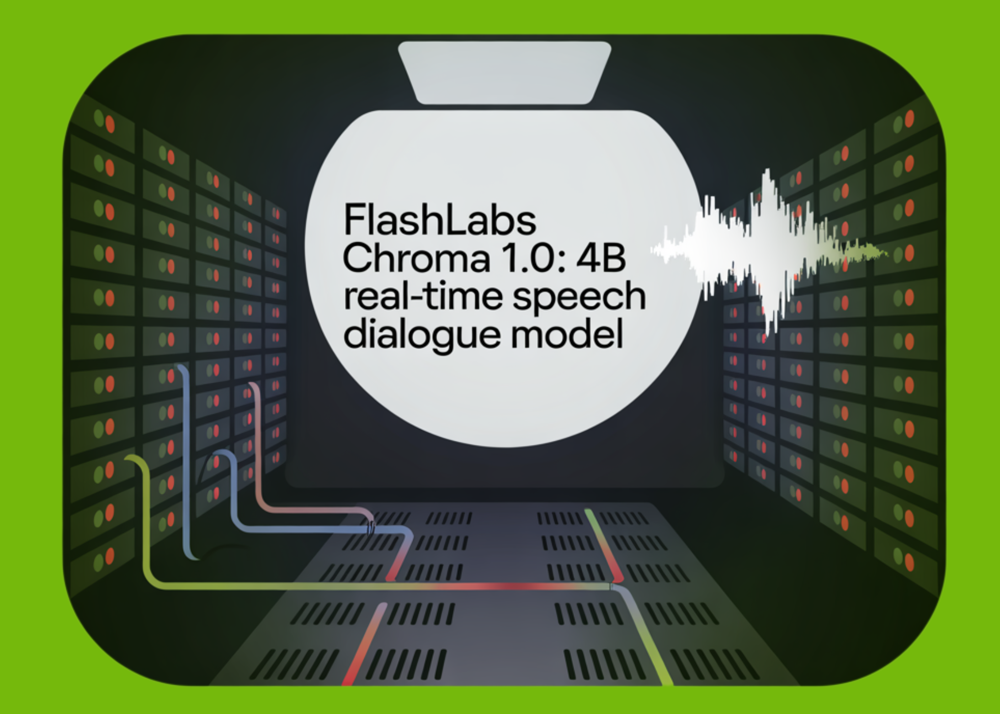

# FlashLabs Researchers Release Chroma 1.0: A 4B Real Time Speech Dialogue Model With Personalized Voice Cloning

> Chroma 1.0 is a real time speech to speech dialogue model that takes audio as input and returns audio as output while preserving the speaker identity across multi turn conversations. It is presented as the first open source end to end spoken dialogue system that combines low latency interaction with high fidelity personalized voice cloning […]

Chroma 1.0 is a real time speech to speech dialogue model that takes audio as input and returns audio as output while preserving the speaker identity across multi turn conversations. It is presented as the first open source end to end spoken dialogue system that combines low latency interaction with high fidelity personalized voice cloning from only a few seconds of reference audio.

The model operates directly on discrete speech representations rather than on text transcripts. It targets the same use cases as commercial real time agents, but with a compact 4B parameter dialogue core and a design that treats speaker similarity as a primary objective, not as an auxiliary feature. Chroma achieves a reported 10.96% relative improvement in speaker similarity over a human baseline and reaches a Real Time Factor (RTF) of 0.43, so it can generate speech more than 2 times faster than playback.

*https://arxiv.org/pdf/2601.11141*

### From cascaded ASR ➡️ LLM ➡️ TTS ➡️ end to end S2S

Most production assistants still use a three stage pipeline, automatic speech recognition to convert audio to text, a large language model for reasoning, and text to speech synthesis. This structure is flexible but it introduces latency and loses paralinguistic information such as timbre, emotion, speaking rate and prosody once the system collapses audio to text. In real time dialogue this loss of acoustic detail directly hurts speaker fidelity and naturalness.

Chroma follows the newer class of speech to speech systems that map between sequences of codec tokens. A speech tokenizer and neural codec produce quantized acoustic codes. A language model then reasons and responds over a sequence that interleaves text tokens and audio codes, without an explicit intermediate transcript. This keeps the model conditioned on prosody and speaker identity during the whole processing chain.

### Architecture, Reasoner + speech generation stack

Chroma 1.0 has two main subsystems. The Chroma Reasoner handles multimodal understanding and text generation. The speech stack, Chroma Backbone, Chroma Decoder and Chroma Codec Decoder, converts that semantic output into personalized response audio.

The Chroma Reasoner is built on the Thinker module from the Qwen-omni series and uses the Qwen2 Audio encoding pipeline. It processes text and audio inputs with shared front ends, fuses them with cross modal attention, and aligns them over time using Time aligned Multimodal Rotary Position Embedding (TM-RoPE). The output is a sequence of hidden states that carry both linguistic content and acoustic cues, for example rhythm and emphasis.

*https://arxiv.org/pdf/2601.11141*

The Chroma Backbone is a 1B parameter LLaMA style model based on Llama3. It is conditioned on the target voice using CSM-1B, which encodes a short reference audio clip and its transcript into embedding prompts that are prepended to the sequence. During inference, token embeddings and hidden states from the Reasoner are fed as unified context, so the Backbone always sees the semantic state of the dialogue while it generates acoustic codes.

To support streaming, the system uses a fixed 1 to 2 interleaving schedule. For every text token from the Reasoner, the Backbone produces 2 audio code tokens. This allows the model to start emitting speech as soon as text generation begins and avoids waiting for full sentences. This interleaving is the main mechanism behind the low Time to First Token.

The Chroma Decoder is a lightweight LLaMA variant with about 100M parameters. The Backbone predicts only the first Residual Vector Quantization codebook per frame, which is a coarse representation. The Decoder then takes the Backbone hidden state and the first code and autoregressively predicts the remaining RVQ levels inside the same frame. This factorization keeps long context temporal structure in the Backbone and restricts the Decoder to frame local refinement, which reduces compute and improves detailed prosody and articulation.

The Chroma Codec Decoder concatenates the coarse and refined codes and maps them to waveform samples. It follows the decoder design of the Mimi vocoder and uses a causal convolutional neural network so that each output sample depends only on past context, which is required for streaming. The system uses 8 codebooks, which cuts the number of autoregressive refinement steps for the Decoder while preserving enough detail for voice cloning.

### Training setup and synthetic speech to speech (S2S) data

High quality speech dialogue data with strong reasoning signals is scarce. Chroma therefore uses a synthetic speech to speech (S2S) pipeline. A Reasoner like LLM first produces textual answers for user questions. A Test to Speech (TTS) system then synthesizes target speech that matches the timbre of the reference audio for those answers. These synthetic pairs train the Backbone and Decoder to perform acoustic modeling and voice cloning. The Reasoner stays frozen and acts as a provider of text embeddings and multimodal hidden states.

### Voice cloning quality and comparison with existing systems

Objective evaluation uses the SEED-TTS-EVAL protocol on English CommonVoice speakers. Chroma operates at 24 kHz sampling rate and achieves a Speaker Similarity score of 0.81. The human baseline is 0.73. CosyVoice-3 reaches 0.72 and most other TTS baselines lie below the human reference. The research team report this as a 10.96% relative improvement over the human baseline, which indicates that the model captures fine paralinguistic details more consistently than human recordings in this metric.

*https://arxiv.org/pdf/2601.11141*

Subjective evaluation compares Chroma with the ElevenLabs eleven_multilingual_v2 model. In naturalness CMOS, listeners prefer ElevenLabs 57.2% of the time versus 24.4% for Chroma, with 18.3% deuce. In speaker similarity CMOS, the scores are very close, 42.4% for ElevenLabs and 40.6% for Chroma, with 17.0% deuce. A follow up test asking which audio sounds more natural between ElevenLabs and the original recordings yields 92.0% preference for ElevenLabs versus 8.0% for ground truth, which shows that perceived naturalness and speaker fidelity are not aligned.

### Latency and real-time behavior

Latency is measured with one concurrent stream. For a 38.80 second response, the total generation time is 16.58 seconds, which gives a Real Time Factor (RTF) of 0.43. The Reasoner contributes 119.12 ms TTFT, the Backbone 8.48 ms and the Decoder 19.27 ms per frame on average. The Codec Decoder works on groups of 4 frames so TTFT does not apply to that component. The overall Time to First Token is 146.87 ms, which is well under one second and suitable for interactive dialogue.

*https://arxiv.org/pdf/2601.11141*

### Spoken dialogue and reasoning benchmarks

Chroma is evaluated on the basic track of URO Bench. It uses only 4B parameters yet achieves an overall task accomplishment score of 57.44%. GLM-4 Voice, a 9B parameter model, leads with 69.09%. Chroma ranks second overall and outperforms several 7B and 0.5B omni baselines on many dimensions. It reaches 71.14% on Storal, 51.69% on TruthfulQA and 22.74% on GSM8K. For oral conversation metrics it attains the highest scores on MLC at 60.26% and on CommonVoice at 62.07%.

*https://arxiv.org/pdf/2601.11141*

Critically, Chroma is the only model in this comparison that supports personalized voice cloning. All other systems focus on spoken dialogue and reasoning only. This means Chroma provides competitive cognitive capability while also performing high fidelity voice personalization in real time.

### Key Takeaways

- **End to end real time speech to speech**: Chroma 1.0 is a 4B parameter spoken dialogue model that maps speech to speech directly using codec tokens, it avoids explicit ASR and TTS stages and preserves prosody and speaker identity through the whole pipeline.

- **Reasoner plus speech stack architecture**: The system combines a Qwen-based Chroma Reasoner with a 1B LLaMA style Backbone, a 100M Chroma Decoder and a Mimi based Codec Decoder, it uses RVQ codebooks and an interleaved 1 to 2 text to audio token schedule to support streaming and low Time to First Token.

- **Strong personalized voice cloning**: On SEED-TTS-EVAL with CommonVoice speakers, Chroma reaches a Speaker Similarity score of 0.81 at 24 kHz, this is reported as a 10.96 percent relative improvement over the human baseline of 0.73 and outperforms CosyVoice 3 and other TTS baselines.

- **Sub second latency and faster than real time generation**: Single stream inference on an H200 GPU yields an overall Time to First Token of about 147 ms, for a 38.80 second response the model generates audio in 16.58 seconds, resulting in a Real Time Factor of 0.43 which is more than 2 times faster than playback.

- **Competitive dialogue and reasoning with cloning as a unique feature**: On URO Bench basic track, Chroma attains 57.44 percent overall task accomplishment and competitive scores on Storal, TruthfulQA, GSM8K, MLC and CommonVoice.

---

Check out the **[Paper](https://arxiv.org/pdf/2601.11141), [Model Weights](https://huggingface.co/FlashLabs/Chroma-4B), [Project](https://modelscope.cn/models/FlashLabs/Chroma-4B) **and** [Playground](https://chroma.flashlabs.ai/)**. Also, feel free to follow us on **[Twitter](https://x.com/intent/follow?screen_name=marktechpost)** and don’t forget to join our **[100k+ ML SubReddit](https://www.reddit.com/r/machinelearningnews/)** and Subscribe to **[our Newsletter](https://www.aidevsignals.com/)**. Wait! are you on telegram? **[now you can join us on telegram as well.](https://t.me/machinelearningresearchnews)**
