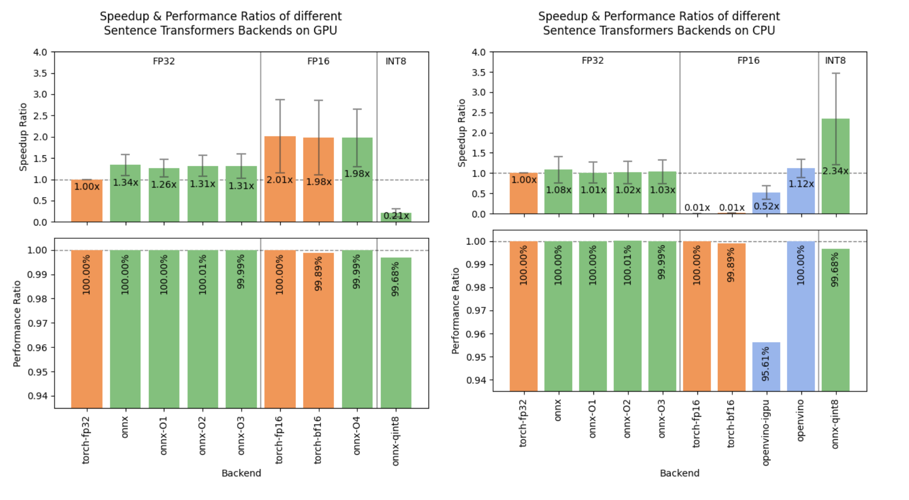

# From ONNX to Static Embeddings: What Makes Sentence Transformers v3.2.0 a Game-Changer?

> There is a growing demand for embedding models that balance accuracy, efficiency, and versatility. Existing models often struggle to achieve this balance, especially in scenarios ranging from low-resource applications to large-scale deployments. The need for more efficient, high-quality embeddings has driven the development of new solutions to meet these evolving requirements. Overview of Sentence Transformers […]

There is a growing demand for embedding models that balance accuracy, efficiency, and versatility. Existing models often struggle to achieve this balance, especially in scenarios ranging from low-resource applications to large-scale deployments. The need for more efficient, high-quality embeddings has driven the development of new solutions to meet these evolving requirements.

### Overview of Sentence Transformers v3.2.0

[Sentence Transformers v3.2.0](https://github.com/UKPLab/sentence-transformers/releases/tag/v3.2.0) is the biggest release for inference in two years, offering significant upgrades for semantic search and representation learning. It builds on previous versions with new features that enhance usability and scalability. This version focuses on improved training and inference efficiency, expanded transformer model support, and better stability, making it suitable for diverse settings and larger production environments.

### Technical Enhancements

From a technical standpoint, Sentence Transformers v3.2.0 brings several notable enhancements. One of the key upgrades is in memory management, incorporating improved techniques for handling large batches of data, enabling faster and more efficient training. This version also leverages optimized GPU utilization, reducing inference time by up to 30% and making real-time applications more feasible.

Additionally, v3.2.0 introduces two new backends for embedding models: ONNX and OpenVINO. The ONNX backend uses the ONNX Runtime to accelerate model inference on both CPU and GPU, reaching up to 1.4x-3x speedup, depending on the precision. It also includes helper methods for optimizing and quantizing models for faster inference. The OpenVINO backend, which uses Intel’s OpenVINO toolkit, outperforms ONNX in some situations on the CPU. The expanded compatibility with the Hugging Face Transformers library allows for easy use of more pretrained models, providing added flexibility for various NLP applications. New pooling strategies further ensure that embeddings are more robust and meaningful, enhancing the quality of tasks like clustering, semantic search, and classification.

*https://github.com/UKPLab/sentence-transformers/releases/tag/v3.2.0*

### Introduction of Static Embeddings

Another major feature is Static Embeddings, a modernized version of traditional word embeddings like GLoVe and word2vec. Static Embeddings are bags of token embeddings that are summed together to create text embeddings, allowing for lightning-fast embeddings without requiring neural networks. They are initialized using either Model2Vec, a technique for distilling Sentence Transformer models into static embeddings, or random initialization followed by finetuning. Model2Vec enables distillation in seconds, providing speed improvements—500x faster on CPU compared to traditional models—while maintaining a reasonable accuracy cost of around 10-20%. Combining Static Embeddings with a cross-encoder re-ranker is a promising solution for efficient search scenarios.

### Performance and Applicability

Sentence Transformers v3.2.0 offers efficient architectures that reduce barriers for use in resource-constrained environments. Benchmarking shows significant improvements in inference speed and embedding quality, with up to 10% accuracy gains in semantic similarity tasks. ONNX and OpenVINO backends provide 2x-3x speedups, enabling real-time deployment. These improvements make it highly suitable for diverse use cases, balancing performance and efficiency while addressing community needs for broader applicability.

### Conclusion

Sentence Transformers v3.2.0 significantly improves efficiency, memory use, and model compatibility, making it more versatile across applications. Enhancements like pooling strategies, GPU optimization, ONNX and OpenVINO backends, and Hugging Face integration make it suitable for both research and production. Static Embeddings further broaden its applicability, providing scalable and accessible semantic embeddings for a wide range of tasks.

---

Check out the** [Details](https://github.com/UKPLab/sentence-transformers/releases/tag/v3.2.0)** and **[Documentation Page](https://sbert.net/docs/sentence_transformer/usage/efficiency.html)**. All credit for this research goes to the researchers of this project. Also, don’t forget to follow us on **[Twitter](https://twitter.com/Marktechpost)** and join our **[Telegram Channel](https://pxl.to/at72b5j)** and [**LinkedIn Gr**](https://www.linkedin.com/groups/13668564/)[**oup**](https://www.linkedin.com/groups/13668564/). **If you like our work, you will love our**[** newsletter..**](https://marktechpost-newsletter.beehiiv.com/subscribe) Don’t Forget to join our **[50k+ ML SubReddit](https://www.reddit.com/r/machinelearningnews/)**.

**[[Upcoming Live Webinar- Oct 29, 2024] ](https://go.predibase.com/predibase-inference-engine-102924-lp?utm_medium=3rdparty&utm_source=marktechpost)****[The Best Platform for Serving Fine-Tuned Models: Predibase Inference Engine (Promoted)](https://go.predibase.com/predibase-inference-engine-102924-lp?utm_medium=3rdparty&utm_source=marktechpost)**
