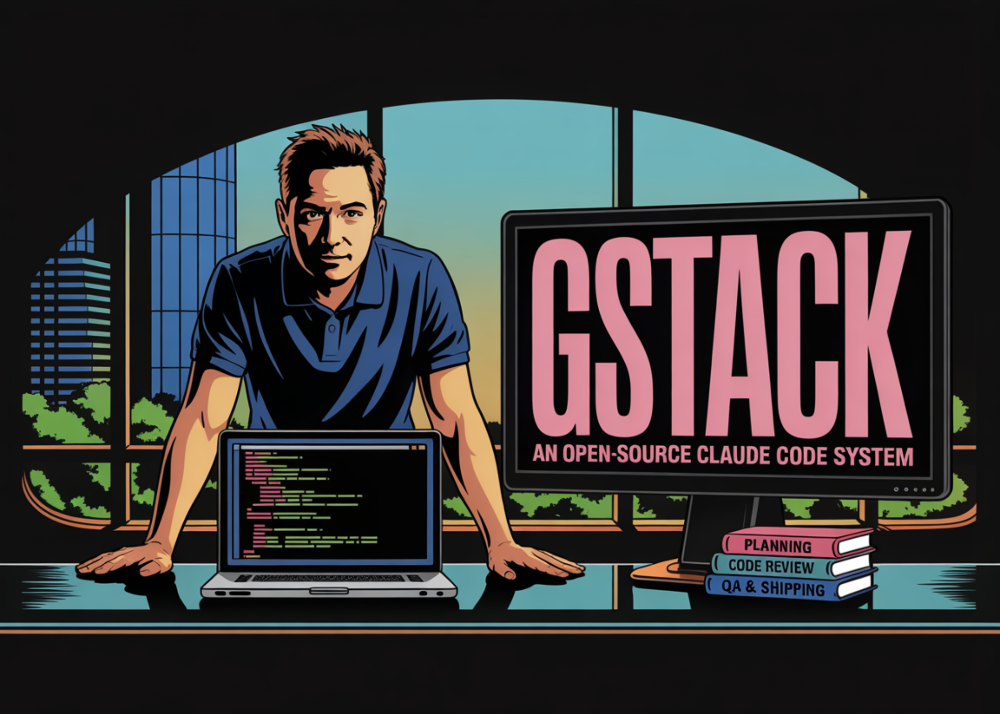

# Garry Tan Releases gstack: An Open-Source Claude Code System for Planning, Code Review, QA, and Shipping

> What if AI-assisted coding became more reliable by separating product planning, engineering review, release, and QA into distinct operating modes? That is the idea behind Garry Tan’s gstack, an open-source toolkit that packages Claude Code into 8 opinionated workflow skills backed by a persistent browser runtime. The tookit describes itself as ‘Eight opinionated workflow skills […]

**What if AI-assisted coding became more reliable by separating product planning, engineering review, release, and QA into distinct operating modes?** That is the idea behind Garry Tan’s **[gstack](https://github.com/garrytan/gstack)**, an open-source toolkit that packages **Claude Code** into 8 opinionated workflow skills backed by a persistent browser runtime. The tookit describes itself as **‘Eight opinionated workflow skills for Claude Code**‘ and groups common software delivery tasks into distinct modes such as planning, review, shipping, browser automation, QA testing, and retrospectives. The goal is not to replace Claude Code with a new model layer. It is to make Claude Code operate with more explicit role boundaries during product planning, engineering review, release, and testing.

### The 8 Core Commands

The **gstack** repository currently exposes 8 main commands: `/plan-ceo-review`, `/plan-eng-review`, `/review`, `/ship`, `/browse`, `/qa`, `/setup-browser-cookies`, and `/retro`. Each command is mapped to a specific operating mode. `/plan-ceo-review` is positioned as a product-level planning pass. `/plan-eng-review` is used for architecture, data flow, failure modes, and tests. `/review` is focused on production risk and code review. `/ship` is used for preparing a ready branch, syncing with main, running tests, and opening a PR. `/browse` gives the agent browser access, while `/qa` is designed for systematic testing of affected routes and flows. `/setup-browser-cookies` imports cookies from a local browser into the headless session, and `/retro` is used for engineering retrospectives.

### The Persistent Browser Is the Core System

The most important technical part of gstack is not the Markdown skills. It is the browser subsystem. gstack gives Claude Code **a persistent browser** and that the browser is the hard part, while the rest is mainly Markdown. Instead of launching a fresh browser for every action, gstack runs a **long-lived headless Chromium daemon** and communicates with it over **localhost HTTP**. The reason is latency and state retention. A cold start costs around **3–5 seconds per tool call**, while subsequent calls after startup are designed to run in roughly **100–200 ms**. Because the browser stays alive, cookies, tabs, `localStorage`, and login state persist across commands. The server also shuts down automatically after **30 minutes of idle time**.

### How gstack Connects Browser Automation to QA

That daemon architecture matters for QA and browser-driven development. In many agent workflows, browser automation is a separate debugging step or a screenshot utility. In gstack, browser access is part of the core workflow. The repo describes `/browse` as the mode that lets the agent log in, click through the app, take screenshots, and inspect breakage. `/qa` builds on top of that by analyzing the branch diff, identifying affected routes, and testing the relevant pages or flows. The sample flow in the repo shows `/qa` inspecting **8 changed files** and **3 affected routes**, then testing those routes against a local app instance. This means the project is trying to tie source changes to actual application behavior instead of treating QA as a detached manual pass.

### Installation Requirements and Project Layout

The repository’s implementation choices are also fairly specific. gstack requires **Claude Code**, **Git**, and **Bun v1.0+**. The `package.json` shows the current version as **0.3.3**, lists **Playwright** and `diff` as runtime dependencies, and compiles a `browse` executable from the `browse` source tree. According to the repo’s README, `/browse` compiles a native binary and is supported on **macOS and Linux**, for both **x64** and **arm64**. The install flow copies the repo into `~/.claude/skills/gstack`, runs `./setup`, and registers the skills for Claude Code. Teams can also copy the same setup into a repository-local `.claude/skills/gstack` directory so the workflow is shared inside a project.

### Why the Project Uses Bun

The architecture document explains why the project uses **Bun** rather than a more conventional Node.js setup. There are 4 stated reasons: compiled binaries, native SQLite access, native TypeScript execution, and a built-in HTTP server with `Bun.serve()`. Those choices are practical rather than cosmetic. gstack reads Chromium’s SQLite cookie database directly, and Bun’s built-in database support removes the need for extra native packages. The compiled binary model also fits the repo’s install style, because users are not expected to manage a separate runtime toolchain inside `~/.claude/skills/`.

### Key Takeaways

- **gstack is a workflow layer for Claude Code, not a new model or agent framework.** It packages software delivery into 8 opinionated slash-command skills for planning, review, shipping, browser automation, QA, cookie setup, and retrospectives.

- **The persistent browser daemon is the main technical component.** gstack runs a long-lived headless Chromium process over localhost HTTP so cookies, tabs, `localStorage`, and login state persist across commands.

- **QA is tied directly to code changes.** The `/qa` workflow analyzes branch diffs, identifies affected routes, and tests the relevant application paths instead of treating browser checks as a separate manual step.

- **The project is built around Bun for practical systems reasons.** Bun is used for compiled binaries, native SQLite access, native TypeScript execution, and a built-in HTTP server for the browser daemon.

- **gstack’s contribution is operational structure.** Its main value is separating product review, engineering review, code review, release, and browser-driven validation into explicit modes with narrow responsibilities.

---

Check out **[Repo here](https://github.com/garrytan/gstack). **Also, feel free to follow us on **[Twitter](https://x.com/intent/follow?screen_name=marktechpost)** and don’t forget to join our **[120k+ ML SubReddit](https://www.reddit.com/r/machinelearningnews/)** and Subscribe to **[our Newsletter](https://www.aidevsignals.com/)**. Wait! are you on telegram? **[now you can join us on telegram as well.](https://t.me/machinelearningresearchnews)**
