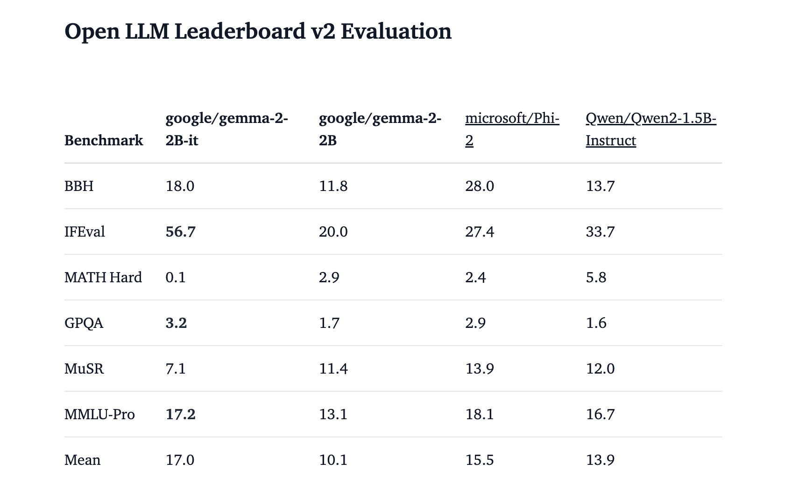

# Gemma 2-2B Released: A 2.6 Billion Parameter Model Offering Advanced Text Generation, On-Device Deployment, and Enhanced Safety Features

> Google DeepMind has unveiled a significant addition to its family of lightweight, state-of-the-art models with the release of Gemma 2 2B. This release follows the previous release of the Gemma 2 series. It includes various new tools to enhance these models’ application and functionality in diverse technological and research environments. The Gemma 2 2B model […]

Google DeepMind has unveiled a significant addition to its family of lightweight, state-of-the-art models with the release of [**Gemma 2 2B**](https://huggingface.co/blog/gemma-july-update). This release follows the previous release of the Gemma 2 series. It includes various new tools to enhance these models’ application and functionality in diverse technological and research environments. The Gemma 2 2B model is a 2.6 billion parameter version designed for on-device use, making it an optimal candidate for applications requiring high performance and efficiency.

The Gemma models are renowned for their text-to-text, decoder-only large language architecture. These models are built from the same foundational research and technology as the Gemini models, ensuring they are robust and reliable. Gemma 2 2 B’s release includes base and instruction-tuned variants, complementing the existing 9B and 27B versions. This expansion allows developers to leverage technical features such as sliding attention and logit soft-capping, which are integral to the Gemma 2 architecture. These features enhance the models’ ability to handle large-scale text generation tasks with improved efficiency and accuracy.

A notable aspect of the Gemma 2 2B release is its compatibility with the Hugging Face ecosystem. Developers can utilize transformers to integrate the Gemma models seamlessly into their applications. A straightforward installation process and usage guidelines facilitate this integration. For instance, to use the gemma-2-2b-it model with transformers, one can install the necessary tools via pip and then implement the model using a simple Python script. This process ensures developers can quickly deploy the model for text generation, content creation, and conversational AI applications.

*[**Image Source**](https://huggingface.co/blog/gemma-july-update)*

In addition to the core model, Google has introduced ShieldGemma, a series of safety classifiers built on top of Gemma 2. These classifiers are designed to filter inputs and outputs, ensuring that applications remain safe and free from harmful content. ShieldGemma is available in multiple variants, including 2B, 9B, and 27B parameters, each tailored to different safety and content moderation needs. This tool is particularly useful for developers aiming to deploy public-facing applications, as it helps moderate & filter out content that might be considered offensive or harmful. The introduction of ShieldGemma underscores Google’s commitment to responsible AI deployment, addressing concerns related to the ethical use of AI technology.

Gemma 2 2B also supports on-device deployment through llama.cpp, an approach that allows the model to run on various operating systems, including Mac, Windows, and Linux. This capability is crucial for developers who require flexible deployment options across different platforms. The setup process for the llama.cpp is user-friendly, involving simple installation steps and command-line instructions to run inference or set up a local server for the model. This flexibility makes Gemma 2 2B accessible for various use cases, from personal projects to enterprise-level applications.

*[**Image Source**](https://huggingface.co/blog/gemma-july-update)*

Another significant feature introduced with Gemma 2 2B is the concept of assisted generation. This technique, also known as speculative decoding, uses a smaller model to speed up the generation process of a larger model. The smaller model quickly generates candidate sequences, which the larger model can validate and accept as its generated text. This method can result in up to a 3x speedup in text generation without losing quality, making it an efficient tool for large-scale applications. Assisted generation leverages the strengths of both small and large models, optimizing computational resources while maintaining high output quality.

The release also highlights Gemma Scope, a suite of sparse autoencoders (SAEs) designed to interpret the internal workings of the Gemma models. These SAEs function as a “microscope,” allowing researchers to break down and study the activations within the models, similar to how biologists use microscopes to examine cells. This tool is invaluable for understanding and improving the interpretability of large language models. Gemma Scope aids researchers in identifying and addressing potential biases and improving overall model performance.

Gemma 2 2B’s versatility is evident in its support for various deployment and usage scenarios. Whether used for natural language processing, automated content creation, or interactive AI applications, the model’s extensive capabilities ensure it can meet diverse user needs. The instruction-tuned variants of Gemma 2 2B are particularly useful for applications requiring precise and context-aware responses, enhancing the user experience in conversational agents and customer support systems.

In conclusion, Google DeepMind’s release of Gemma 2 2B, with its diverse applications, safety features, and innovative tools like assisted generation and Gemma Scope, is set to enhance the capabilities of developers and researchers working with advanced AI models. Its combination of high performance, flexible deployment options, and robust safety measures positions Gemma 2 2B as a leading solution. 

---

Check out the** [Models](https://huggingface.co/collections/google/gemma-2-2b-release-66a20f3796a2ff2a7c76f98f) **and **[Details](https://huggingface.co/blog/gemma-july-update).** All credit for this research goes to the researchers of this project. Also, don’t forget to follow us on **[Twitter](https://twitter.com/Marktechpost)** and join our **[Telegram Channel](https://pxl.to/at72b5j)** and [**LinkedIn Gr**](https://www.linkedin.com/groups/13668564/)[**oup**](https://www.linkedin.com/groups/13668564/). **If you like our work, you will love our**[** newsletter..**](https://marktechpost-newsletter.beehiiv.com/subscribe)

Don’t Forget to join our **[47k+ ML SubReddit](https://www.reddit.com/r/machinelearningnews/)**

**Find Upcoming [AI Webinars here](https://www.marktechpost.com/ai-webinars-list-llms-rag-generative-ai-ml-vector-database/)**
