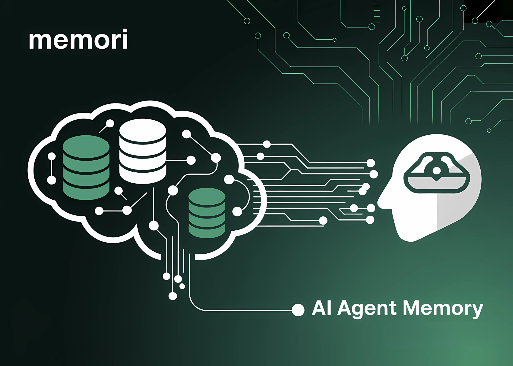

# GibsonAI Releases Memori: An Open-Source SQL-Native Memory Engine for AI Agents

> When we think about human intelligence, memory is one of the first things that comes to mind. It’s what enables us to learn from our experiences, adapt to new situations, and make more informed decisions over time. Similarly, AI Agents become smarter with memory. For example, an agent can remember your past purchases, your budget, […]

When we think about human intelligence, memory is one of the first things that comes to mind. It’s what enables us to learn from our experiences, adapt to new situations, and make more informed decisions over time. Similarly, AI Agents become smarter with **memory**. For example, an agent can remember your past purchases, your budget, your preferences, and suggest gifts for your friends based on the learning from the past conversations.

Agents usually break tasks into steps (plan → search → call API → parse → write), but then they might forget what happened in earlier steps without memory. Agents repeat tool calls, fetch the same data again, or miss simple rules like “always refer to the user by their name.” As a result of repeating the same context over and over again, the agents can spend more tokens, achieve slower results, and provide inconsistent answers. The industry has collectively spent billions on vector databases and embedding infrastructure to solve what is, at its core, a data persistence problem for AI Agents. These solutions create black-box systems where developers cannot inspect, query, or understand why certain memories were retrieved.

The [GibsonAI](https://pxl.to/frusm1k) team built [**Memori**](https://pxl.to/zf3v75) to fix this issue. [**Memori**](https://pxl.to/zf3v75) is an open-source memory engine that provides persistent, intelligent memory for any LLM using standard SQL databases(PostgreSQL/MySQL). In this article, we’ll explore how Memori tackles memory challenges and what it offers.

## The Stateless Nature of Modern AI: The Hidden Cost

Studies indicate that users spend 23-31% of their time providing context that they’ve already shared in previous conversations. For a development team using AI assistants, this translates to:

- **Individual Developer**: ~2 hours/week repeating context

- **10-person Team**: ~20 hours/week of lost productivity

- **Enterprise (1000 developers)**: ~2000 hours/week or $4M/year in redundant communication

Beyond productivity, this repetition breaks the illusion of intelligence. An AI that cannot remember your name after hundreds of conversations doesn’t feel intelligent.

### Current Limitations of Stateless LLMs

- **No Learning from Interactions**: Every mistake is repeated, every preference must be restated

- **Broken Workflows**: Multi-session projects require constant context rebuilding

- **No Personalization**: The AI cannot adapt to individual users or teams

- **Lost Insights**: Valuable patterns in conversations are never captured

- **Compliance Challenges**: No audit trail of AI decision-making

### The Need for Persistent, Queryable Memory

What AI really needs is **persistent, queryable memory** just like every application relies on a database. But you can’t simply use your existing app database as AI memory because it isn’t designed for context selection, relevance ranking, or injecting knowledge back into an agent’s workflow. That’s why we built a memory layer that is essential for AI and agents to feel intelligent truly.

## Why SQL Matters for AI Memory

SQL databases have been around for more than 50 years. They are the backbone of almost every application we use today, from banking apps to social networks. Why? Because SQL is simple, reliable, and universal.

- **Every developer knows SQL.** You don’t need to learn a new query language.

- **Battle-tested reliability.** SQL has run the world’s most critical systems for decades.

- **Powerful queries.** You can filter, join, and aggregate data with ease.

- **Strong guarantees.** ACID transactions make sure your data stays consistent and safe.

- **Huge ecosystem.** Tools for migration, backups, dashboards, and monitoring are everywhere.

When you build on SQL, you’re standing on decades of proven tech, not reinventing the wheel.

## The Drawbacks of Vector Databases

Most competing AI memory systems today are built on **vector databases**. On paper, they sound advanced: they let you store embeddings and search by similarity. But in practice, they come with hidden costs and complexity:

- **Multiple moving parts.** A typical setup needs a vector DB, a cache, and a SQL DB just to function.

- **Vendor lock-in.** Your data often lives inside a proprietary system, making it hard to move or audit.

- **Black-box retrieval.** You can’t easily see _why_ a certain memory was pulled.

- **Expensive.** Infrastructure and usage costs add up quickly, especially at scale.

- **Hard to debug.** Embeddings are not human-readable, so you can’t just query with SQL and check results.

Here’s how it compares to [**Memori**](https://pxl.to/zf3v75)’s SQL-first design:

AspectVector Database / RAG SolutionsMemori’s ApproachServices Required3–5 (Vector DB + Cache + SQL)1 (SQL only)DatabasesVector + Cache + SQLSQL onlyQuery LanguageProprietary APIStandard SQLDebuggingBlack box embeddingsReadable SQL queriesBackupComplex orchestrationcp memory.db backup.db or pg_basebackupData ProcessingEmbeddings: ~$0.0001 / 1K tokens (OpenAI) → cheap upfrontEntity Extraction: GPT-4o at ~$0.005 / 1K tokens → higher upfrontStorage Costs$0.10–0.50 / GB / month (vector DBs)~$0.01–0.05 / GB / month (SQL)Query Costs~$0.0004 / 1K vectors searchedNear zero (standard SQL queries)InfrastructureMultiple moving parts, higher maintenanceSingle database, simple to manage

### Why It Works?

If you think SQL can’t handle memory at scale, think again. **SQLite**, one of the simplest SQL databases, is the most widely deployed database in the world:

- Over **4 billion** deployments

- Runs on every iPhone, Android device, and web browser

- Executes **trillions** of queries every single day

If SQLite can handle this massive workload with ease, why build AI memory on expensive, distributed vector clusters?

## Memori Solution Overview

[**Memori**](https://pxl.to/zf3v75) uses structured entity extraction, relationship mapping, and SQL-based retrieval to create transparent, portable, and queryable AI memory. Memomi uses multiple agents working together to intelligently promote essential long-term memories to short-term storage for faster context injection.

With a single line of code `memori.enable()` any LLM gains the ability to remember conversations, learn from interactions, and maintain context across sessions. The entire memory system is stored in a standard SQLite database (or PostgreSQL/MySQL for enterprise deployments), making it fully portable, auditable, and owned by the user.

### Key Differentiators

- **Radical Simplicity**: One line to enable memory for any LLM framework (OpenAI, Anthropic, LiteLLM, LangChain)

- **True Data Ownership**: Memory stored in standard SQL databases that users fully control

- **Complete Transparency**: Every memory decision is queryable with SQL and fully explainable

- **Zero Vendor Lock-in**: Export your entire memory as a SQLite file and move anywhere

- **Cost Efficiency**: 80-90% cheaper than vector database solutions at scale

- **Compliance Ready**: SQL-based storage enables audit trails, data residency, and regulatory compliance

### Memori Use Cases

- Smart shopping experience with an AI Agent that remembers customer preferences and shopping behavior.

- Personal AI assistants that remember user preferences and context

- Customer support bots that never ask the same question twice

- Educational tutors who adapt to student progress

- Team knowledge management systems with shared memory

- Compliance-focused applications requiring complete audit trails

### Business Impact Metrics

Based on early implementations from our community users, we identified that [**Memori**](https://pxl.to/zf3v75) helps with the following:

- **Development Time**: 90% reduction in memory system implementation (hours vs. weeks)

- **Infrastructure Costs**: 80-90% reduction compared to vector database solutions

- **Query Performance**: 10-50ms response time (2-4x faster than vector similarity search)

- **Memory Portability**: 100% of memory data portable (vs. 0% with cloud vector databases)

- **Compliance Readiness**: Full SQL audit capability from day one

- **Maintenance Overhead**: Single database vs. distributed vector systems

### Technical Innovation

[**Memori**](https://pxl.to/zf3v75) introduces three core innovations:

- **Dual-Mode Memory System**: Combining “conscious” working memory with “auto” intelligent search, mimicking human cognitive patterns

- **Universal Integration Layer**: Automatic memory injection for any LLM without framework-specific code

- **Multi-Agent Architecture:** Multiple specialized AI agents working together for intelligent memory

## Existing Solutions in the Market

There are already several approaches to giving AI agents some form of memory, each with its own strengths and trade-offs:

- **Mem0** → A feature-rich solution that combines Redis, vector databases, and orchestration layers to manage memory in a distributed setup.

- **LangChain Memory** → Provides convenient abstractions for developers building within the LangChain framework.

- **Vector Databases** (Pinecone, Weaviate, Chroma) → Focused on semantic similarity search using embeddings, designed for specialized use cases.

- **Custom Solutions** → In-house designs tailored to specific business needs, offering flexibility but requiring significant maintenance.

These solutions demonstrate the various directions the industry is taking to address the memory problem. [**Memori**](https://pxl.to/zf3v75) enters the landscape with a different philosophy, bringing memory into a **SQL-native, open-source form** that is simple, transparent, and production-ready.

## Memori Built on a Strong Database Infrastructure

In addition to this, AI agents need not only memory but also a database backbone to make that memory usable and scalable. Think of AI agents that can run queries safely in an isolated database sandbox, optimise queries over time, and autoscale on demand, such as initiating a new database for a user to keep their relevant data separate.

A robust database infrastructure from GibsonAI backs [**Memori**](https://pxl.to/zf3v75). This makes memory reliable and production-ready with:

- Instant provisioning

- Autoscale on demand

- Database branching

- Database versioning

- Query optimization

- Point of recovery

## Strategic Vision

While competitors chase complexity with distributed vector solutions and proprietary embeddings, [**Memori**](https://pxl.to/zf3v75) embraces the proven reliability of SQL databases that have powered applications for decades.

The goal is not to build the most sophisticated memory system, but the most practical one. By storing AI memory in the same databases that already run the world’s applications, [**Memori**](https://pxl.to/zf3v75) enables a future where AI memory is as portable, queryable, and manageable as any other application data.

---

Check out the **[GitHub Page here](https://pxl.to/zf3v75)_._** Thanks to the GibsonAI team for the thought leadership/Resources and supporting this article.
