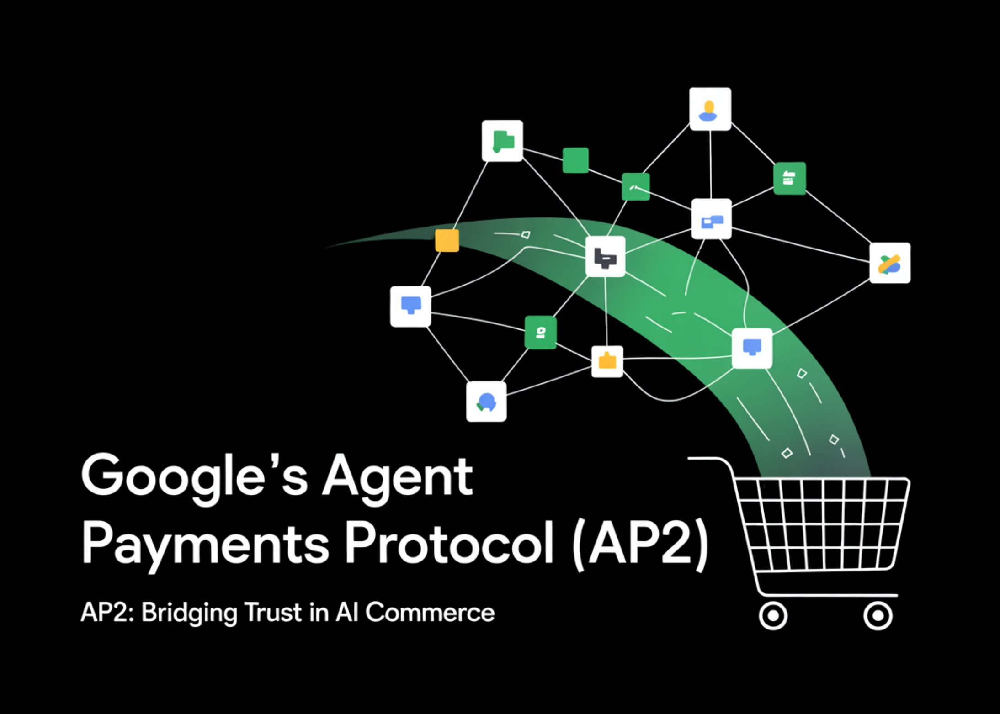

# Google AI Introduces Agent Payments Protocol (AP2): An Open Protocol for Interoperable AI Agent Checkout Across Merchants and Wallets

> Your shopping agent auto-purchases a $499 Pro plan instead of the $49 Basic tier—who’s on the hook: the user, the agent’s developer, or the merchant? This trust gap is a primary blocker for agent-led checkout on today’s payment rails. Google’s Agent Payments Protocol (AP2) addresses it with an open, interoperable specification for agent-initiated payments, defining […]

Your shopping agent auto-purchases a $499 Pro plan instead of the $49 Basic tier—who’s on the hook: the user, the agent’s developer, or the merchant? This trust gap is a primary blocker for agent-led checkout on today’s payment rails. [Google’s Agent Payments Protocol (AP2) ](https://github.com/google-agentic-commerce/AP2)addresses it with an open, interoperable specification for agent-initiated payments, defining a cryptographically verifiable common language so any compliant agent can transact with any compliant merchant globally.

Google’s Agent Payments Protocol (AP2) is an open, vendor-neutral specification for executing payments initiated by AI agents with cryptographic, auditable proof of user intent. AP2 extends existing open protocols—Agent2Agent (A2A) and Model Context Protocol (MCP)—to define how agents, merchants, and payment processors exchange verifiable evidence across the “intent → cart → payment” pipeline. The goal is to close the trust gap in agent-led commerce without fragmenting the payments ecosystem.

*https://github.com/google-agentic-commerce/AP2*

### Why do agents need a payments protocol?

Today’s rails assume a human is the one clicking “buy” on a trusted surface. When an autonomous or semi-autonomous agent initiates checkout, merchants and issuers face three unresolved questions: (1) was the user’s authority truly delegated (authorization), (2) does the request reflect what the user meant and approved (authenticity), and (3) who is responsible if something goes wrong (accountability). AP2 formalizes the data, cryptography, and messaging to answer those questions consistently across providers and payment types.

### How does AP2 establish trust?

AP2 uses **Verifiable Credentials (VCs)**—tamper-evident, cryptographically signed digital objects—to carry evidence through a transaction. The protocol standardizes three mandate types:

- **Intent Mandate** (human-not-present): captures the constraints under which an agent may transact (e.g., brand/category, price caps, timing windows), signed by the user.

- **Cart Mandate** (human-present): binds the user’s explicit approval to a merchant-signed cart (items, amounts, currency), producing non-repudiable proof of “what you saw is what you paid.”

- **Payment Mandate**: conveys to networks/issuers that an AI agent was involved, including modality (human-present vs not present) and risk-relevant context.

These VCs form an audit trail that unambiguously links user authorization to the final charge request.

### What are the core roles and trust boundaries?

AP2 defines a role-based architecture to separate concerns and minimize data exposure:

- **User** delegates a task to an agent.

- **User/Shopping Agent** (the interface the user interacts with) interprets the task, negotiates carts, and collects approvals.

- **Credentials Provider** (e.g., wallet) holds payment methods and issues method-specific artifacts.

- **Merchant Endpoint** exposes catalog/quoting and signs carts.

- **Merchant Payment Processor** constructs the network authorization object.

- **Network & Issuer** evaluate and authorize the payment.

### Human-present vs human-not-present: what changes on the wire?

**AP2 defines clear, testable flows:**

- **Human-present**: the merchant signs a final cart; the user approves it in a trusted UI, generating a signed **Cart Mandate**. The processor submits the network authorization alongside the **Payment Mandate**. If needed, step-up (e.g., 3DS) occurs on a trusted surface.

- **Human-not-present**: the user pre-authorizes an **Intent Mandate** (e.g., “buy when price 

### What does this look like for developers?

Google has published a public repository (Apache-2.0) with reference documentation, Python types, and runnable samples:

- **Samples** demonstrate human-present card flows, an x402 variant, and Android digital payment credentials, showing how to issue/verify mandates and move from agent negotiation to network authorization.

- **Types package**: core protocol objects are available under `src/ap2/types` for integration.

- **Framework choice**: while samples use Google’s ADK and Gemini 2.5 Flash, AP2 is framework-agnostic; any agent stack can generate/verify mandates and speak the protocol.

### How does AP2 address privacy and security?

AP2’s role separation ensures sensitive data (e.g., PANs, tokens) remains with the Credentials Provider and never needs to flow through general-purpose agent surfaces. Mandates are signed with verifiable identities and can embed risk signals without exposing full credentials to counterparties. This aligns with existing controls (e.g., step-up authentication) and provides networks with explicit markers of agent involvement to support risk and dispute logic.

### What about ecosystem readiness?

Google cites collaboration with **60+ organizations**, spanning networks, issuers, gateways, and technology vendors (e.g., American Express, Mastercard, PayPal, Coinbase, Intuit, ServiceNow, UnionPay International, Worldpay, Adyen). The objective is to avoid one-off integrations by aligning on common mandate semantics and accountability signals across platforms.

### Implementation notes and edge cases

- **Determinism over inference**: merchants receive cryptographic evidence of what the user approved (cart) or pre-authorized (intent), rather than model-generated summaries.

- **Disputes**: the credential chain functions as evidentiary material for networks/issuers; accountability can be assigned based on which mandate was signed and by whom.

- **Challenges**: the issuer or merchant can trigger step-up; AP2 requires challenges to be completed on trusted surfaces and linked to the mandate trail.

- **Multiple agents**: when more than one agent participates (e.g., travel metasearch + airline + hotel), A2A coordinates tasks; AP2 ensures each cart is merchant-signed and user-authorized before payment submission.

### What comes next?

The AP2 team plans to evolve the spec in the open and continue adding reference implementations, including deeper integrations across networks and web3, and alignment with standards bodies for VC formats and identity primitives. Developers can start today by running the sample scenarios, integrating mandate types, and validating flows against their agent/merchant stacks.

### Summary

AP2 gives the agent ecosystem a concrete, cryptographically grounded way to prove user authorization, bind it to merchant-signed carts, and present issuers with an auditable record—without locking developers into a single stack or payment method. If agents are going to buy things on our behalf, this is the kind of evidence trail the payments system needs.

---

Check out the **[GitHub Page](https://github.com/google-agentic-commerce/AP2), [Project Page](https://ap2-protocol.org/) **and **[Technical details](https://cloud.google.com/blog/products/ai-machine-learning/announcing-agents-to-payments-ap2-protocol)_._** Feel free to check out our **[GitHub Page for Tutorials, Codes and Notebooks](https://github.com/Marktechpost/AI-Tutorial-Codes-Included)**. Also, feel free to follow us on **[Twitter](https://x.com/intent/follow?screen_name=marktechpost)** and don’t forget to join our **[100k+ ML SubReddit](https://www.reddit.com/r/machinelearningnews/)** and Subscribe to **[our Newsletter](https://www.aidevsignals.com/)**.
