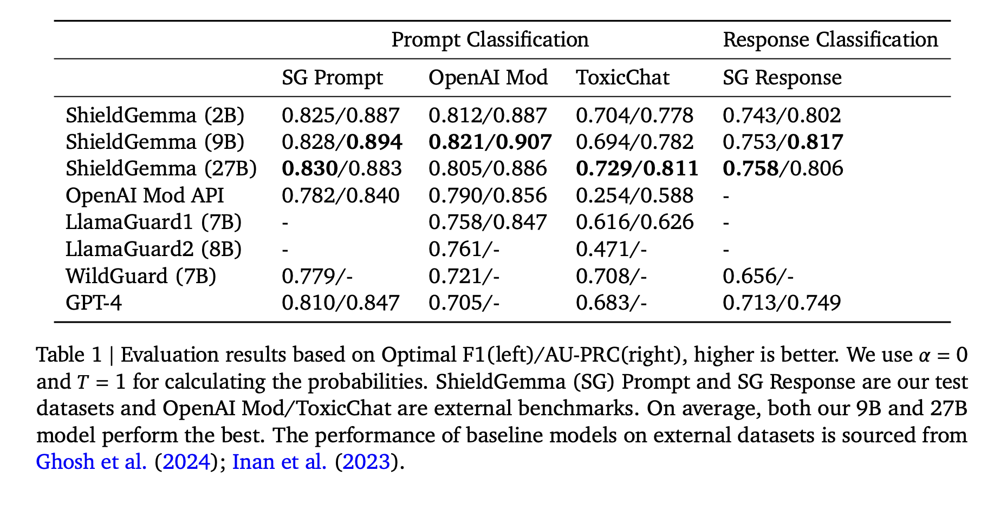

# Google AI Introduces ShieldGemma: A Comprehensive Suite of LLM-based Safety Content Moderation Models Built on Gemma2

> Large Language Models (LLMs) have gained significant traction in various domains, revolutionizing applications from conversational agents to content generation. These models demonstrate exceptional capabilities in comprehending and producing human-like text, enabling sophisticated applications across diverse fields. However, the deployment of LLMs necessitates robust mechanisms to ensure safe and responsible user interactions. Current practices often employ […]

Large Language Models (LLMs) have gained significant traction in various domains, revolutionizing applications from conversational agents to content generation. These models demonstrate exceptional capabilities in comprehending and producing human-like text, enabling sophisticated applications across diverse fields. However, the deployment of LLMs necessitates robust mechanisms to ensure safe and responsible user interactions. Current practices often employ content moderation solutions like LlamaGuard, WildGuard, and AEGIS to filter LLM inputs and outputs for potential safety risks. Despite providing initial safeguards, these tools face limitations. They often lack granular predictions of harm types or offer only binary outputs instead of probabilities, restricting customized harm filtering or threshold adjustments. Also, most solutions provide fixed-size models, which may not align with specific deployment needs. With that, the absence of detailed instructions for constructing training data hampers the development of models robust against adversarial prompts and fair across identity groups.

Researchers have made significant strides in content moderation, particularly for human-generated content on online platforms. Tools like Perspective API have been instrumental in detecting toxic language. However, these resources often fall short when applied to the unique context of human prompts and LLM-generated responses. Recent advancements in LLM content moderation have emerged through fine-tuning approaches, as seen in models like Llama-Guard, Aegis, MD-Judge, and WildGuard.

The development of robust safety models hinges on high-quality data. While human-computer interaction data is abundant, its direct use presents challenges due to limited positive examples, lack of adversarial and diverse data, and privacy concerns. LLMs, utilizing their vast pre-trained knowledge, have demonstrated exceptional capabilities in generating synthetic data aligned with human requirements. In the safety domain, this approach allows for the creation of diverse and highly adversarial prompts that can effectively test and improve LLM safety mechanisms.

Safety policies play a crucial role in deploying AI systems in real-world scenarios. These policies provide guidelines for acceptable content in both user inputs and model outputs. They serve dual purposes: ensuring consistency among human annotators and facilitating the development of zero-shot/few-shot classifiers as out-of-the-box solutions. While the categories of disallowed content are largely consistent for both inputs and outputs, the emphasis differs. Input policies focus on prohibiting harmful requests or attempts to elicit harmful content, while output policies primarily aim to prevent the generation of any harmful content.

Researchers from Google present**_ ShieldGemma_**, a spectrum of content moderation models ranging from 2B to 27B parameters, built on Gemma2. These models filter both user input and model output for key harm types, adapting to various application needs. The innovation lies in a novel methodology for generating high-quality, adversarial, diverse, and fair datasets using synthetic data generation techniques. This approach reduces human annotation effort and has broad applicability beyond safety-related challenges. By combining scalable architectures with advanced data generation, ShieldGemma addresses the limitations of existing solutions, offering more nuanced and adaptable content filtering across different deployment scenarios.

ShieldGemma introduces a comprehensive approach to content moderation based on the Gemma2 framework. The method defines a detailed content safety taxonomy for six harm types: Sexually Explicit Information, Hate Speech, Dangerous Content, Harassment, Violence, and Obscenity and Profanity. This taxonomy guides the model’s decision-making process for both user input and model output scenarios.

The core innovation lies in the synthetic data curation pipeline. This process begins with raw data generation using AART (Automated Adversarial [Red Teaming](https://www.marktechpost.com/2025/08/17/what-is-ai-red-teaming-top-18-ai-red-teaming-tools-2025/)) to create diverse, adversarial prompts. The data is then expanded through a self-critiquing and generation framework, enhancing semantic and syntactic diversity. The dataset is further augmented with examples from Anthropic HH-RLHF to increase variety.

To optimize the training process, ShieldGemma employs a cluster-margin algorithm for data sub-sampling, balancing uncertainty and diversity. The selected data undergoes human annotation, with fairness expansion applied to improve representation across various identity categories. Finally, the model is fine-tuned using supervised learning on Gemma2 Instruction-Tuned models of varying sizes (2B, 9B, and 27B parameters).

ShieldGemma (SG) models demonstrate superior performance in binary classification tasks across all sizes (2B, 9B, and 27B parameters) compared to baseline models. The SG-9B model, in particular, achieves a 10.8% higher average AU-PRC on external benchmarks than LlamaGuard1, despite having a similar model size and training data volume. Also, the 9B model’s F1 score surpasses that of WildGuard and GPT-4 by 4.3% and 6.4%, respectively. Within the ShieldGemma family, performance is consistent on internal benchmarks. However, on external benchmarks, the 9B and 27B models show slightly better generalization capability, with average AU-PRC scores 1.2% and 1.7% higher than the 2B model, respectively. These results highlight ShieldGemma’s effectiveness in content moderation tasks across various model sizes.

ShieldGemma marks a significant advancement in safety content moderation for Large Language Models. Built on Gemma2, this suite of models (2B to 27B parameters) demonstrates superior performance across diverse benchmarks. The key innovation lies in its novel synthetic data generation pipeline, producing high-quality, diverse datasets while minimizing human annotation. This methodology extends beyond safety applications, potentially benefiting various AI development domains. By outperforming existing baselines and offering flexible deployment options, ShieldGemma enhances the safety and reliability of LLM interactions. Sharing these resources with the research community aims to accelerate progress in AI safety and responsible deployment.

---

Check out the **[Paper](https://arxiv.org/pdf/2407.21772) and [HF Model Card](https://huggingface.co/google/shieldgemma-2b).** All credit for this research goes to the researchers of this project. Also, don’t forget to follow us on **[Twitter](https://twitter.com/Marktechpost)** and join our **[Telegram Channel](https://pxl.to/at72b5j)** and [**LinkedIn Gr**](https://www.linkedin.com/groups/13668564/)[**oup**](https://www.linkedin.com/groups/13668564/). **If you like our work, you will love our**[** newsletter..**](https://marktechpost-newsletter.beehiiv.com/subscribe)

Don’t Forget to join our **[47k+ ML SubReddit](https://www.reddit.com/r/machinelearningnews/)**

**Find Upcoming [AI Webinars here](https://www.marktechpost.com/ai-webinars-list-llms-rag-generative-ai-ml-vector-database/)**

---

> [Arcee AI Released DistillKit: An Open Source, Easy-to-Use Tool Transforming Model Distillation for Creating Efficient, High-Performance Small Language Models](https://www.marktechpost.com/2024/08/01/arcee-ai-released-distillkit-an-open-source-easy-to-use-tool-transforming-model-distillation-for-creating-efficient-high-performance-small-language-models/)
