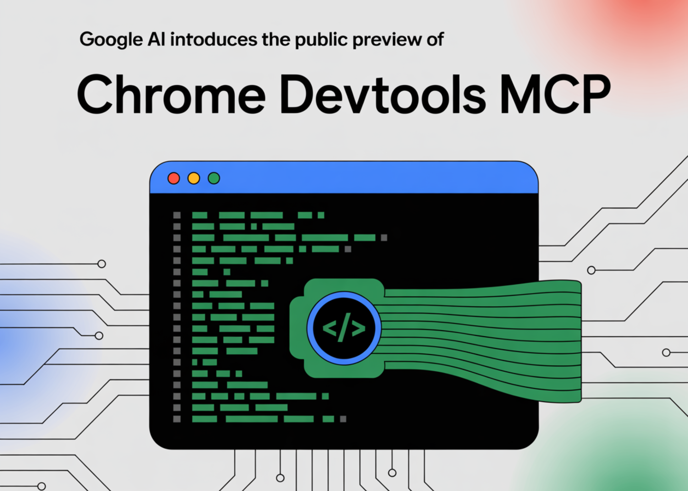

# Google AI Introduces the Public Preview of Chrome DevTools MCP: Making Your Coding Agent Control and Inspect a Live Chrome Browser

> Google has released a public preview of “Chrome DevTools MCP,” a Model Context Protocol (MCP) server that lets AI coding agents control and inspect a real Chrome instance—recording performance traces, inspecting the DOM and CSS, executing JavaScript, reading console output, and automating user flows. The launch directly targets a well-known limitation in code-generating agents: they […]

Google has released a **[public preview of “Chrome DevTools MCP](https://github.com/ChromeDevTools/chrome-devtools-mcp)**,” a Model Context Protocol (MCP) server that lets AI coding agents control and inspect a real Chrome instance—recording performance traces, inspecting the DOM and CSS, executing JavaScript, reading console output, and automating user flows. The launch directly targets a well-known limitation in code-generating agents: they usually cannot observe the runtime behavior of the pages they create or modify. By wiring agents into Chrome’s DevTools via MCP, Google is turning static suggestion engines into loop-closed debuggers that run measurements in the browser before proposing fixes.

### What exactly is Chrome DevTools MCP?

MCP is an open protocol for connecting LLMs to tools and data. Google’s DevTools MCP acts as a specialized server that exposes Chrome’s debugging surface to MCP-compatible clients. Google’s developer blog positions this as “bringing the power of Chrome DevTools to AI coding assistants,” with concrete workflows like initiating a performance trace (e.g., `performance_start_trace`) against a target URL, then having the agent analyze the resulting trace to suggest optimizations (for example, diagnosing high Largest Contentful Paint).

[](https://www.marktechpost.com/wp-content/uploads/2025/09/900x500-4-scaled.png)

### Capabilities and tool surface

The official GitHub repository documents a broad tool set. Beyond performance tracing (`performance_start_trace`, `performance_stop_trace`, `performance_analyze_insight`), agents can run navigation primitives (`navigate_page`, `new_page`, `wait_for`), simulate user input (`click`, `fill`, `drag`, `hover`), and interrogate runtime state (`list_console_messages`, `evaluate_script`, `list_network_requests`, `get_network_request`). Screenshot and snapshot utilities provide visual and DOM-state capture to support diffs and regressions. The server uses Puppeteer under the hood for reliable automation and waiting semantics, and it speaks to Chrome via the Chrome DevTools Protocol (CDP).

### Installation

Setup is intentionally minimal for MCP clients. Google recommends adding a single config stanza that shells out to `npx`, always tracking the latest server build:

Copy CodeCopiedUse a different Browser
```
{
  "mcpServers": {
    "chrome-devtools": {
      "command": "npx",
      "args": ["chrome-devtools-mcp@latest"]
    }
  }
}
```

This server integrates with multiple agent front ends: Gemini CLI, Claude Code, Cursor, and GitHub Copilot’s MCP support. For VS Code/Copilot, the repo documents a `code --add-mcp` one-liner; for Claude Code, a `claude mcp add` command mirrors the same `npx` target. The package targets Node.js ≥22 and current Chrome.

### Example agent workflows

Google’s announcement highlights pragmatic prompts that demonstrate end-to-end loops: verify a proposed fix in a live browser; analyze network failures (e.g., CORS or blocked image requests); simulate user behaviors like form submission to reproduce bugs; inspect layout issues by reading DOM/CSS in context; and run automated performance audits to reduce LCP and other Core Web Vitals. These are all operations agents can now validate with actual measurements rather than heuristics.

*https://developer.chrome.com/blog/chrome-devtools-mcp?hl=en*

### Summary

Chrome DevTools MCP’s public preview is a practical inflection point for agentic frontend tooling: it grounds AI assistants in real browser telemetry—performance traces, DOM/CSS state, network and console data—so recommendations are driven by measurements rather than guesswork. The first-party server, shipped by the Chrome DevTools team, is installable via `npx` and targets MCP-capable clients, with Chrome/CDP under the hood. Expect shorter diagnose-fix loops for regressions and flaky UI flows, plus tighter validation of performance work.

---

Check out the **[Technical details](https://developer.chrome.com/blog/chrome-devtools-mcp?hl=en) **and** [GitHub Page](https://github.com/ChromeDevTools/chrome-devtools-mcp)**. Feel free to check out our **[GitHub Page for Tutorials, Codes and Notebooks](https://github.com/Marktechpost/AI-Tutorial-Codes-Included)**. Also, feel free to follow us on **[Twitter](https://x.com/intent/follow?screen_name=marktechpost)** and don’t forget to join our **[100k+ ML SubReddit](https://www.reddit.com/r/machinelearningnews/)** and Subscribe to **[our Newsletter](https://www.aidevsignals.com/)**.

**For content partnership/promotions on marktechpost.com, please [TALK to us](https://calendly.com/marktechpost/marktechpost-promotion-call)**
