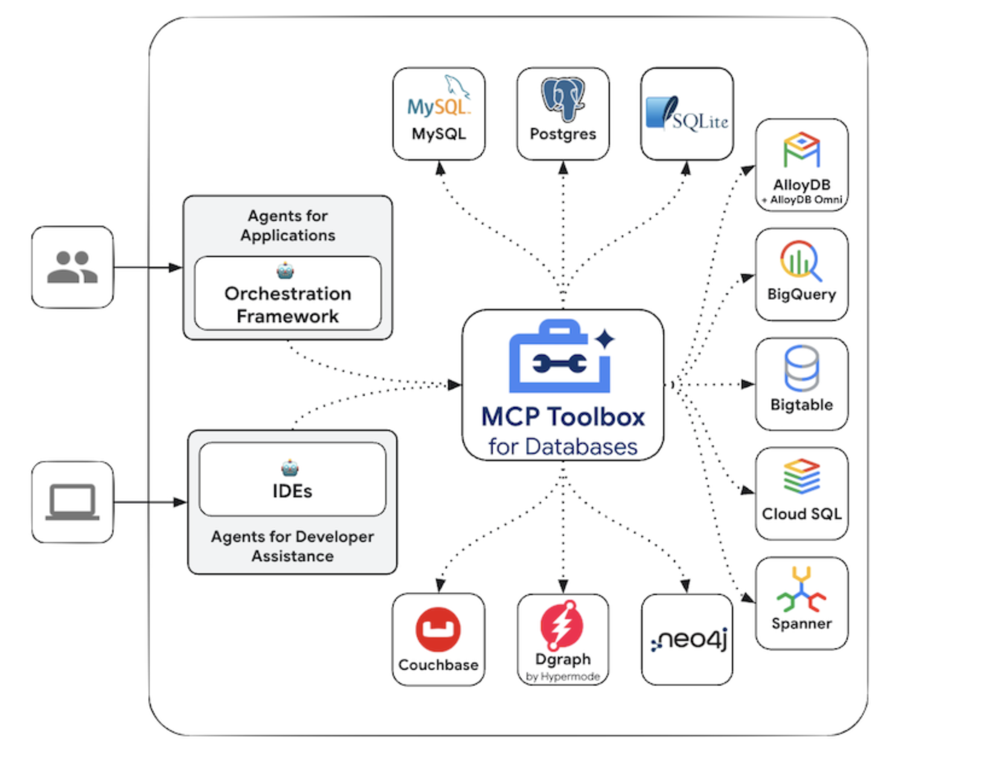

# Google AI Just Open-Sourced a MCP Toolbox to Let AI Agents Query Databases Safely and Efficiently

> Google has released the MCP Toolbox for Databases, a new open-source module under its GenAI Toolbox aimed at simplifying the integration of SQL databases into AI agents. The release is part of Google’s broader strategy to advance the Model Context Protocol (MCP), a standardized approach that allows language models to interact with external systems—including tools, […]

Google has released the **MCP Toolbox for Databases**, a new open-source module under its [GenAI Toolbox](https://github.com/googleapis/genai-toolbox) aimed at simplifying the integration of SQL databases into AI agents. The release is part of Google’s broader strategy to advance the **Model Context Protocol (MCP)**, a standardized approach that allows language models to interact with external systems—including tools, APIs, and databases—using structured, typed interfaces.

This toolbox addresses a growing need: enabling AI agents to interact with structured data repositories like PostgreSQL and MySQL in a secure, scalable, and efficient manner. Traditionally, building such integrations requires managing authentication, connection handling, schema alignment, and security controls—introducing friction and complexity. The MCP Toolbox removes much of this burden, making integration possible with less than 10 lines of Python and minimal configuration.

### Why This Matters for AI Workflows

Databases are essential for storing and querying operational and analytical data. In enterprise and production contexts, AI agents need to access these data sources to perform tasks like reporting, customer support, monitoring, and decision automation. However, connecting large language models (LLMs) directly to SQL databases introduces operational and security concerns such as unsafe query generation, poor connection lifecycle management, and exposure of sensitive credentials.

**The MCP Toolbox for Databases solves these problems by providing:**

- Built-in support for credential-based authentication

- Secure and scalable connection pooling

- Schema-aware tool interfaces for structured querying

- MCP-compliant input/output formats for compatibility with LLM orchestration frameworks

### Key Technical Highlights

#### Minimal Configuration, Maximum Usability

The toolbox allows developers to integrate databases with AI agents using a configuration-driven setup. Instead of dealing with raw credentials or managing individual connections, developers can simply define their database type and environment, and the toolbox handles the rest. This abstraction reduces the boilerplate and risk associated with manual integration.

#### Native Support for MCP-Compliant Tooling

All tools generated through the toolbox conform to the Model Context Protocol, which defines structured input/output formats for tool interactions. This standardization improves interpretability and safety by constraining LLM interactions through schemas rather than free-form text. These tools can be used directly in agent orchestration frameworks such as LangChain or Google’s own agent infrastructure.

The structured nature of MCP-compliant tools also aids in prompt engineering, allowing LLMs to reason more effectively and safely when interacting with external systems.

#### Connection Pooling and Authentication

The database interface includes native support for connection pooling to handle concurrent queries efficiently—especially important in multi-agent or high-traffic systems. Authentication is handled securely through environment-based configurations, reducing the need to hard-code credentials or expose them during runtime.

This design minimizes risks such as leaking credentials or overwhelming a database with concurrent requests, making it suitable for production-grade deployment.

#### Schema-Aware Query Generation

One of the core advantages of this toolbox is its ability to introspect database schemas and make them available to LLMs or agents. This enables safe, schema-validated querying. By mapping out the structure of tables and their relationships, the agent gains situational awareness and can avoid generating invalid or unsafe queries.

This schema grounding also enhances the performance of natural language to SQL pipelines by improving query generation reliability and reducing hallucinations.

### Use Cases

**The MCP Toolbox for Databases supports a broad range of applications:**

- **Customer service agents** that retrieve user information from relational databases in real time

- **BI assistants** that answer business metric questions by querying analytical databases

- **DevOps bots** that monitor database status and report anomalies

- **Autonomous data agents** for ETL, reporting, and compliance verification tasks

Because it’s built on open protocols and popular Python libraries, the toolbox is easily extensible and fits into existing LLM-agent workflows.

### Fully Open Source 

The module is part of the fully open-source GenAI Toolbox released under the Apache 2.0 license. It builds on established packages such as `sqlalchemy` to ensure compatibility with a wide range of databases and deployment environments. Developers can fork, customize, or contribute to the module as needed.

### Conclusion

The MCP Toolbox for Databases represents an important step in operationalizing AI agents in data-rich environments. By removing integration overhead and embedding best practices for security and performance, Google is enabling developers to bring AI to the heart of enterprise data systems. The combination of structured interfaces, lightweight setup, and open-source flexibility makes this release a compelling foundation for building production-ready AI agents with reliable database access.

---

Check out the** _[GitHub Page](https://github.com/googleapis/genai-toolbox)._** All credit for this research goes to the researchers of this project. Also, feel free to follow us on **[Twitter](https://x.com/intent/follow?screen_name=marktechpost)**, **[Youtube](https://www.youtube.com/@Marktechpost)** and **[Spotify](https://open.spotify.com/show/1d5n4iy6LLTRo4khzTgKCp)** and don’t forget to join our **[100k+ ML SubReddit](https://www.reddit.com/r/machinelearningnews/)** and Subscribe to **[our Newsletter](https://www.airesearchinsights.com/subscribe)**.
