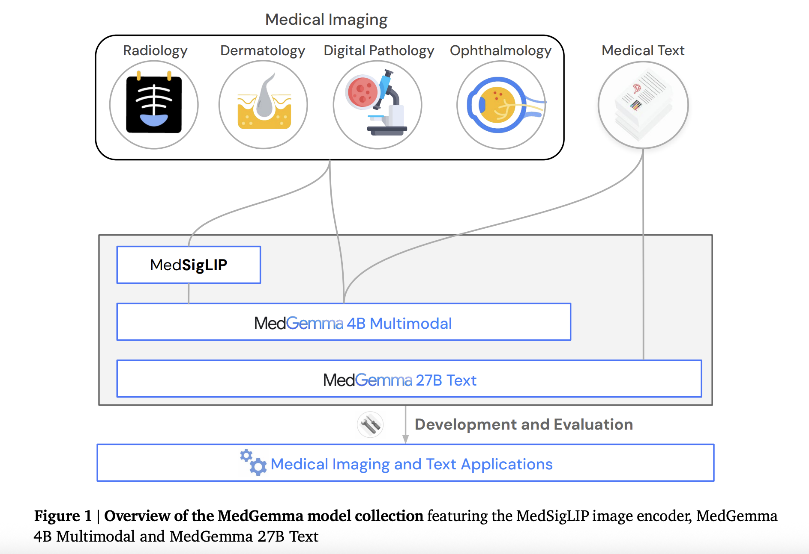

# Google AI Open-Sourced MedGemma 27B and MedSigLIP for Scalable Multimodal Medical Reasoning

> In a strategic move to advance open-source development in medical AI, Google DeepMind and Google Research have introduced two new models under the MedGemma umbrella: MedGemma 27B Multimodal, a large-scale vision-language foundation model, and MedSigLIP, a lightweight medical image-text encoder. These additions represent the most capable open-weight models released to date within the Health AI […]

In a strategic move to advance open-source development in medical AI, Google DeepMind and Google Research have introduced two new models under the MedGemma umbrella: **MedGemma 27B Multimodal**, a large-scale vision-language foundation model, and **MedSigLIP**, a lightweight medical image-text encoder. These additions represent the most capable open-weight models released to date within the Health AI Developer Foundations (HAI-DEF) framework.

### The MedGemma Architecture

MedGemma builds upon the Gemma 3 transformer backbone, extending its capability to the healthcare domain by integrating multimodal processing and domain-specific tuning. The MedGemma family is designed to address core challenges in clinical AI—namely data heterogeneity, limited task-specific supervision, and the need for efficient deployment in real-world settings. The models process both medical images and clinical text, making them particularly useful for tasks such as diagnosis, report generation, retrieval, and agentic reasoning.

### MedGemma 27B Multimodal: Scaling Multimodal Reasoning in Healthcare

The **MedGemma 27B Multimodal** model is a significant evolution from its text-only predecessor. It incorporates an enhanced vision-language architecture optimized for complex medical reasoning, including longitudinal electronic health record (EHR) understanding and image-guided decision making.

**Key Characteristics**:

- **Input Modality**: Accepts both medical images and text in a unified interface.

- **Architecture**: Uses a 27B parameter transformer decoder with arbitrary image-text interleaving, powered by a high-resolution (896×896) image encoder.

- **Vision Encoder**: Reuses the SigLIP-400M backbone tuned on 33M+ medical image-text pairs, including large-scale data from radiology, histopathology, ophthalmology, and dermatology.

**Performance**:

- Achieves **87.7% accuracy on MedQA** (text-only variant), outperforming all open models under 50B parameters.

- Demonstrates robust capabilities in agentic environments such as **AgentClinic**, handling multi-step decision-making across simulated diagnostic flows.

- Provides end-to-end reasoning across patient history, clinical images, and genomics—critical for personalized treatment planning.

**Clinical Use Cases**:

- Multimodal question answering (VQA-RAD, SLAKE)

- Radiology report generation (MIMIC-CXR)

- Cross-modal retrieval (text-to-image and image-to-text search)

- Simulated clinical agents (AgentClinic-MIMIC-IV)

Early evaluations indicate that MedGemma 27B Multimodal rivals larger closed models like GPT-4o and Gemini 2.5 Pro in domain-specific tasks, while being fully open and more computationally efficient.

### MedSigLIP: A Lightweight, Domain-Tuned Image-Text Encoder

**MedSigLIP** is a vision-language encoder adapted from SigLIP-400M and optimized specifically for healthcare applications. While smaller in scale, it plays a foundational role in powering the vision capabilities of both MedGemma 4B and 27B Multimodal.

**Core Capabilities**:

- **Lightweight**: With only 400M parameters and reduced resolution (448×448), it supports edge deployment and mobile inference.

- **Zero-shot and Linear Probe Ready**: Performs competitively on medical classification tasks without task-specific finetuning.

- **Cross-domain Generalization**: Outperforms dedicated image-only models in dermatology, ophthalmology, histopathology, and radiology.

**Evaluation Benchmarks**:

- **Chest X-rays (CXR14, CheXpert)**: Outperforms the HAI-DEF ELIXR-based CXR foundation model by 2% in AUC.

- **Dermatology (US-Derm MCQA)**: Achieves 0.881 AUC with linear probing over 79 skin conditions.

- **Ophthalmology (EyePACS)**: Delivers 0.857 AUC on 5-class diabetic retinopathy classification.

- **Histopathology**: Matches or exceeds state-of-the-art on cancer subtype classification (e.g., colorectal, prostate, breast).

The model uses averaged cosine similarity between image and textual embeddings for zero-shot classification and retrieval. Additionally, a linear probe setup (logistic regression) allows efficient finetuning with minimal labeled data.

### Deployment and Ecosystem Integration

Both models are **100% open source**, with weights, training scripts, and tutorials available through the [MedGemma repository](https://goo.gle/medgemma). They are fully compatible with Gemma infrastructure and can be integrated into tool-augmented pipelines or LLM-based agents using fewer than 10 lines of Python code. Support for quantization and model distillation enables deployment on mobile hardware without significant loss in performance.

Importantly, all the above models can be deployed on a single GPU, and larger models like the 27B variant remain accessible for academic labs and institutions with moderate compute budgets.

### Conclusion

The release of **MedGemma 27B Multimodal** and **MedSigLIP** signals a maturing open-source strategy for health AI development. These models demonstrate that with proper domain adaptation and efficient architectures, high-performance medical AI does not need to be proprietary or prohibitively expensive. By combining strong out-of-the-box reasoning with modular adaptability, these models lower the entry barrier for building clinical-grade applications—from triage systems and diagnostic agents to multimodal retrieval tools.

---

Check out the **[Paper](https://arxiv.org/abs/2507.05201)**, **[Technical details](https://research.google/blog/medgemma-our-most-capable-open-models-for-health-ai-development/)**, **[GitHub-MedGemma](https://github.com/google-health/medgemma)** and **[GitHub-MedGemma](https://github.com/google-health/medsiglip)**. All credit for this research goes to the researchers of this project. Also, feel free to follow us on **[Twitter](https://x.com/intent/follow?screen_name=marktechpost)**, and **[Youtube](https://www.youtube.com/@Marktechpost)** and don’t forget to join our **[100k+ ML SubReddit](https://www.reddit.com/r/machinelearningnews/)** and Subscribe to **[our Newsletter](https://www.airesearchinsights.com/subscribe)**.
