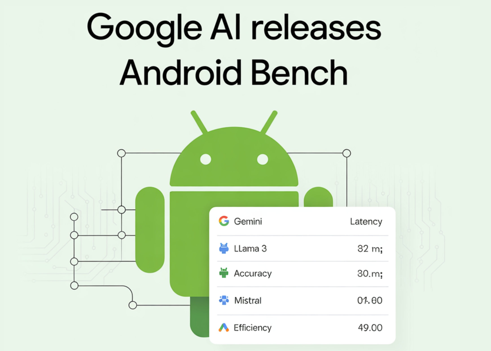

# Google AI Releases Android Bench: An Evaluation Framework and Leaderboard for LLMs in Android Development

> Google has officially released Android Bench, a new leaderboard and evaluation framework designed to measure how Large Language Models (LLMs) perform specifically on Android development tasks. The dataset, methodology, and test harness have been made open-source and are publicly available on GitHub. Benchmark Methodology and Task Design General coding benchmarks often fail to capture the […]

Google has officially released **Android Bench**, a new leaderboard and evaluation framework designed to measure how Large Language Models (LLMs) perform specifically on Android development tasks. The dataset, methodology, and test harness have been made open-source and are publicly available on [GitHub](https://github.com/android-bench/android-bench).

### Benchmark Methodology and Task Design

General coding benchmarks often fail to capture the platform-specific dependencies and nuances of mobile development. Android Bench addresses this by curating a task set sourced directly from real-world, public GitHub Android repositories.

**Evaluated scenarios cover varying difficulty levels, including:**

- Resolving breaking changes across Android releases.

- Domain-specific tasks, such as networking on Wear OS devices.

- Migrating code to the latest version of **Jetpack Compose** (Android’s modern toolkit for building native user interfaces).

To ensure a model-agnostic evaluation, the framework prompts an LLM to fix a reported issue and then verifies the **fix using standard developer testing practices:**

- **Unit tests:** Tests that verify small, isolated blocks of code (like a single function or class) without needing the Android framework.

- **Instrumentation tests:** Tests that run on a physical Android device or emulator to verify how the code interacts with the actual Android system and APIs.

### Mitigating Data Contamination

A significant challenge for developers evaluating public benchmarks is **data contamination**. This occurs when an LLM is exposed to the evaluation tasks during its training process, resulting in the model memorizing the answers rather than demonstrating genuine reasoning and problem-solving capabilities.

**To ensure the integrity of the Android Bench results, Google team implemented several preventative measures:**

- **Manual review of agent trajectories:** Developers review the step-by-step reasoning and action paths the model takes to arrive at a solution, ensuring it is actively solving the problem.

- **Canary string integration:** A unique, identifiable string of text is embedded into the benchmark dataset. This acts as a signal to web crawlers and data scrapers used by AI companies to explicitly exclude this data from future model training runs.

### Initial Android Bench Leaderboard Results

For the initial release, the benchmark strictly measures base model performance, intentionally omitting complex agentic workflows or tool use.

The **Score** represents the average percentage of 100 test cases successfully resolved across 10 independent runs for each model. Because LLM outputs can vary between runs, the results include a **Confidence Interval (CI)** with a p-value < 0.05. The CI provides the expected performance range, indicating the statistical reliability of the model’s score.

In this first release, models successfully completed between 16% and 72% of the tasks.

**Model****Score (%)****CI Range (%)****Date****Gemini 3.1 Pro Preview**72.465.3 — 79.82026-03-04**Claude Opus 4.6**66.658.9 — 73.92026-03-04**GPT-5.2-Codex**62.554.7 — 70.32026-03-04**Claude Opus 4.5**61.953.9 — 69.62026-03-04**Gemini 3 Pro Preview**60.452.6 — 67.82026-03-04**Claude Sonnet 4.6**58.451.1 — 66.62026-03-04**Claude Sonnet 4.5**54.245.5 — 62.42026-03-04**Gemini 3 Flash Preview**42.036.3 — 47.92026-03-04**Gemini 2.5 Flash**16.110.9 — 21.92026-03-04

_Note: You can try all the evaluated models for your own Android projects using API keys in the latest stable version of Android Studio._

### Key Takeaways

- **Specialized Focus Over General Benchmarks:** Android Bench addresses the shortcomings of generic coding benchmarks by specifically measuring how well LLMs handle the unique complexities, APIs, and dependencies of the Android ecosystem.

- **Grounded in Real-World Scenarios:** Instead of isolated algorithmic tests, the benchmark evaluates models against actual challenges pulled from public GitHub repositories. Tasks include resolving breaking API changes, migrating legacy UI code to Jetpack Compose, and handling device-specific networking (e.g., on Wear OS).

- **Verifiable, Model-Agnostic Testing:** Code generation is evaluated based on functionality, not methodology. The framework automatically verifies the LLM’s proposed fixes using standard Android engineering practices: isolated unit tests and emulator-based instrumentation tests.

- **Strict Anti-Contamination Measures:** To ensure models are actually reasoning rather than regurgitating memorized training data, the benchmark employs manual reviews of agent reasoning paths and uses ‘canary strings’ to prevent AI web crawlers from ingesting the test dataset.

- **Baseline Performance Established:** The 1st version of the leaderboard focuses purely on base model performance without external agentic tools. Gemini 3.1 Pro Preview currently leads with a 72.4% success rate, highlighting a wide variance in current LLM capabilities (which range from 16.1% to 72.4% across tested models).

---

Check out the **[Repo](https://github.com/android-bench/android-bench) **and** [Technical details](https://android-developers.googleblog.com/2026/03/elevating-ai-assisted-androi.html). **Also, feel free to follow us on **[Twitter](https://x.com/intent/follow?screen_name=marktechpost)** and don’t forget to join our **[120k+ ML SubReddit](https://www.reddit.com/r/machinelearningnews/)** and Subscribe to **[our Newsletter](https://www.aidevsignals.com/)**. Wait! are you on telegram? **[now you can join us on telegram as well.](https://t.me/machinelearningresearchnews)**
