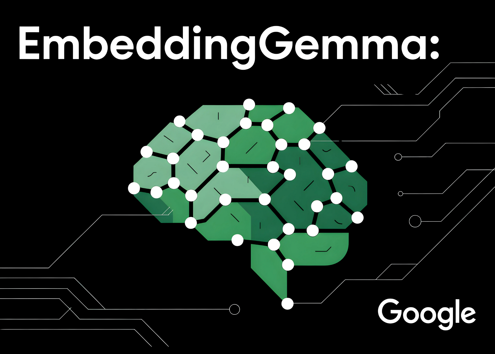

# Google AI Releases EmbeddingGemma: A 308M Parameter On-Device Embedding Model with State-of-the-Art MTEB Results

> EmbeddingGemma is Google’s new open text embedding model optimized for on-device AI, designed to balance efficiency with state-of-the-art retrieval performance. How compact is EmbeddingGemma compared to other models? At just 308 million parameters, EmbeddingGemma is lightweight enough to run on mobile devices and offline environments. Despite its size, it performs competitively with much larger embedding […]

**EmbeddingGemma** is Google’s new open text embedding model optimized for on-device AI, designed to balance efficiency with state-of-the-art retrieval performance.

### How compact is EmbeddingGemma compared to other models?

At just **308 million parameters**, EmbeddingGemma is lightweight enough to run on mobile devices and offline environments. Despite its size, it performs competitively with much larger embedding models. Inference latency is low (sub-15 ms for 256 tokens on EdgeTPU), making it suitable for real-time applications.

### How well does it perform on multilingual benchmarks?

EmbeddingGemma was trained across **100+ languages** and achieved the **highest ranking on the Massive Text Embedding Benchmark (MTEB)** among models under 500M parameters. Its performance rivals or exceeds embedding models nearly twice its size, particularly in cross-lingual retrieval and semantic search.

*https://developers.googleblog.com/en/introducing-embeddinggemma/*

*https://developers.googleblog.com/en/introducing-embeddinggemma/*

### What is the underlying architecture?

EmbeddingGemma is built on a **Gemma 3–based encoder backbone with mean pooling**. Importantly, the architecture does not use the multimodal-specific bidirectional attention layers that Gemma 3 applies for image inputs. Instead, EmbeddingGemma employs a **standard transformer encoder stack with full-sequence self-attention**, which is typical for text embedding models.

This encoder produces **768-dimensional embeddings** and supports sequences up to **2,048 tokens**, making it well-suited for retrieval-augmented generation (RAG) and long-document search. The mean pooling step ensures fixed-length vector representations regardless of input size.

*https://developers.googleblog.com/en/introducing-embeddinggemma/*

### What makes its embeddings flexible?

EmbeddingGemma employs **Matryoshka Representation Learning (MRL)**. This allows embeddings to be truncated from 768 dimensions down to 512, 256, or even 128 dimensions with minimal loss of quality. Developers can tune the trade-off between storage efficiency and retrieval precision without retraining.

### Can it run entirely offline?

Yes. EmbeddingGemma was specifically designed for **on-device, offline-first use cases**. Since it shares a tokenizer with **Gemma 3n**, the same embeddings can directly power compact retrieval pipelines for local RAG systems, with privacy benefits from avoiding cloud inference.

### What tools and frameworks support EmbeddingGemma?

**It integrates seamlessly with:**

- **Hugging Face** (transformers, Sentence-Transformers, transformers.js)

- **LangChain** and **LlamaIndex** for RAG pipelines

- **Weaviate** and other vector databases

- **ONNX Runtime** for optimized deployment across platformsThis ecosystem ensures developers can slot it directly into existing workflows.

### How can it be implemented in practice?

**(1) Load and Embed**

```
`from sentence_transformers import SentenceTransformer
model = SentenceTransformer("google/embeddinggemma-300m")
emb = model.encode(["example text to embed"])
`
```

**(2) Adjust Embedding Size**
Use full 768 dims for maximum accuracy or truncate to 512/256/128 dims for lower memory or faster retrieval.

**(3) Integrate into RAG**
Run similarity search locally (cosine similarity) and feed top results into **Gemma 3n** for generation. This enables a fully **offline RAG pipeline**.

[](https://www.marktechpost.com/wp-content/uploads/2025/09/1000x700-info-1-scaled.png)

### Why EmbeddingGemma?

- **Efficiency at scale** – High multilingual retrieval accuracy in a compact footprint.

- **Flexibility** – Adjustable embedding dimensions via MRL.

- **Privacy** – End-to-end offline pipelines without external dependencies.

- **Accessibility** – Open weights, permissive licensing, and strong ecosystem support.

EmbeddingGemma proves that **smaller embedding models can achieve best-in-class retrieval performance** while being light enough for offline deployment. It marks an important step toward efficient, privacy-conscious, and scalable on-device AI.

---

Check out the **[Model ](https://huggingface.co/google/embeddinggemma-300m)and [Technical details](https://developers.googleblog.com/en/introducing-embeddinggemma/)_._** Feel free to check out our **[GitHub Page for Tutorials, Codes and Notebooks](https://github.com/Marktechpost/AI-Tutorial-Codes-Included)**. Also, feel free to follow us on **[Twitter](https://x.com/intent/follow?screen_name=marktechpost)** and don’t forget to join our **[100k+ ML SubReddit](https://www.reddit.com/r/machinelearningnews/)** and Subscribe to **[our Newsletter](https://www.aidevsignals.com/)**.
