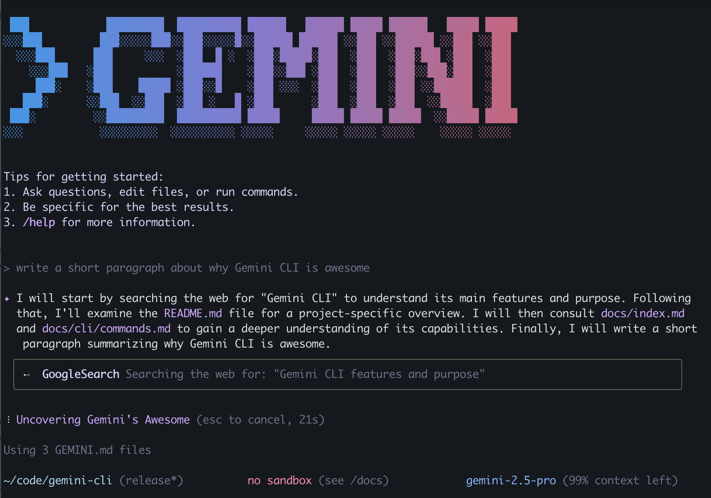

# Google AI Releases Gemini CLI: An Open-Source AI Agent for Your Terminal

> Google has unveiled Gemini CLI, an open-source command-line AI agent that integrates the Gemini 2.5 Pro model directly into the terminal. Designed for developers and technical power users, Gemini CLI allows users to interact with Gemini using natural language directly from the command line—supporting workflows such as code explanation, debugging, documentation generation, file manipulation, and […]

Google has unveiled **Gemini CLI**, an open-source command-line AI agent that integrates the Gemini 2.5 Pro model directly into the terminal. Designed for developers and technical power users, Gemini CLI allows users to interact with Gemini using natural language directly from the command line—supporting workflows such as code explanation, debugging, documentation generation, file manipulation, and even web-grounded research.

Gemini CLI builds on the backend infrastructure of Gemini Code Assist and offers a similar intelligence layer to developers who prefer terminal-based interfaces. It supports scripting, prompt-based interactions, and agent extensions, giving developers the flexibility to integrate it into CI/CD pipelines, automation scripts, or everyday development work. By combining terminal accessibility with the full power of Gemini’s multimodal reasoning, Google is positioning this tool as a lightweight but powerful complement to IDE-bound assistants.

A standout feature of Gemini CLI is its integration with **Gemini 2.5 Pro**, a frontier LLM that supports up to **1 million tokens** in context. Developers can access the model for free using a personal Google account, with generous usage quotas—up to 60 requests per minute and 1,000 per day. The tool is built to be lightweight and immediately usable; installation is as simple as running `npx` or using `npm install -g`. Once installed, users can authenticate and start issuing natural-language prompts from their terminal.

What makes Gemini CLI particularly appealing to developers is its **open-source license (Apache 2.0)**. Developers can inspect, modify, and extend the codebase hosted on [GitHub](https://github.com/google-gemini/gemini-cli), building their own agents or modifying prompts to suit specific project requirements. This flexibility fosters both transparency and community innovation, allowing AI capabilities to be fine-tuned to real-world developer workflows.

The CLI supports both interactive sessions and non-interactive scripting. For example, a user might run `gemini` and type “Explain the changes in this codebase since yesterday,” or use it in a script with `--prompt` to automate documentation generation. It’s also extensible via configuration files like `GEMINI.md`, allowing developers to preload context, customize system prompts, or define tool-specific workflows.

Gemini CLI goes beyond basic language modeling. It incorporates **Model-Context Protocol (MCP)** extensions and **Google Search grounding**, enabling it to reason based on real-time information. Developers can also integrate multimodal tools like Veo (for video generation) and Imagen (for image generation), expanding the scope of what can be done from the terminal. Whether it’s prototyping visuals, scaffolding code, or summarizing research, Gemini CLI is designed to accommodate a diverse range of technical use cases.

Early adoption has been promising. Developers appreciate the natural language flexibility, scripting compatibility, and model performance, especially given the free-tier access. The community is already submitting pull requests and contributing to the codebase, and Google appears to be actively engaging in further improvements based on GitHub feedback. It’s also noteworthy that the Gemini CLI backend shares infrastructure with Gemini Code Assist, ensuring consistency across terminal and IDE environments.

From a broader perspective, Gemini CLI enters a competitive landscape of AI development tools that includes GitHub Copilot, OpenAI Codex CLI, and other LLM-powered agents. However, Google’s decision to make Gemini CLI open-source, paired with a generous free quota and a terminal-native interface, sets it apart. It appeals directly to backend developers, DevOps engineers, and technical teams looking for flexible, integrated AI tooling without being locked into proprietary IDEs or paid platforms.

To get started, users can install Gemini CLI with a one-liner, authenticate via their Google account, and begin experimenting with natural-language commands. The setup is minimal, and the learning curve is shallow, especially for users already familiar with command-line tools. For those looking to go deeper, the project’s GitHub repository offers detailed examples, instructions for contributing, and information about extending the agent’s capabilities.

In conclusion, Gemini CLI is Google’s push to bring advanced AI capabilities closer to where many developers spend most of their time: the terminal. By blending open-source transparency, powerful model access, extensibility, and real-time grounding, Gemini CLI presents itself as a compelling tool for developers who want more from their AI assistants. It not only streamlines development workflows but also opens new avenues for automation, multimodal interaction, and intelligent reasoning—all without leaving the command line.

**TLDR**: Google AI has released **Gemini CLI**, an open-source command-line interface that integrates Gemini 2.5 Pro directly into the terminal. It allows developers to run natural-language commands for code generation, debugging, file operations, and more—without leaving the shell. Built with extensibility in mind, Gemini CLI supports scripting, multimodal tools like Veo and Imagen, and real-time web grounding. With a generous free-tier, shared backend with Gemini Code Assist, and support for the Model-Context Protocol (MCP), it offers a powerful AI experience tailored for developers and automation workflows.

---

Check out the** _[Paper ](https://blog.google/technology/developers/introducing-gemini-cli-open-source-ai-agent/)and [GitHub Page](https://github.com/google-gemini/gemini-cli)._** All credit for this research goes to the researchers of this project. Also, feel free to follow us on **[Twitter](https://x.com/intent/follow?screen_name=marktechpost)** and don’t forget to join our **[100k+ ML SubReddit](https://www.reddit.com/r/machinelearningnews/)** and Subscribe to **[our Newsletter](https://www.airesearchinsights.com/subscribe)**.
