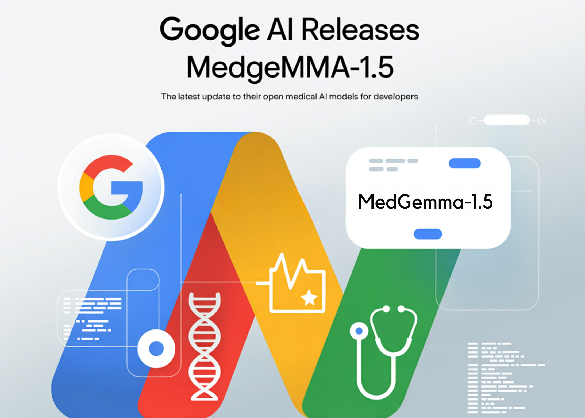

# Google AI Releases MedGemma-1.5: The Latest Update to their Open Medical AI Models for Developers

> Google Research has expanded its Health AI Developer Foundations program (HAI-DEF) with the release of MedGemma-1.5. The model is released as open starting points for developers who want to build medical imaging, text and speech systems and then adapt them to local workflows and regulations. MedGemma 1.5, small multimodal model for real clinical data MedGemma […]

Google Research has expanded its [Health AI Developer Foundations program (HAI-DEF)](https://developers.google.com/health-ai-developer-foundations) with the release of [MedGemma-1.5](https://huggingface.co/google/medgemma-1.5-4b-it). The model is released as open starting points for developers who want to build medical imaging, text and speech systems and then adapt them to local workflows and regulations.

*https://research.google/blog/next-generation-medical-image-interpretation-with-medgemma-15-and-medical-speech-to-text-with-medasr/*

### MedGemma 1.5, small multimodal model for real clinical data

MedGemma is a family of medical generative models built on Gemma. The new release, MedGemma-1.5-4B, targets developers who need a compact model that can still handle real clinical data. The previous MedGemma-1-27B model remains available for more demanding text heavy use cases.

MedGemma-1.5-4B is multimodal. It accepts text, two dimensional images, high dimensional volumes and whole slide pathology images. The model is part of the Health AI Developer Foundations program so it is intended as a base to fine tune, not a ready made diagnostic device.

*https://research.google/blog/next-generation-medical-image-interpretation-with-medgemma-15-and-medical-speech-to-text-with-medasr/*

### Support for high dimensional CT, MRI and pathology

A major change in MedGemma-1.5 is support for high dimensional imaging. The model can process three dimensional CT and MRI volumes as sets of slices together with a natural language prompt. It can also process large histopathology slides by working over patches extracted from the slide.

On internal benchmarks, MedGemma-1.5 improves disease related CT findings from 58% to 61% accuracy and MRI disease findings from 51% to 65% accuracy when averaged over findings. For histopathology, the ROUGE L score on single slide cases increases from 0.02 to 0.49. This matches the 0.498 ROUGE L score of the task specific PolyPath model.

*https://research.google/blog/next-generation-medical-image-interpretation-with-medgemma-15-and-medical-speech-to-text-with-medasr/*

### Imaging and report extraction benchmarks

MedGemma-1.5 also improves several benchmarks that are closer to production workflows.

On the Chest ImaGenome benchmark for anatomical localization in chest X rays, it improves intersection over union from 3% to 38%. On the MS-CXR-T benchmark for longitudinal chest X-ray comparison, macro-accuracy increases from 61% to 66%.

Across internal single image benchmarks that cover chest radiography, dermatology, histopathology and ophthalmology, average accuracy goes from 59% to 62%t. These are simple single image tasks, useful as sanity checks during domain adaptation.

MedGemma-1.5 also targets document extraction. On medical laboratory reports, the model improves macro F1 from 60% to 78% when extracting lab type, value and units. For developers this means less custom rule based parsing for semi structured PDF or text reports.

Applications deployed on Google Cloud can now work directly with DICOM, which is the standard file format used in radiology. This removes the need for a custom preprocessor for many hospital systems.

*https://research.google/blog/next-generation-medical-image-interpretation-with-medgemma-15-and-medical-speech-to-text-with-medasr/*

### Medical text reasoning with MedQA and EHRQA

MedGemma-1.5 is not only an imaging model. It also improves baseline performance on medical text tasks.

On MedQA, a multiple choice benchmark for medical question answering, the 4B model improves accuracy from 64% to 69% relative to the previous MedGemma-1. On EHRQA, a text based electronic health record question answering benchmark, accuracy increases from 68% to 90%.

These numbers matter if you plan to use MedGemma-1.5 as a backbone for tools such as chart summarization, guideline grounding or retrieval augmented generation over clinical notes. The 4B size keeps fine tuning and serving cost at a practical level.

### MedASR, a domain tuned speech recognition model

Clinical workflows contain a large amount of dictated speech. MedASR is the new medical automated speech recognition model released together with MedGemma-1.5.

MedASR uses a Conformer based architecture that is pre trained and fine tuned for clinical audio. It targets tasks such as chest X-ray dictation, radiology reports and general medical notes. The model is available through the same Health AI Developer Foundations channel on Vertex AI and on Hugging Face.

In evaluations against Whisper-large-v3, a general ASR model, MedASR reduces word error rate for chest X-ray dictation from 12.5% to 5.2%. That corresponds to 58% fewer transcription errors. On a broader internal medical dictation benchmark, MedASR reaches 5.2% word error rate while Whisper-large-v3 has 28.2%, which corresponds to 82% fewer errors.

### Key Takeaways

- MedGemma-1.5-4B is a compact multimodal medical model that handles text, 2D images, 3D CT and MRI volumes and whole slide pathology, released as part of the Health AI Developer Foundations program for adaptation to local use cases.

- On imaging benchmarks, MedGemma-1.5 improves CT disease findings from 58% to 61%, MRI disease findings from 51% to 65%, and histopathology ROUGE-L from 0.02 to 0.49, matching the PolyPath model performance.

- For downstream clinical style tasks, MedGemma-1.5 increases Chest ImaGenome intersection over union from 3% to 38%, MS-CXR-T macro accuracy from 61%t to 66% and lab report extraction macro F1 from 60% to 78% while keeping model size at 4B parameters.

- MedGemma-1.5 also strengthens text reasoning, raising MedQA accuracy from 64% to 69% and EHRQA accuracy from 68% to 90%, which makes it suitable as a backbone for chart summarization and EHR question answering systems.

- MedASR, a Conformer based medical ASR model in the same program, cuts word error rate on chest X-ray dictation from 12.5% to 5.2% and on a broad medical dictation benchmark from 28.2% to 5.2% compared to Whisper-large-v3, providing a domain tuned speech front end for MedGemma centered workflows.

---

Check out the **[Model Weights](https://huggingface.co/google/medgemma-1.5-4b-it)** and **[Technical details](https://research.google/blog/next-generation-medical-image-interpretation-with-medgemma-15-and-medical-speech-to-text-with-medasr/)**. Also, feel free to follow us on **[Twitter](https://x.com/intent/follow?screen_name=marktechpost)** and don’t forget to join our **[100k+ ML SubReddit](https://www.reddit.com/r/machinelearningnews/)** and Subscribe to **[our Newsletter](https://www.aidevsignals.com/)**. Wait! are you on telegram? **[now you can join us on telegram as well.](https://t.me/machinelearningresearchnews)**
