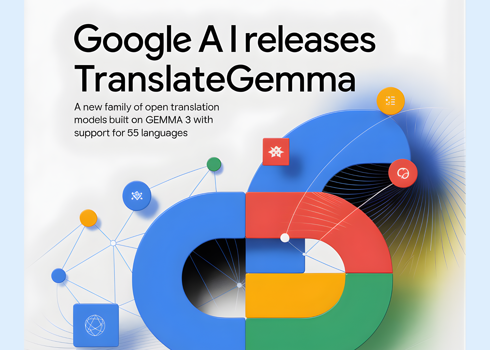

# Google AI Releases TranslateGemma: A New Family of Open Translation Models Built on Gemma 3 with Support for 55 Languages

> Google AI has released TranslateGemma, a suite of open machine translation models built on Gemma 3 and targeted at 55 languages. The family comes in 4B, 12B and 27B parameter sizes. It is designed to run across devices from mobile and edge hardware to laptops and a single H100 GPU or TPU instance in the […]

Google AI has released TranslateGemma, a suite of open machine translation models built on Gemma 3 and targeted at 55 languages. The family comes in 4B, 12B and 27B parameter sizes. It is designed to run across devices from mobile and edge hardware to laptops and a single H100 GPU or TPU instance in the cloud.

TranslateGemma is not a separate architecture. It is Gemma 3 specialized for translation through a two stage post training pipeline. (1) supervised fine tuning on large parallel corpora. (2) Reinforcement learning that optimizes translation quality with a multi signal reward ensemble. The goal is to push translation quality while keeping the general instruction following behavior of Gemma 3.

### Supervised fine tuning on synthetic and human parallel data

The supervised fine tuning stage starts from the public Gemma 3 4B, 12B and 27B checkpoints. The research team uses parallel data that combines human translations with high quality synthetic translations generated by Gemini models.

Synthetic data is produced from monolingual sources with a multi step procedure. The pipeline selects candidate sentences and short documents, feeds them to Gemini 2.5 Flash, and then filters outputs with MetricX 24 QE to keep only examples that show clear quality gains. This is applied across all WMT24 plus plus language pairs plus 30 more language pairs.

Low resource languages receive human generated parallel data from the SMOL and GATITOS datasets. SMOL covers 123 languages and GATITOS covers 170 languages. This improves coverage of scripts and language families that are under represented in publicly available web parallel data.

The final supervised fine tuning mixture also keeps 30 percent generic instruction following data from the original Gemma 3 mixture. This is important. Without it, the model would over specialize on pure translation and lose general LLM behavior such as following instructions or doing simple reasoning in context.

Training uses the Kauldron SFT (Supervised Fine tuning) tooling with the AdaFactor optimizer. The learning rate is 0.0001 with batch size 64 for 200000 steps. All model parameters are updated except the token embeddings, which are frozen. Freezing embeddings helps preserve representation quality for languages and scripts that do not appear in the supervised fine tuning data.

### Reinforcement learning with a translation focused reward ensemble

After supervised fine tuning, TranslateGemma runs a reinforcement learning phase on top of the same translation data mixture. The reinforcement learning objective uses several reward models.

**The reward ensemble includes:**

- MetricX 24 XXL QE, a learned regression metric that approximates MQM scores and is used here in quality estimation mode without a reference.

- Gemma AutoMQM QE, a span level error predictor fine tuned from Gemma 3 27B IT on MQM labeled data. It produces token level rewards based on error type and severity.

- ChrF, a character n gram overlap metric that compares model output with synthetic references and is rescaled to match the other rewards.

- A Naturalness Autorater that uses the policy model as an LLM judge and produces span level penalties for segments that do not sound like native text.

- A generalist reward model from the Gemma 3 post training setup that keeps reasoning and instruction following ability intact.

TranslateGemma uses reinforcement learning algorithms that combine sequence level rewards with token level advantages. Span level rewards from AutoMQM and the Naturalness Autorater attach directly to the affected tokens. These token advantages are added to sequence advantages computed from reward to go and then batch normalized. This improves credit assignment compared with pure sequence level reinforcement learning.

### Benchmark results on WMT24++

TranslateGemma is evaluated on the WMT24++ benchmark using MetricX 24 and Comet22. MetricX is lower better and correlates with MQM error counts. Comet22 is higher better and measures adequacy and fluency.

*https://arxiv.org/pdf/2601.09012*

The above Table from the research pape summarizes results for English centered evaluation over 55 language pairs.

- 27B: Gemma 3 baseline has MetricX 4.04 and Comet22 83.1. TranslateGemma 27B reaches MetricX 3.09 and Comet22 84.4.

- 12B: Gemma 3 baseline has MetricX 4.86 and Comet22 81.6. TranslateGemma 12B reaches MetricX 3.60 and Comet22 83.5.

- 4B: Gemma 3 baseline has MetricX 6.97 and Comet22 77.2. TranslateGemma 4B reaches MetricX 5.32 and Comet22 80.1.

The key pattern is that TranslateGemma improves quality for every model size. At the same time, model scale interacts with specialization. The 12B TranslateGemma model surpasses the 27B Gemma 3 baseline. The 4B TranslateGemma model reaches quality similar to the 12B Gemma 3 baseline. This means a smaller translation specialized model can replace a larger baseline model for many machine translation workloads.

*https://arxiv.org/pdf/2601.09012*

A language level breakdown in the above appendix table from the research paper shows that these gains appear across all 55 language pairs. For example, MetricX improves from 1.63 to 1.19 for English to German, 2.54 to 1.88 for English to Spanish, 3.90 to 2.72 for English to Hebrew, and 5.92 to 4.45 for English to Swahili. Improvements are also large for harder cases such as English to Lithuanian, English to Estonian and English to Icelandic.

Human evaluation on WMT25 with MQM confirms this trend. TranslateGemma 27B usually yields lower MQM scores, that is fewer weighted errors, than Gemma 3 27B, with especially strong gains for low resource directions such as English to Marathi, English to Swahili and Czech to Ukrainian. There are two notable exceptions. For German as target both systems are very close. For Japanese to English TranslateGemma shows a regression caused mainly by named entity errors, even though other error categories improve.

### Multimodal translation and interface for developers

TranslateGemma inherits the image understanding stack of Gemma 3. The research team evaluates image translation on the Vistra benchmark. They select 264 images that each contain a single text instance. The model receives only the image plus a prompt that asks it to translate the text in the image. There is no separate bounding box input and no explicit OCR step.

On this setting, TranslateGemma 27B improves MetricX from 2.03 to 1.58 and Comet22 from 76.1 to 77.7. The 4B variant shows smaller but positive gains. The 12B model improves MetricX but has a slightly lower Comet22 score than the baseline. Overall, the research team concludes that TranslateGemma retains the multimodal ability of Gemma 3 and that text translation improvements mostly carry over to image translation.

### Key Takeaways

- **TranslateGemma is a specialized Gemma 3 variant for translation**: TranslateGemma is a suite of open translation models derived from Gemma 3, with 4B, 12B and 27B parameter sizes, optimized for 55 languages through a two stage pipeline, supervised fine tuning then reinforcement learning with translation focused rewards.

- **Training combines Gemini synthetic data with human parallel corpora**: The models are fine tuned on a mixture of high quality synthetic parallel data generated by Gemini and human translated data, which improves coverage for both high resource and low resource languages while preserving general LLM capabilities from Gemma 3.

- **Reinforcement learning uses an ensemble of quality estimation rewards**: After supervised fine tuning, TranslateGemma applies reinforcement learning driven by an ensemble of reward models, including MetricX QE and AutoMQM, that explicitly target translation quality and fluency rather than generic chat behavior.

- **Smaller models match or beat larger Gemma 3 baselines on WMT24++**: On WMT24++ across 55 languages, all TranslateGemma sizes show consistent improvements over Gemma 3, with the 12B model surpassing the 27B Gemma 3 baseline and the 4B model reaching quality comparable to the 12B baseline, which reduces compute requirements for a given translation quality level.

- **Models retain multimodal abilities and are released as open weights**: TranslateGemma keeps Gemma 3 image text translation capabilities and improves performance on the Vistra image translation benchmark, and the weights are released as open models on Hugging Face and Vertex AI, enabling local and cloud deployment.

---

Check out the **[Paper](https://arxiv.org/pdf/2601.09012)**, **[Model Weights](https://huggingface.co/collections/google/translategemma) **and** [Technical details](https://blog.google/innovation-and-ai/technology/developers-tools/translategemma/)**. Also, feel free to follow us on **[Twitter](https://x.com/intent/follow?screen_name=marktechpost)** and don’t forget to join our **[100k+ ML SubReddit](https://www.reddit.com/r/machinelearningnews/)** and Subscribe to **[our Newsletter](https://www.aidevsignals.com/)**. Wait! are you on telegram? **[now you can join us on telegram as well.](https://t.me/machinelearningresearchnews)**
